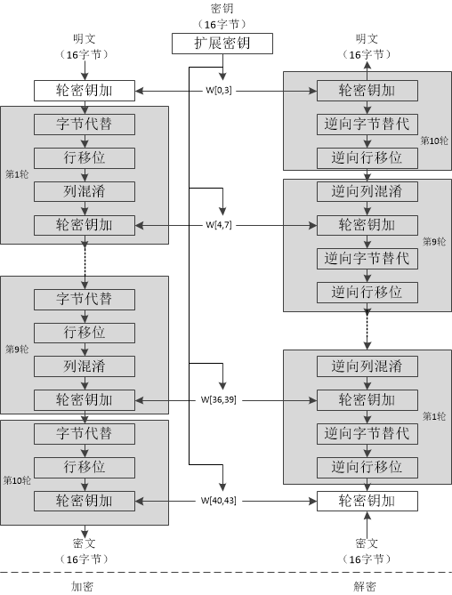
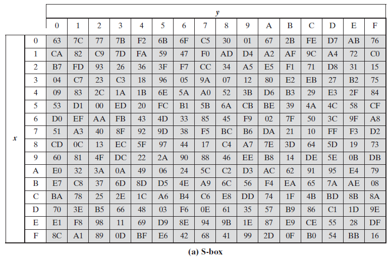
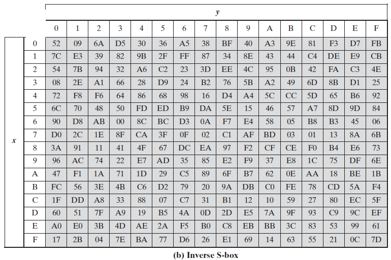
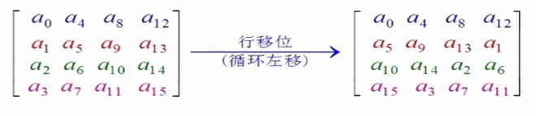
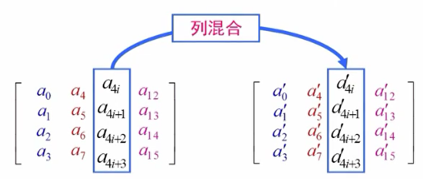
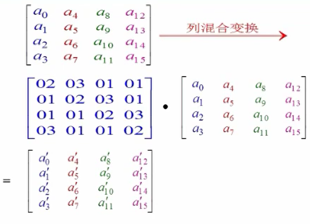
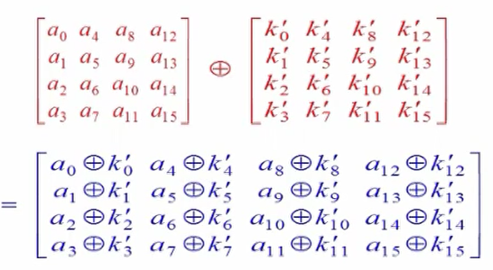
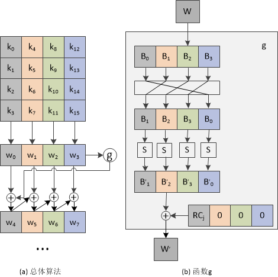

### 本文为AES算法的原理详解。
<!--more-->

## AES算法

AES算法是迭代型分组密码算法

#### 基本参数：

* 分组长度：128比特
* 密钥长度：128、192或256比特
* 圈数：10、12或14圈，与密钥长度相对应。

前9次加密过程除了密钥都一样，最后一次加密过程没有列混淆。

### 算法流程

#### 字节代替变换(S盒)

字节代替变换时关于字节的非线性变换，它将字节矩阵中每一个字节利用同一个S盒变换为另一个字节。变换后位置不变。

由两个可逆变换复合而成。

* 将每一个字节变换为它在有限域GF(2^8)中的乘法逆。并规定0变换到其自身。
* 对上一步骤的变换结果用二元域上的一个仿射变换作用。
S盒

也可以直接按照s盒的表进行替换

S和S-1分别为16x16的矩阵，完成一个8比特输入到8比特输出的映射，输入的高4-bit对应的值作为行标，低4-bit对应的值作为列标。假设输入字节的值为a=a7a6a5a4a3a2a1a0，则输出值为S[a7a6a5a4][a3a2a1a0]，S-1的变换也同理。

#### 行移位变换

如果将一个字节矩阵的行从上到下分别称为第0，1，2，3行，则行移位变换的作用就是将这个字节矩阵的第i行循环移位左移i个字节。

#### 列混合变换

列混合变换对一个字节矩阵逐列进行变换

#### 圈密钥加

圈密钥是通过密钥生成算法从初始密钥中产生，其长度等于分组长度。

#### 密钥扩展算法

AES算法的圈密钥长度等于分组长度128比特，即4个32位字，若迭代圈数为Nr，则连同入口密钥，共需4(Nr+1)个32位字的密钥。

密钥扩展说明：

* 将种子密钥按图(a)的格式排列，其中k0、k1、……、k15依次表示种子密钥的一个字
节；排列后用4个32比特的字表示，分别记为w[0]、w[1]、w[2]、w[3]；　　　　

* 按照如下方式，依次求解w[j]，其中j是整数并且属于[4,43]；　　　　
* 若j%4=0,则w[j]=w[j-4]⊕g(w[j-1]),否则w[j]=w[j-4]⊕w[j-1]；　　函数g的流程说明：　　　　
    * 将w循环左移8比特；　　　　
    * 分别对每个字节做S盒置换；　　　　
    * 32比特的常量（RC[j/4],0,0,0）进行异或，RC是一个一维数组，其值如下。（RC的值只需要有10个，而此处用了11个，实际上RC[0]在运算中没有用到，增加RC[0]是为了便于程序中用数组表示。由于j的最小取值是4，j/4的最小取值则是1，因此不会产生错误。）

RC = {0x00, 0x01, 0x02, 0x04, 0x08, 0x10, 0x20, 0x40, 0x80, 0x1B, 0x36}

参考：
[https://www.cnblogs.com/luop/p/4334160.html](https://www.cnblogs.com/luop/p/4334160.html)