### 本文为Apache PHP MySQL的安装配置总结。
<!--more-->

#### 安装Apache

##### 下载

从Apache官网下载安装包
地址：<https://httpd.apache.org/docs/current/platform/windows.html>

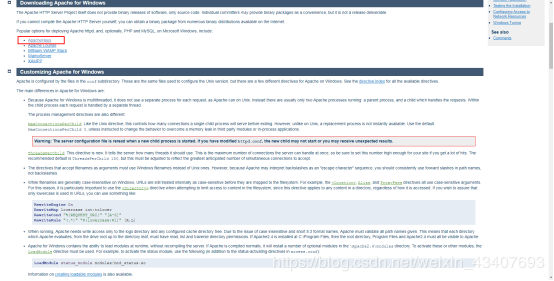

##### 解压安装

记住解压路径
用管理员身份运行cmd
进入安装目录bin文件夹下，执行一下代码
安装：
> httpd.exe -k install -n "Apache"

然后输入
> httpd.exe -t

查看配置文件
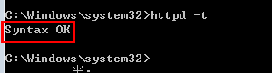
如果是这样的则成功
不是的话，需要配置conf/httpd.conf

配置完再输入httpd.exe -t 查看配置是否好

##### 启动服务

这里改一下监听端口号

如果apache不能启动，
443端口占用，则改一下文件。conf/extra/httpd-ahssl.conf
改为442端口
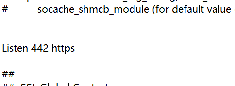
启动服务：
> net start Apache
重新启动：
> net restart Apache
停止服务
> net stop Apache

由于改成了81端口，所以浏览器输入localhost:81，即可看见运行结果。

##### 卸载

> httpd.exe -k uninstall -n "Apache"

#### 安装PHP

##### 下载PHP压缩包

下载地址：
[https://windows.php.net/download/](https://windows.php.net/download/)


下载VC15 x64 Thread Safe下的zip压缩包，并且解压到想要安装的目录下。
##### 配置Apache支持PHP解析


打开Apache配置文件，Apache24/conf/httpd.conf
在一堆#LoadModule最下方加上

```
#加载PHP
LoadModule php7_module 'D:/server/php7/php7apache2_4.dll'
#加载PHP配置
PHPIniDir 'D:/server/php7'
#分配给PHP
AddType application/x-httpd-php .php .html .htm
```

说明：LoadModule是加载模块关键字，php7_module是模块名，C:/PHP7/php7apache2_4.dll是Apache支持PHP解析的dll库文件

PHPIniDir是配置文件目录关键字，'C:/PHP7'是php.ini文件所在目录，此配置实现重启Apache，php的配置同时生效。

AddType关键字添加解析类型，application/x-httpd-php .php表示所有以.php结尾的文件都会使用php解析。

##### 测试

先写一个index.php

```
<?php
    echo "hello world";
?>
```
保存到Aapche24的htdocs目录下

运行Apche服务，输入localhost:81/index.php


可以看到配置成功

#### 安装MySql

B站视频
[https://www.bilibili.com/video/av90016352/?spm_id_from=333.788.b_636f6d6d656e74.9](
https://www.bilibili.com/video/av90016352/?spm_id_from=333.788.b_636f6d6d656e74.9)
视频讲的非常细。
本文链接[https://www.cnblogs.com/honeynan/p/12408119.html](https://www.cnblogs.com/honeynan/p/12408119.html)
[https://www.jb51.net/article/179326.htm](https://www.jb51.net/article/179326.htm)

##### 下载安装包

下载地址：

[https://dev.mysql.com/downloads/installer/](https://dev.mysql.com/downloads/installer/)

##### 安装

双击安装包，进行安装
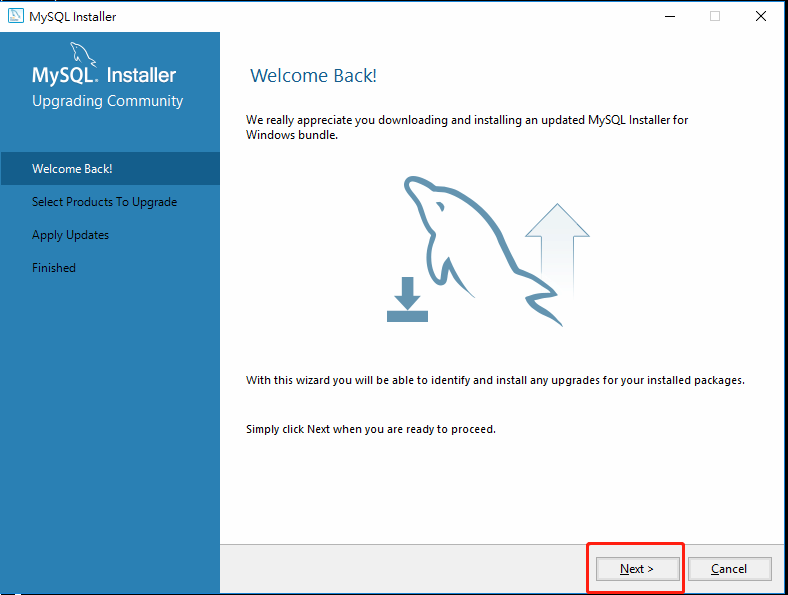
之后一直next，或者execute、finish就行
下面到了最为关键的步骤 ，现在、马上、立刻，拿一支笔、拿一个笔记本（不是随便一张纸）！！！下面的东西需要记。
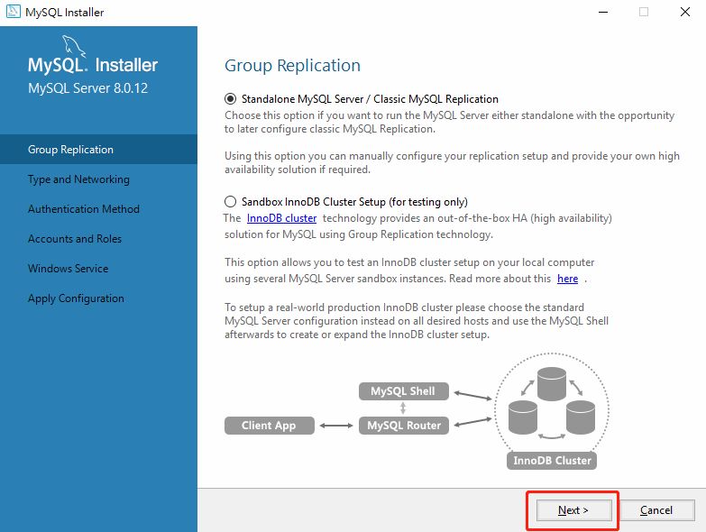

如图所示Port（端口号）后边有黄色惊叹号，说明当前默认的端口号被占用，需要更换端口号。

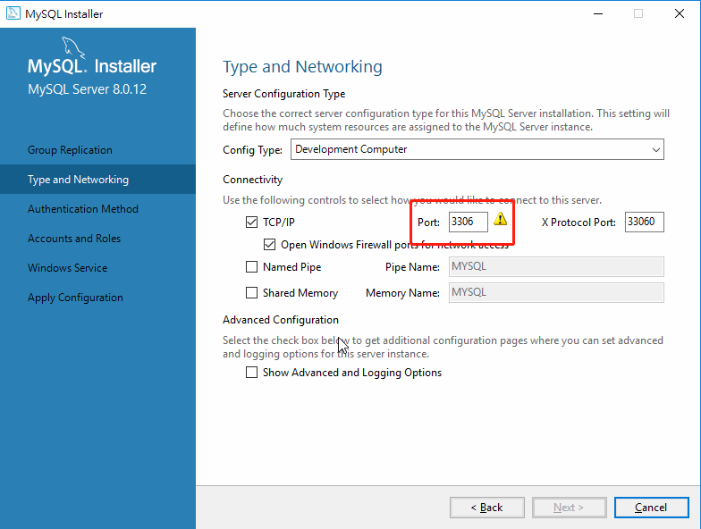

如图所示，可更换为3303，切记！更换后的端口号一定要牢记，最好整理到常用的笔记本上。记录好之后，单机NEXT，NEXT。
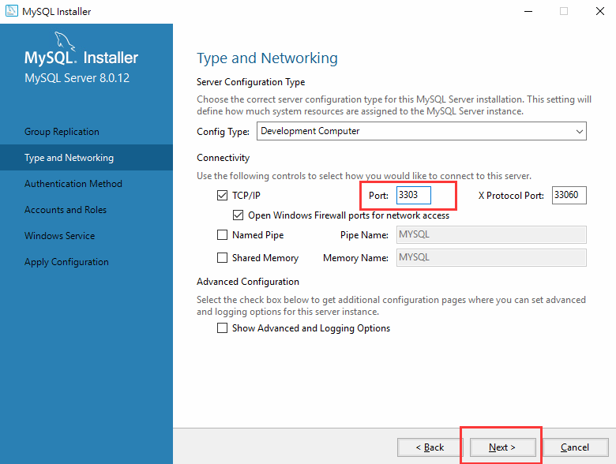

接下来同样相当重要，为你的root用户设置密码，设置密码时一定要先把要设置的密码记录下来，再输入。　　　　
密码设置成功后，可以选择添加用户，也可以等待安装成功后再添加。
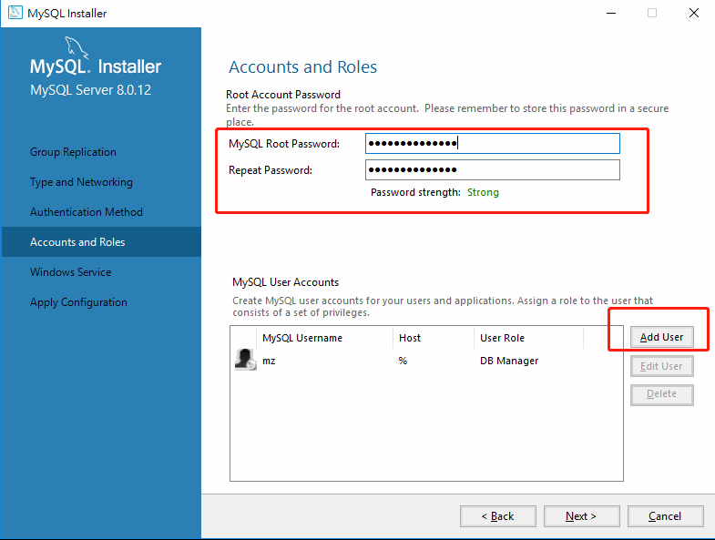
可以修改服务名，一般默认，点Next
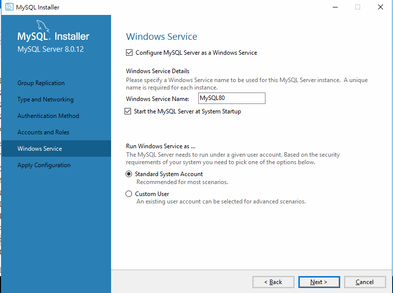

Excute->NEXT->Finish->NEXT->Finish。
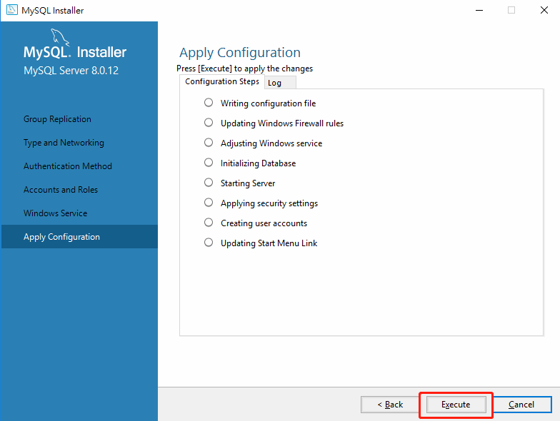

##### 配置环境变量

一般在c盘programfile里边mysql，mysql server 8.0的bin文件夹，把这个文件夹加到path路径
最后添加配置文件
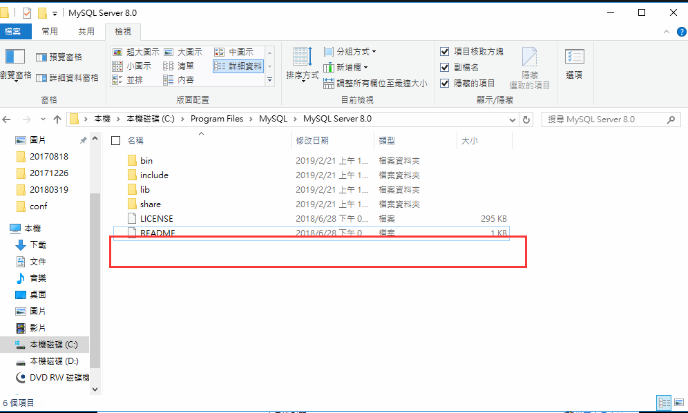
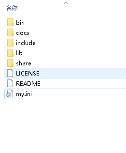
如果没有那个my.ini文件，得新建配置

```
[mysqld]
# 设置3306端口
port=3306
# 设置mysql的安装目录
basedir=C:\Program Files\MySQL
# 设置mysql数据库的数据的存放目录
datadir=C:\Program Files\MySQL\Data
# 允许最大连接数
max_connections=200
# 允许连接失败的次数。
max_connect_errors=10
# 服务端使用的字符集默认为UTF8
character-set-server=utf8
# 创建新表时将使用的默认存储引擎
default-storage-engine=INNODB
# 默认使用“mysql_native_password”插件认证
#mysql_native_password
default_authentication_plugin=mysql_native_password
[mysql]
# 设置mysql客户端默认字符集
default-character-set=utf8
[client]
# 设置mysql客户端连接服务端时默认使用的端口
port=3306
default-character-set=utf8
```

保存文件为my.ini

以管理员身份运行命令提示符（即：cmd）,进入mysql安装目录，输入mysqld --initialize --console，9P0gYk-?0,kT就是初始密码，一定要记录。
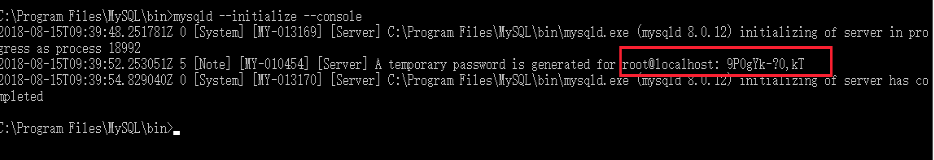

继续在命令行中输入mysqld --install，如果出现 Service successfully installed.即为成功！


如果出现以下内容，需要删除原有服务。
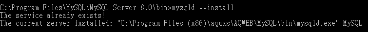

删除原有服务需要在命令行中输入：sc delete mysql。　　
之后再次输入：mysqld --install。


mysql服务安装成功后，需要启动服务。在命令行中输入：net start mysql 。


到此，mysql数据库全部安装、配置完毕，可以正常使用了！　　
登录mysql，在命令行中输入：mysql -uroot -p 回车，输入root密码。也可以使用用户登录，将root改为你自己的用户名即可。　　

注！ -p后边可以直接跟密码吗？可以！但是这样会让你的数据库密码暴露出来，所以建议大家以后先回车，再输入密码，mysql会为你隐藏密码。

**登录时如果出现如图所示的情况：**
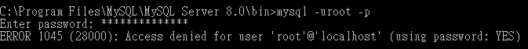

在输入密码的时候输入初始密码：
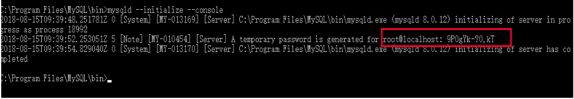

登录成功后，在操作数据库的时候会报以下错误：
> ERROR 1820 (HY000): You must reset your password using ALTER USER statement before executing this statement.


这是因为此时你的密码时初始密码，你需要先修改密码才可以继续操作。　　修改密码如下：
> alter user 'root'@'localhost' identified by '123456';


最后的“123456”替换为你想要设置的密码，切记不要设置为纯数字或者纯密码，密码太简单也会报错。　　修改完之后，提示OK，说明修改成功！
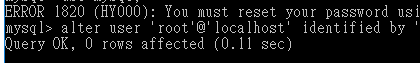

PS：如果当登录时出现无法登录的情况或者忘记root密码（请先检查mysql服务是否已开启），请看一下文章

[https://www.cnblogs.com/honeynan/p/12408144.html](https://www.cnblogs.com/honeynan/p/12408144.html)

root密码 root

root@localhost密码PXz8s+quq8>k

