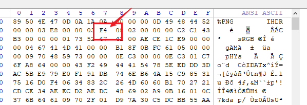
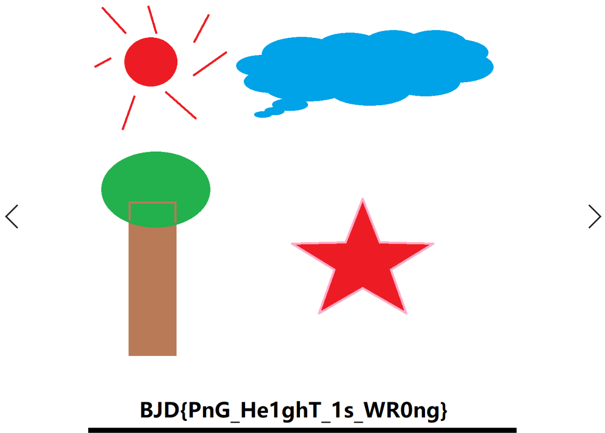
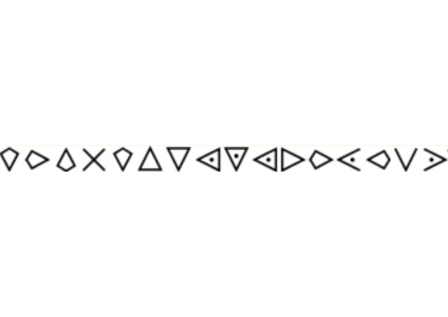
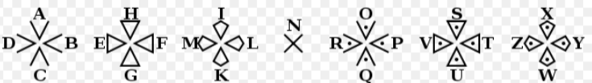
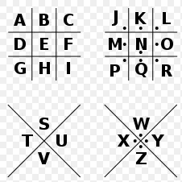
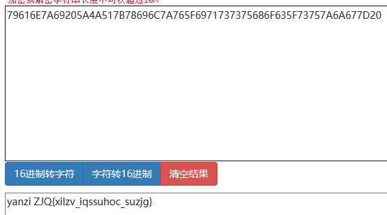
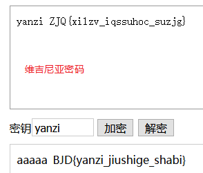
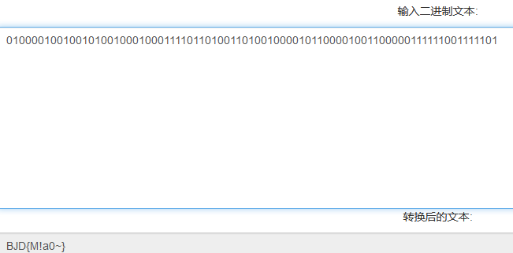
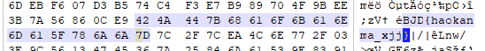

这次跟着去水了一把。平常也练了一些，但见到这些题，也只能说是见识面太窄，还是慢慢积累吧。以下是部分wp，慢慢学慢慢更。

<!--more-->
[题目地址](https://buuoj.cn/challenges)

### 签到-y1ng

QkpEe1czbGMwbWVfVDBfQkpEQ1RGfQ==
直接base64解码得到falg

### 老文盲了1

附件下载完打开是一行生僻字，
> 罼雧締眔擴灝淛匶襫黼瀬鎶軄鶛驕鳓哵眔鞹鰝

着实是无头绪，在后来hint的提示下，知道是读音。然后一个一个百度，连起来读一下知道flag。
> bi ji di da kuo hao zhe jiu shi fu lai ge zhi jie jiao le ba da guo hao

### A beautiful picture

这个就是标准隐写了，打开WinHex，改一下图片的高度，改到最大。

然后得到flag。

### 灵能精通

这个题是猪圈密码的变形，可以根据提米描述，然后查一下这段话可以知道是圣堂武士密码。

### 燕言燕语

给的是一串字符串，直接hex转string：得到yanzi ZJQ{xilzv_iqssuhoc_suzjg}

然后就是换位密码，试过不是栅栏，从网上得知是维吉尼亚密码。yanzi是key。接下来就是解密了。

### cat flag

这个是根据图中只有两种形态，想到二进制，鸡腿为1，然后二进制转字符串。

### 小姐姐

压缩包直接解压缩得到图片，然后用winhex打开，搜BJD得到flag。
