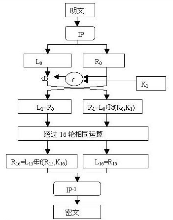
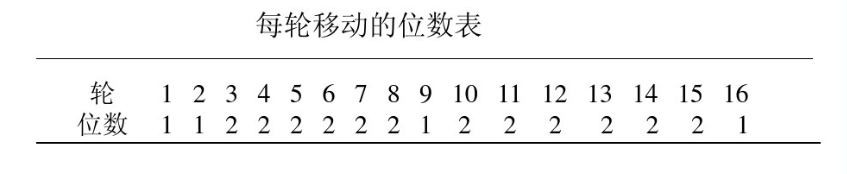
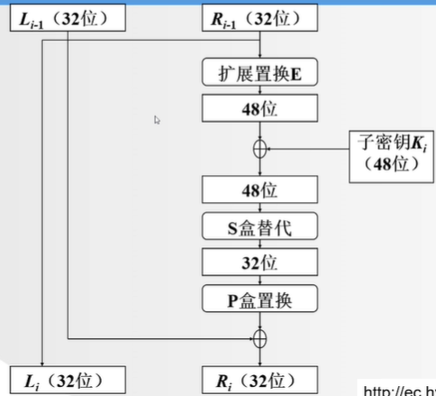
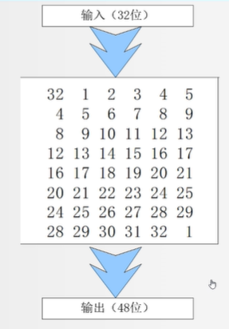
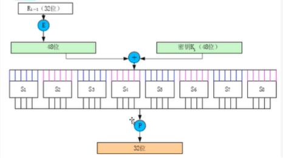
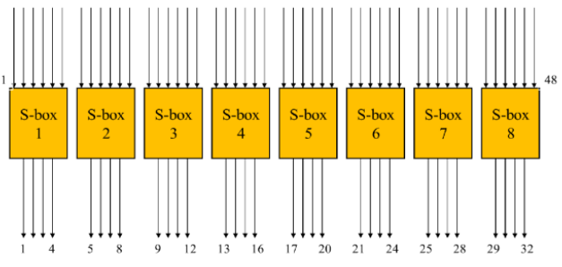
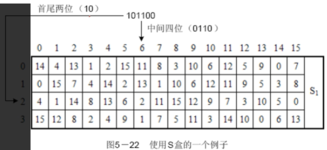

## 本文为DES算法的原理详解

<!--more-->

## DES算法详解

### 算法简介

DES是一个分组加密算法，典型的DES以64位为分组数据加密，加密和解密用的是同一算法。
它的密钥长度是56比特。尽管从规格上来说，DES的密钥长度是64比特，但由于每个7比特会设置一个用于错误检验的比特，因此实质上其密钥长度是56比特。
加密算法流程：


### 明文初始置换（IP初始置换）

IP置换目的是将输入的64位明文数据块按位重新组合，并把输出分为L0，R0两部分，每部分各长32位。
**注意：这里的数字表示的是原数据的位置，不是数据**

置换规则如下表：

> 58,50,42,34,26,18,10,2,
> 60,52,44,36,28,20,12,4,
> 62,54,46,38,30,22,14,6,
> 64,56,48,40,32,24,16,8,
> 57,49,41,33,25,17, 9,1,
> 59,51,43,35,27,19,11,3,
> 61,53,45,37,29,21,13,5,
> 63,55,47,39,31,23,15,7,

即将第58位明文换到第一个位置，第50位明文换到第2位。以此类推。
L0:
> 58,50,42,34,26,18,10,2,
> 60,52,44,36,28,20,12,4,
> 62,54,46,38,30,22,14,6,
> 64,56,48,40,32,24,16,8,

R0:
> 57,49,41,33,25,17, 9,1,
> 59,51,43,35,27,19,11,3,
> 61,53,45,37,29,21,13,5,
> 63,55,47,39,31,23,15,7,

然后分为左右两部分

### 密钥生成

#### 密钥初始置换（密钥由64位转为56位）

**操作对象是64位秘钥**

不考虑每个字节的第8位，DES的密钥由64位减至56位，每个字节的第8位作为奇偶校验位。产生的56位密钥由下表生成（注意表中没有8，16，24，32，40，48，56和64这8位）：
**注意：这里的数字表示的是原数据的位置，不是数据**
C0:
> 57,49,41,33,25,17,9
> 1,58,50,42,34,26,18
> 10,2,59,51,43,35,27
> 19,11,3,60,52,44,36

D0:
> 63,55,47,39,31,23,15
> 7,62,54,46,38,30,22
> 14,6,61,53,45,37,29
> 21,13,5,28,20,12,4

#### 生成16个48位的子密钥

在DES的每一轮中，从56位密钥产生出不同的48子密钥，确定这些子密钥的方式如下：
1）将56位密钥分成两部分，每部分28位。
2）根据轮数，这两部分分别循环左移1位或2位。每轮移动的位数如下表：


##### 第一轮循环左移1位

C1:
> 49,41,33,25,17,9,1
> 58,50,42,34,26,18,10
> 2,59,51,43,35,27,19
> 11,3,60,52,44,36,57

D1:
> 55,47,39,31,23,15,7,
> 62,54,46,38,30,22,14,
> 6,61,53,45,37,29,21,
> 13,5,28,20,12,4,63

C1和D1合并之后，再经过置换表2生成48位的子密钥k1。**56位转48位**
**置换表2**
> 14,17,11,24,1,5
> 3,28,15,6,21,10
> 23,19,12,4,26,8
> 16,7,27,20,13,2
> 41,52,31,37,47,55
> 30,40,51,45,33,48
> 44.,49,39,56,34,53
> 46,42,50,36,29,32

C1和D1再次经过循环左移变换，生成C2和D2，C2和D2合并，通过置换表2生成子秘钥K2。
以此类推，得到子秘钥K1~K16。需要注意其中循环左移的位数。

### 16轮迭代（F函数）

#### 明文扩展置换（E盒扩展32位转48位）

输入初始置换后明文右侧32位，最后变为48位。

扩展规则如下：


> 32,1,2,3,4,5,
> 4,5,6,7,8,9,
> 8,9,10,11,12,13,
> 12,13,14,15,16,17,
> 16,17,18,19,20,21,
> 20,21,22,23,24,25,
> 24,25,26,27,28,29,
> 28,29,30,31,32,1

#### S盒替代

   压缩后的密钥与扩展分组异或以后得到48位的数据，将这个数据送入S盒，进行替代运算。替代由8个不同的S盒完成，每个S盒有6位输入4位输出。48位输入分为8个6位的分组，一个分组对应一个S盒，对应的S盒对各组进行代替操作。



   一个S盒就是一个4行16列的表，盒中的每一项都是一个4位的数。S盒的6个输入确定了其对应的输出在哪一行哪一列，输入的**高低两位做为行数H**，**中间四位做为列数L**，在S-BOX中查找第H行L列对应的数据(<32)。

##### 8个S盒

**S盒1：**
> 14,4,13,1,2,15,11,8,3,10,6,12,5,9,0,7,
> 0,15,7,4,14,2,13,1,10,6,12,11,9,5,3,8,
> 4,1,14,8,13,6,2,11,15,12,9,7,3,10,5,0,
> 15,12,8,2,4,9,1,7,5,11,3,14,10,0,6,13,

**S盒2：**
> 15,1,8,14,6,11,3,4,9,7,2,13,12,0,5,10,
> 3,13,4,7,15,2,8,14,12,0,1,10,6,9,11,5,
> 0,14,7,11,10,4,13,1,5,8,12,6,9,3,2,15,
> 13,8,10,1,3,15,4,2,11,6,7,12,0,5,14,9,

**S盒3：**
> 10,0,9,14,6,3,15,5,1,13,12,7,11,4,2,8,
> 13,7,0,9,3,4,6,10,2,8,5,14,12,11,15,1,
> 13,6,4,9,8,15,3,0,11,1,2,12,5,10,14,7,
> 1,10,13,0,6,9,8,7,4,15,14,3,11,5,2,12,

**S盒4：**
> 7,13,14,3,0,6,9,10,1,2,8,5,11,12,4,15,
> 13,8,11,5,6,15,0,3,4,7,2,12,1,10,14,9,
> 10,6,9,0,12,11,7,13,15,1,3,14,5,2,8,4,
> 3,15,0,6,10,1,13,8,9,4,5,11,12,7,2,14,

**S盒5：**
> 2,12,4,1,7,10,11,6,8,5,3,15,13,0,14,9,
> 14,11,2,12,4,7,13,1,5,0,15,10,3,9,8,6,
> 4,2,1,11,10,13,7,8,15,9,12,5,6,3,0,14,
> 11,8,12,7,1,14,2,13,6,15,0,9,10,4,5,3,

**S盒6：**
> 12,1,10,15,9,2,6,8,0,13,3,4,14,7,5,11,
> 10,15,4,2,7,12,9,5,6,1,13,14,0,11,3,8,
> 9,14,15,5,2,8,12,3,7,0,4,10,1,13,11,6,
> 4,3,2,12,9,5,15,10,11,14,1,7,6,0,8,13,

**S盒7：**
> 4,11,2,14,15,0,8,13,3,12,9,7,5,10,6,1,
> 13,0,11,7,4,9,1,10,14,3,5,12,2,15,8,6,
> 1,4,11,13,12,3,7,14,10,15,6,8,0,5,9,2,
> 6,11,13,8,1,4,10,7,9,5,0,15,14,2,3,12,

**S盒8：**
> 13,2,8,4,6,15,11,1,10,9,3,14,5,0,12,7,
> 1,15,13,8,10,3,7,4,12,5,6,11,0,14,9,2,
> 7,11,4,1,9,12,14,2,0,6,10,13,15,3,5,8,
> 2,1,14,7,4,10,8,13,15,12,9,0,3,5,6,11,



例如，假设S盒8的输入为110011，第1位和第6位组合为11，对应于S盒8的第3行；第2位到第5位为1001，对应于S盒8的第9列。S盒8的第3行第9列的数字为12，因此用1100来代替110011。注意，S盒的行列计数都是从0开始。

代替过程产生8个4位的分组，组合在一起形成32位数据。

S盒代替是DES算法的关键步骤，所有的其他的运算都是线性的，易于分析，而S盒是非线性的，相比于其他步骤，提供了更好安全性。

#### P盒置换

S盒代替运算的32位输出按照P盒进行置换。该置换把输入的每位映射到输出位，任何一位不能被映射两次，也不能被略去，映射规则如下表：
> 16,7,20,21,29,12,28,17,1,15,23,26,5,18,31,10,
> 2,8,24,14,32,27,3,9,19,13,30,6,22,11,4,25,

表中的数字代表原数据中此位置的数据在新数据中的位置，即原数据块的第16位放到新数据的第1位，第7位放到第2位，……依此类推，第25位放到第32位。

最后，P盒置换的结果与最初的64位分组左半部分L0异或，然后左、右半部分交换，接着开始另一轮

### 末置换

末置换是初始置换的逆过程，DES最后一轮后，左、右两半部分并未进行交换，而是两部分合并形成一个分组做为末置换的输入。末置换规则如下：
> 40,8,48,16,56,24,64,32,39,7,47,15,55,23,63,31,
> 38,6,46,14,54,22,62,30,37,5,45,13,53,21,61,29,
> 36,4,44,12,52,20,60,28,35,3,43,11,51,19,59,27,
> 34,2,42,10,50,18,58,26,33,1,41,9,49,17,57,25,

### DES的解密

加密和解密可以使用相同的算法。加密和解密唯一不同的是秘钥的次序是相反的。就是说如果每一轮的加密秘钥分别是K1、K2、K3...K16，那么解密秘钥就是K16、K15、K14...K1。

## 代码实现（python）

### 密钥生成部分

``` python

MaxTime = 16
# 密钥初始置换 64位密钥转换为56位
key_table1 = [57,49,41,33,25,17,9,
              1,58,50,42,34,26,18,
              10,2,59,51,43,35,27,
              19,11,3,60,52,44,36,
              63,55,47,39,31,23,15,
              7,62,54,46,38,30,22,
              14,6,61,53,45,37,29,
              21,13,5,28,20,12,4]
# 密钥置换表2 56位转48位
key_table2 = [14,17,11,24,1,5,
              3,28,15,6,21,10,
              23,19,12,4,26,8,
              16,7,27,20,13,2,
              41,52,31,37,47,55,
              30,40,51,45,33,48,
              44,49,39,56,34,53,
              46,42,50,36,29,32]
def ListMove(l,step): #将列表中的元素循环左移
    return l[step:] + l[:step]
def SubKey(key): #生成子密钥
    keyresult = []
    key0 = [0 for i in range(56)]
    for i in range(len(key_table1)):  #密钥初始置换 64位转56位
        key0[i] = key[key_table1[i]-1]
    # 生成16个密钥
    for i in range(MaxTime):
        key1 = [0 for i in range(48)]
        # 每次位移次数
        if i == 0 or i == 1 or i == 8 or i == 15:
            step = 1
        else:
            step = 2
        # 分成左右两部分
        temp1 = key0[0:28]
        temp2 = key0[28:56]
        # 循环左移
        temp1 = ListMove(temp1,step)
        temp2 = ListMove(temp2,step)
        # 左右连接
        key0 = temp1 + temp2
        # 置换 56位转48位
        for i in range(len(key_table2)):
            key1[i] = key0[key_table2[i]-1]
        # 生成密钥
        keyresult.append(key1)
    # 返回每次的密钥
    return keyresult
```

### F函数

```python

MaxTime = 16
# 初始IP置换表
IP_table = [58,50,42,34,26,18,10,2,
            60,52,44,36,28,20,12,4,
            62,54,46,38,30,22,14,6,
            64,56,48,40,32,24,16,8,
            57,49,41,33,25,17, 9,1,
            59,51,43,35,27,19,11,3,
            61,53,45,37,29,21,13,5,
            63,55,47,39,31,23,15,7]
# 逆IP置换表
Inv_IP_table = [40,  8, 48, 16, 56, 24, 64, 32,
                39,  7, 47, 15, 55, 23, 63, 31,
                38,  6, 46, 14, 54, 22, 62, 30,
                37,  5, 45, 13, 53, 21, 61, 29,
                36,  4, 44, 12, 52, 20, 60, 28,
                35,  3, 43, 11, 51, 19, 59, 27,
                34,  2, 42, 10, 50, 18, 58, 26,
                33,  1, 41,  9, 49, 17, 57, 25]
# E盒表
extend_table = [32,  1,  2,  3,  4,  5,
                4,  5,  6,  7,  8,  9,
                8,  9, 10, 11, 12, 13,
                12, 13, 14, 15, 16, 17,
                16, 17, 18, 19, 20, 21,
                20, 21, 22, 23, 24, 25,
                24, 25, 26, 27, 28, 29,
                28, 29, 30, 31, 32,  1]
# S1盒
S1 = [14,  4, 13,  1,  2, 15, 11,  8,  3, 10,  6, 12,  5,  9,  0,  7,
      0, 15,  7,  4, 14,  2, 13,  1, 10,  6, 12, 11,  9,  5,  3,  8,
      4,  1, 14,  8, 13,  6,  2, 11, 15, 12,  9,  7,  3, 10,  5,  0,
      15, 12,  8,  2,  4,  9,  1,  7,  5, 11,  3, 14, 10,  0,  6, 13]
# S2盒
S2 = [15,  1,  8, 14,  6, 11,  3,  4,  9,  7,  2, 13, 12,  0,  5, 10,
      3, 13,  4,  7, 15,  2,  8, 14, 12,  0,  1, 10,  6,  9, 11,  5,
      0, 14,  7, 11, 10,  4, 13,  1,  5,  8, 12,  6,  9,  3,  2, 15,
      13,  8, 10,  1,  3, 15,  4,  2, 11,  6,  7, 12,  0,  5, 14,  9]
# S3盒
S3 = [10,  0,  9, 14,  6,  3, 15,  5,  1, 13, 12,  7, 11,  4,  2,  8,
      13,  7,  0,  9,  3,  4,  6, 10,  2,  8,  5, 14, 12, 11, 15,  1,
      13,  6,  4,  9,  8, 15,  3,  0, 11,  1,  2, 12,  5, 10, 14,  7,
      1, 10, 13,  0,  6,  9,  8,  7,  4, 15, 14,  3, 11,  5,  2, 12]
# S4盒
S4 = [7, 13, 14,  3,  0,  6,  9, 10,  1,  2,  8,  5, 11, 12,  4, 15,
      13,  8, 11,  5,  6, 15,  0,  3,  4,  7,  2, 12,  1, 10, 14,  9,
      10,  6,  9,  0, 12, 11,  7, 13, 15,  1,  3, 14,  5,  2,  8,  4,
      3, 15,  0,  6, 10,  1, 13,  8,  9,  4,  5, 11, 12,  7,  2, 14]
# S5盒
S5 = [2, 12,  4,  1,  7, 10, 11,  6,  8,  5,  3, 15, 13,  0, 14,  9,
      14, 11,  2, 12,  4,  7, 13,  1,  5,  0, 15, 10,  3,  9,  8,  6,
      4,  2,  1, 11, 10, 13,  7,  8, 15,  9, 12,  5,  6,  3,  0, 14,
      11,  8, 12,  7,  1, 14,  2, 13,  6, 15,  0,  9, 10,  4,  5,  3]
# S6盒
S6 = [12,  1, 10, 15,  9,  2,  6,  8,  0, 13,  3,  4, 14,  7,  5, 11,
      10, 15,  4,  2,  7, 12,  9,  5,  6,  1, 13, 14,  0, 11,  3,  8,
      9, 14, 15,  5,  2,  8, 12,  3,  7,  0,  4, 10,  1, 13, 11,  6,
      4,  3,  2, 12,  9,  5, 15, 10, 11, 14,  1,  7,  6,  0,  8, 13]
# S7盒
S7 = [4, 11,  2, 14, 15,  0,  8, 13,  3, 12,  9,  7,  5, 10,  6,  1,
      13,  0, 11,  7,  4,  9,  1, 10, 14,  3,  5, 12,  2, 15,  8,  6,
      1,  4, 11, 13, 12,  3,  7, 14, 10, 15,  6,  8,  0,  5,  9,  2,
      6, 11, 13,  8,  1,  4, 10,  7,  9,  5,  0, 15, 14,  2,  3, 12]
# S8盒
S8 = [13,  2,  8,  4,  6, 15, 11,  1, 10,  9,  3, 14,  5,  0, 12,  7,
      1, 15, 13,  8, 10,  3,  7,  4, 12,  5,  6, 11,  0, 14,  9,  2,
      7, 11,  4,  1,  9, 12, 14,  2,  0,  6, 10, 13, 15,  3,  5,  8,
      2,  1, 14,  7,  4, 10,  8, 13, 15, 12,  9,  0,  3,  5,  6, 11]
# S盒
S = [S1,S2,S3,S4,S5,S6,S7,S8]
# p盒
p_table = [16,  7, 20, 21, 29, 12, 28, 17,
           1, 15, 23, 26,  5, 18, 31, 10,
           2,  8, 24, 14, 32, 27,  3,  9,
           19, 13, 30,  6, 22, 11,  4, 25]
# 10进制转4位二进制
def int2bit(n):
    a = []
    for i in range(4):
        a.insert(0,str(n%2))
        n = int(n/2)
    return a
# IP置换，op为0为加密置换，op为1表示解密置换
def IP(text,op):
    temp = [0 for i in range(64)]
    if op == 0:
        for i in range(64):
            temp[i] = text[IP_table[i]-1]
        return temp
    if op == 1:
        for i in range(64):
            temp[i] = text[Inv_IP_table[i]-1]
        return temp
# E盒扩展
def Extend(text):
    extend = [0 for i in range(48)]
    for i in range(48):
        extend[i] = text[extend_table[i]-1]
    return  extend
# S盒变换
def s_Replace(text):
    sResult = [0 for i in range(32)]
    for k in range(8):
        row = 2 * int(text[k*6]) + int(text[k*6+5])
        column = 8*int(text[k*6+1]) + 4*int(text[k*6+2]) + 2*int(text[k*6+3]) + int(text[k*6+4])
        temp = S[k][row*16+column]
        for i in range(4):
            sResult[4*k + i] = int2bit(temp)[i]
    return  sResult
# P盒置换
def p_Replace(text):
    pResult = [0 for i in range(32)]
    for i in range(32):
        pResult[i] = text[p_table[i]-1]
    return pResult
# 异或运算
def Xor(bit1,bit2):
    xorResult = [0 for i in range(len(bit1))]
    for i in range(len(bit1)):
        xorResult[i] = str(int(bit1[i])^int(bit2[i]))
    return xorResult
```

### 加密函数

```python

# /*
#  * @Author: Barry
#  * @Date: 2020-03-30 16:02:41
#  * @Last Modified by: Barry
#  * @Last Modified time: 2020-03-30 16:03:52
#  */
import creatSubkey as cs
import  f_Function as f
#16进制转2进制
def hex2bin(text):
    result = []
    for i in range(len(text)):
        result.extend(f.int2bit(int(text[i],16)))
    return result
# 2进制转16进制
def bin2hex(text):
    result = []
    q = len(text)//4
    for i in range(q):
        dec = int(text[4*i])*8 + int(text[4*i+1])*4+int(text[4*i+2])*2 + int(text[4*i+3])*1
        x = hex(dec)[2:]
        result.extend(x)
    rs = ''.join(result)
    return rs
# 加密步骤
def DESEncryption(plaintext,secret_key):
    secret_key = cs.SubKey(secret_key) #密钥初始置换
    text1 = f.IP(plaintext,0)
    L = [text1[i] for i in range(32)]
    R = [text1[i] for i in range(32,64)]
    for i in range(16):
        temp = R
        temp = f.Extend(temp)
        temp = f.Xor(temp,secret_key[i])
        temp = f.s_Replace(temp)
        temp = f.p_Replace(temp)
        temp = f.Xor(temp,L)
        L = R
        R = temp
    L,R = R,L
    cText = L
    cText.extend((R))
    cText = f.IP(cText,1)
    return bin2hex(cText)
#程序入口
if __name__ == '__main__':
    # 输入明文
    print('读入16位十六进制明文')
    f1 = open('des_plaintext.txt', 'r')
    plaintext = f1.read()
    f1.close()
    print("读入完成")
    # 输入密钥
    print("读入16位十六进制密钥")
    # with open('des_sercetkey.txt','r') as f:
    #     secret_key = f.read()
    f2 = open('des_sercetkey.txt', 'r')
    secret_key = f2.read()
    f2.close()
    print("读入完成")
    print("算法开始")
    print("明文为：" + plaintext)
    print("密钥为：" + secret_key)
    plaintext = hex2bin(plaintext)
    secret_key = hex2bin(secret_key)
    # 算法开始
    Ciphertext = DESEncryption(plaintext, secret_key)
    # 打印密文
    print("加密后密文为" + Ciphertext)
```

### 解密函数

```python

import creatSubkey as cs
import f_Function as f
#16进制转2进制
def hex2bin(text):
    result = []
    for i in range(len(text)):
        result.extend(f.int2bit(int(text[i],16)))
    return result
# 2进制转16进制
def bin2hex(text):
    result = []
    q = len(text)//4
    for i in range(q):
        dec = int(text[4*i])*8 + int(text[4*i+1])*4+int(text[4*i+2])*2 + int(text[4*i+3])*1
        x = hex(dec)[2:]
        result.extend(x)
    rs = ''.join(result)
    return rs
def Decryption(text,key):
    keylist = cs.SubKey(key)
    text1 = f.IP(text,0)
    L = [text1[i] for i in range(32)]
    R = [text1[i] for i in range(32,64)]
    for i in range(16):
        temp = R
        temp = f.Extend(temp)
        temp = f.Xor(temp, keylist[15-i])
        temp = f.s_Replace(temp)
        temp = f.p_Replace(temp)
        temp = f.Xor(temp, L)
        L = R
        R = temp
    L, R = R, L
    cText = L
    cText.extend((R))
    cText = f.IP(cText, 1)
    return bin2hex(cText)
if __name__ == '__main__':
    print('读入16位十六进制密文')
    f1 = open('des_ciphertext.txt', 'r')
    ciphertext = f1.read()
    f1.close()
    print("读入完成")
    # 输入密钥
    print("读入16位十六进制密钥")
    # with open('des_sercetkey.txt','r') as f:
    #     secret_key = f.read()
    f2 = open('des_sercetkey.txt', 'r')
    secret_key = f2.read()
    f2.close()
    print("读入完成")
    print("算法开始")
    print("密文为：" + ciphertext)
    print("密钥为：" + secret_key)
    ciphertext = hex2bin(ciphertext)
    secret_key = hex2bin(secret_key)
    # 算法开始
    plaintext = Decryption(ciphertext, secret_key)
    # 打印密文
    print("解密后明文为" + plaintext)


```

本文参考链接：
原文链接：
[https://blog.csdn.net/qq_27570955/article/details/52442092](https://blog.csdn.net/qq_27570955/article/details/52442092)
[https://www.cnblogs.com/songwenlong/p/5944139.html](https://www.cnblogs.com/songwenlong/p/5944139.html)
