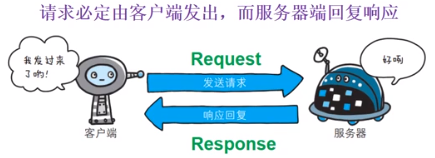
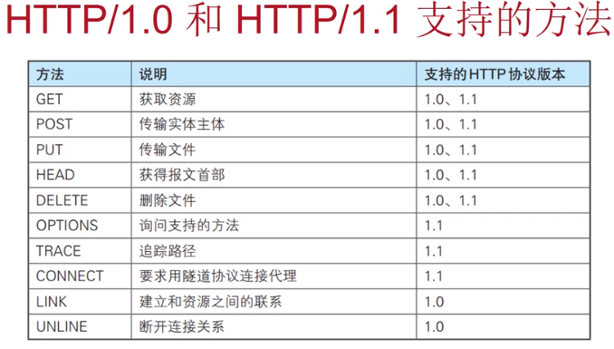
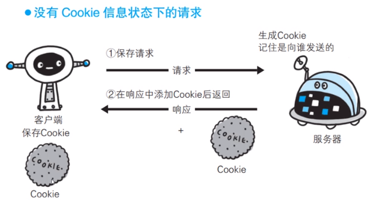
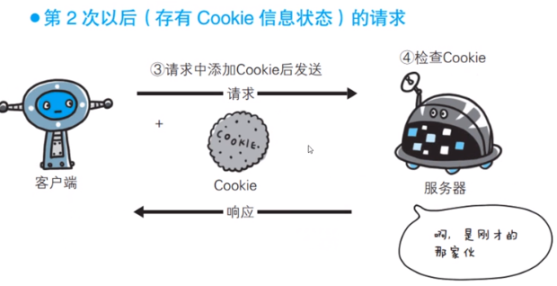
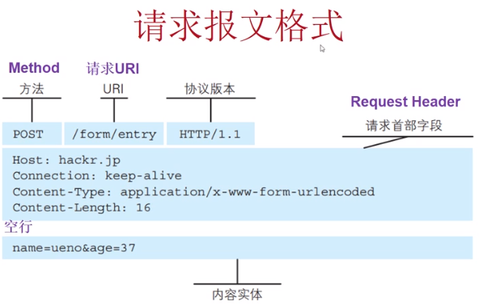
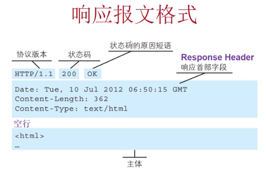
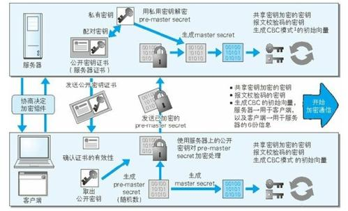

### 简单介绍了HTTP协议
<!--more-->
## 1.环境

## 2.了解WEB
Web使用一种名为HTTP（HyperText Transfer Protocol，超文本运输协议）的协议作为规范，完成从客户端到服务器端等一系列运作流程。Web是建立在HTTP（TCP/80)协议上通信的。
WWW（万维网）这一名称，是Web浏览器当年用来浏览超文本的客户端应用程序时的名称。现在表示这一系列的集合，简称Web
* 页面的文本标记语言**HTML**（HyperText Markup Language,超文本标记语言）
* 作为文档传递协议的**HTTP**
* 指定文档所在地址的**URL**（Uniform Resource Locator,统一资源定位符）
* **URI**（Uniform Resource Identifier,统一资源标识符）
URI用字符标识某一互联网资源，URL表示资源的地点（互联网上所处的位置）
**URL是一种具体的URI**
HTTP/1.1是目前主流的HTTP协议版本

## 3.HTTP协议简介

客户端和服务器

HTTP是不保存状态的协议，目的是为了更快的处理大量事务。不能进行事务的关联。
隐含参数和Cookie技术，能协助HTTP解决无状态问题

### HTTP Method GET

GET：获取资源 

通过URL传
请求访问已被URI识别的资源。指定的资源经服务器端解析后返回相应内容。

如果请求的资源是文本，保持原样返回；如果是像CGI（Common Gateway Interface,通用网关借口)那样的程序，返回经过执行后的输出结果。

### HTTP Method POST

POST：传输实体主体

以下用POST
* 请求中包含数据更新等副作用时
* 发送敏感信息时（防止Referer安全隐患）
* 发送的信息量很多时（URL长度有限）

副作用：指除了获取资源（内容）以外的其他操作。比如，追加/更新/删除服务器端的数据、购买商品、注册/删除用户等操作。

### HTTP Method PUT

PUT：传输文件 

存在安全隐患一般文件上传采用POST

### HTTP Method HEAD

HEAD：获得报文首部

与GET方法一样，只是不返回报文主体部分，用于确认URI的有效性及资源更新的日期时间等。

### HTTP Method DELETE

用来删除文件，是与PUT相反的的方法。DELETE方法按请求URI删除指定的资源

### Cookie的工作原理

## 4.HTTP报文

请求端的HTTP报文叫请求报文，响应端的HTTP报文叫响应报文。

#### 请求报文：

* 报文首部：
  * 请求行
  * 请求首部字段
  * 通用首部字段
  * 实体首部字段
  * 其他
* 空行：
* 报文主体

#### 响应报文：

* 报文首部：
  * 状态行
  * 响应首部字段
  * 通用首部字段
  * 实体首部字段
  * 其他
* 空行
* 报文主体

## 5.HTTP状态码

【功能】：当客户端向服务器发送请求时，描述返回的请求结果。

||类别|原因短语|
|-|---|-----|
|1XX|Informational(信息性状态码）|接收的请求正在处理|
|2XX|Success（成功状态码）|请求正常处理完毕|
|3XX|Redirection（重定向状态码）|需要进行附加操作以完成请求|
|4XX|Client Error（客户端错误状态码）|服务器无法处理请求|
|5XX|Server Error（服务器错误状态码）|服务器处理请求出错|

#### 3XX：

* 301 Moved Permanently：永久重定向
* 302 Moved Temporarily：临时重定向 希望用户（本次）能使用新的URI访问
* 303 See Other：要求用户（用GET定向获取请求的资源）
* 304 Not Modified：访问页面没有修改
* 307 Temporary Redirect：希望把POST改为GET

#### 4XX：

* 400 Bad Request:语法错误等造成错误请求
* 401 Unauthorized：需要授权认证
* 403 Forbidden：访问权限不够
* 404 Not Found：没有找到

#### 5XX：

* 500 Internal Server Error：服务器端执行请求发生错误
* 503 Service Unavailable：服务器暂时处于超负载或正在进行停机维护，无法处理请求

## 6.HTTP首部

#### HTTP报文首部：

通用首部字段：

|首部字段名|说明|参数|
|--------|----|--|
|Cache-Control|控制缓存的行为|private,max-age=0,no-cache等|
|Connection|逐跳首部、持久连接的管理|Keep-Alive/close|
|Date|创建报文的日期时间|Tue,03 Jul 2012 04:40:59 GMT|
|Pragma|报文指令||
|Trailer|说明报文主体后记录了哪些字段||
|Transfer-Encoding|指定报文主体的传输编码方式|chunked等|
|Upgrade|升级为其他协议|是否可使用更高的版本进行通讯|
|Via|追踪客户端与服务器之间的请求和响应报文的传输路径||
|Warning|告知用户一些与缓存有关的警告|[警告码][警告的主机：端口号]“[警告内容]”([日期时间])|

请求首部字段：

|首部字段名|说明|参数|
|--------|----|----|
|Accept|用户代理可处理的**媒体类型**|type/subtype形式；text/html,text/plain等|
|Accept-Charset|优先的**字符集**|utf-8等|
|Accept-Language|优先的语言|zh-cn等|
|Accept-Encoding|优先编码内容|gzip等|
|Authorization|通知服务器，用户代理的认证信息|转码认证|
|Expect|期待服务器的特定行为|例：100-continue|
|From|用户的电子邮箱地址|例：info@hacker.jp|
|Host|请求资源所在服务器|必须包含；例：www.baidu.com|
|If-Match|条件请求|例："123456|
|If-Modified-Since|比较资源的更新时间||
|If--None-Match|比较实体标记（与If-Match相反）||
|If-Range|资源未更新时发送实体Byte的范围请求||
|If-Unmodified-Since|比较资源的更新时间（与If-Modified-Since相反）||
|Max-Forwards|最大传输逐跳数||
|Proxy-Authorization|代理服务器要求客户端的认证信息||
|Range|实体的字节范围要求||
|Referer|对请求URI的原始获取方||
|TE|传输编码的优先级||
|User-Agent|HTTP客户端程序的信息|系统，浏览器，ip地址|
|Cookie|服务器接收到的Cookeie信息||

响应首部字段：

|首部字段名|说明|参数|
|-------|----|---|
|Accept-Ranges|是否接受字节范围请求||
|Age|推算资源创建经过时间|例：600|
|ETag|客户端实体标示||
|Location|令客户端重定向至URI|重定向目的地|
|Prox-Authenticate|代理服务器对客户端的认证信息||
|Retry-After|对再次发起请求的时机要求||
|Server|HTTP服务器的安装信息|具有安全隐患|
|Vary|代理服务器缓存的管理信息||
|WWW-Authenticate|服务器对客户端的认证信息|访问认证|
|Set-Cookie|开始状态管理所使用的Cookie信息|NAME=VALUE；expires=DATE；path=PATH；domain=域名；Secure；HttpOnly|

实体首部字段：

|首部字段名|说明|参数|
|-------|----|---|
|Allow|资源可支持的HTTP方法|GET等|
|Content-Encoding|实体主体适用的编码方式|gzip等|
|Content-Language|实体主体的自然语言|zh-cn等|
|Content-Length|实体主体的大小（单位：字节）|15000等|
|Content-Location|替代对应资源的URI||
|Content-MD5|实体主体的报文摘要||
|Content-Range|实体主体的位置范围||
|Content-Type|实体主体的媒体类型||
|Expires|实体主体过期的日期时间||
|Last-Modified|资源的最后修改日期时间||

HTTP首部字段是由首部字段名和字段值构成的
* Content-Type: 报文主体对象的类型
* Keep-Alive：

## 7.HTTPS协议简介

### 缺点：

* 通讯使用明文（不加密），内容可能会被窃听
* 不验证通信方的身份，因此有可能遭遇伪装
* 无法证明报文的完整性，所以有可能已遭篡改

HTTP+加密+认证+完整性保护=HTTPS

## 8.HTTP的认证

* BASIC认证（基本认证）
* DIGEST认证（摘要认证）
* SSL客户端认证
* FormBase认证（基于表单认证）
* Windows统一认证（Keberos认证，NTLM认证）