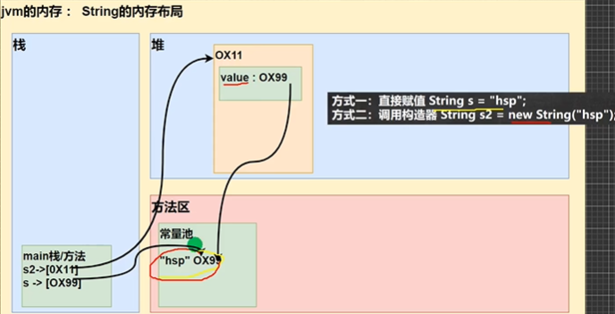

## 面向对象编程

### 类变量和类方法

#### 类变量

类变量也叫静态变量，是该类的所有对象共享的变量，任何一个该类的对象去访问它时，取到的都是相同的值，同样任何一个该类的对象去修改它时，修改的也是同一个变量

1. static(静态)变量是同一个类所有对象共享
2. sataic类变量在类加载的时候就生成

定义语法：
访问修饰符 static 数据类型 变量名（推荐）
static 访问修饰符 数据类型 变量名

#### 类变量与实例变量的区别

类变量是该类的所有对象共享的，而实例变量是每个对象独享的

#### 类方法

类方法也叫静态方法
静态方法使用时可以直接使用

1. 类方法和普通方法都是随着类的加载而加载，将结构信息存储在方法区：类方法中无this的参数，普通方法中隐含着this的参数
2. 类方法可以通过类名调用，也可以通过对象名调用
3. 普通方法和对象有关，需要通过对象名调用
4. 类方法中不允许使用和对象有关的关键字，比如this和super。普通方法可以
5. 静态方法中只能访问静态变量或静态方法
6. 普通成员方法，既可以访问非静态成员，也可以访问静态成员
7. 静态方法可以被继承，但不能被重写

### 理解main方法语法

1. main方法是java虚拟机调用
2. java虚拟机需要调用类的main()方法，所以该方法的访问权限必须是public
3. java虚拟机在执行main()方法时不必创建对象，所以该方法必须是static
4. 该方法接收String类型的数组参数，该数组中保存执行java命令时传递给所运行的类的参数
5. java 执行的程序 参数1 参数2 参数3
6. 在main()方法中，可以直接调用main方法所在类的静态方法或静态属性
7. 不能直接访问该类中的非静态成员，必须创建该类的一个实例对象后，才能通过这个对象去访问类中的非静态成员

### 代码块

又称为初始化块，属于类中的成员，类似于方法，将逻辑语句封装在方法体中，通过{}包围起来
但和方法不同，没有方法名，没有返回，没有参数，只有方法体，而且不用通过对象或类显式调用，而是加载类时，或创建对象时隐式调用

基本语法
[修饰符]{
    代码
};

#### 代码块的好处

1. 相当于另外一种形式的构造器，可以做初始化的操作
2. 代码块调用顺序优先于构造器

#### 细节讨论

1. static代码块也叫静态代码块，作用就是对类进行初始化，而且它随着类的加载而执行，并且只会执行一次，如果是普通代码块，每创建一个对象，就执行
2. 类什么时候被加载
   1. 创建对象实例时
   2. 创建子类对象实例，父类也会被加载
   3. 使用类的静态成员时
3. 普通的代码块，在创建对象实例时，会被隐式的调用。被创建一次，就会调用一次。如果只是使用类的静态成员时，普通代码块并不会执行
4. 创建一个对象时，在一个类调用顺序时
   1. 调用静态代码块和静态属性初始化（两个优先级一样，按定义顺序调用）
   2. 调用普通代码块和普通属性的初始化（两个优先级一样，按定义顺序调用）
   3. 调用构造方法
5. 构造器的最前面其实隐含了super()和调用普通代码块，在类加载时，就执行完毕
6. 创建一个子类时，它们的静态代码块，静态属性初始化，普通代码块，普通属性初始化，构造方法的调用顺序
   1. 父类的静态代码块和静态属性（优先级一样，按定义顺序）
   2. 子类的静态代码块和静态属性（优先级一样，按定义顺序）
   3. 父类的普通代码块和普通属性初始化（优先级一样，按定义顺序）
   4. 父类的构造方法
   5. 子类的普通代码块和普通属性初始化
   6. 子类的构造方法
7. 静态代码块只能调用静态成员，普通代码块可以调用任意成员

### 单例设计模式

单例模式就是采取一定的方法保证在整个的软件系统中，对某个类只能存在一个对象实例，并且该类只提供一个取得其对象实例的方法

1. 构造器私有化=》防止直接new
2. 类的内部创建对象
3. 向外暴露一个静态的公共方法

饿汉式VS懒汉式

1. 二者最主要的区别在于创建对象的时机不同；饿汉式是在类加载就创建了对象实例，而懒汉式是在使用时才创建
2. 饿汉式不存在线程安全问题，懒汉式存在线程安全问题
3. 饿汉式存在浪费资源的可能，因为如果程序员一个对象实例都没有使用，那么饿汉式创建的对象就浪费了，懒汉式是使用时才创建，就不存在这个问题
4. javaSE标准类中，java.lang.Runtime就是单例模式

### final关键字

final可以修饰类、属性、方法和局部变量

1. 当不希望类被继承时，可以用final修饰
2. 当不希望父类的某个方法被子类覆盖/重写时，可以用final关键字修饰
3. 当不希望类的某个属性的值被修改，可以用final
4. 当不希望某个局部变量被修改，可以使用final修饰

#### 细节

1. final修饰的属性又叫常量
2. final修饰的属性在定义时，必须赋值，并且以后不能再修改，赋值可以在如下位置之一
   1. 定义时
   2. 在构造器中
   3. 在代码块中
3. 如果final修饰的属性是静态的，则初始化的位置只能是定义时或在静态代码块，不能在构造器中赋值
4. final类不能继承，但是可以实例化对象
5. 如果类不是final类，但是含有final方法，则该方法虽然不能重写，但是可以被继承
6. 一般来说，如果一个方法以及是final类了，就没必要再将方法修饰成final方法
7. final不能修饰构造方法
8. final和static往往搭配使用，效率更高，底层编译器做了优化处理
9. 包装类（Integer，Double，Boolean等都是final），String也是final类

### 抽象类

当父类的一些方法不能确定时，可以用abstract关键字来修饰该方法，这个方法就是抽象方法，用abstract来修饰该类就是抽象类

1. 用abstract关键字来修饰一个类时，这个类就叫抽象类访问修饰符abstract 类名{}
2. 用abstract关键字来修饰一个方法时，这个方法就是抽象方法 访问修饰符 abstract 返回类型 方法名(参数列表)： //没有方法体
3. 抽象类的价值更多作用是在于设计，是设计者设计好后，让子类继承并实现抽象类()

#### 抽象类细节

1. 抽象类不能被实例化
2. 抽象类不一定要包含abstract方法
3. 一旦类包含了abstract方法，则这个类必须声明为abstract
4. abstract只能修饰类和方法，不能修饰属性和其它的
5. 抽象类可以有任意成员，比如：非抽象方法、构造器、静态属性等待
6. 抽象方法不能有主体，即不能实现
7. 如果一个类继承了抽象类，则它必须实现抽象类的所有抽象方法，除非它自己也声明为abstract类
8. 抽象方法不能使用private、final和static来修饰，因为这些关键字都是和重写相违背的

#### 抽象类-模板设计模式

### 接口

接口就是给出一些没有实现的方法，封装到一起，到某个类要使用的时候，在根据具体情况把这些方法写出来

在jdk8后，可以有默认实现方法，需要使用default关键字修饰，也可以有静态方法

#### 接口细节

1. 接口不能被实例化
2. 接口中所有方法是public方法，接口中抽象方法，可以不同abstract修饰
3. 一个普通类实现接口，就必须将该接口的所有方法都实现
4. 抽象类实现接口，可以不用实现接口的方法
5. 一个类同时可以实现多个接口
6. 接口中的属性只能是final，而且是public static final 修饰符
7. 接口中属性的访问形式：接口名.属性名
8. 一个接口不能继承其他的类，但是可以继承多个别的接口
9. 接口的修饰符只能是public和默认，这点和类的修饰符一样

#### 接口和继承类

接口和继承解决的问题不同

继承的价值在于：解决代码的复用性和可维护性
接口的价值在于：设计好的各种规范，让其他类去实现这些方法

接口比继承更加灵活

接口在一定程度上实现代码解耦

#### 接口多态

1. 多态参数
2. 多态数组
3. 接口存在多态传递现象

### 内部类

一个类的内部又完整的嵌套了另一个类结构。被嵌套的类称为内部类，嵌套其他类的类称为外部类。内部类可以直接访问私有属性，并且可以体现类与类之间的包含关系

#### 内部类的分类

定义在外部类局部位置上

1. 局部内部类（有类名）
2. 匿名内部类（没有类名，重点）

定义在外部类的成员位置上

1. 成员内部类（没用static修饰）
2. 静态内部类（使用static修饰）

#### 局部内部类

局部内部类是定义在外部类的局部位置，比如方法中，并且有类名

1. 可以直接访问外部类的所有成员，包含私有的
2. 不能添加访问修饰符，因为它的地位就是一个局部变量。局部变量不能使用修饰符。但是可以使用final修饰
3. 作用域：仅仅在定义它的方法或代码块中
4. 局部内部类---访问--->外部类的成员【直接访问】
5. 外部类---访问--->局部内部类的成员【创建对象，再访问】
6. 外部其他类---不能访问--->局部内部类
7. 如果外部类和局部内部类的成员方法重名时，默认遵循就近原则，如果想访问外部类的成员，可以使用（外部类名.this.成员）去访问

#### 匿名内部类

匿名内部类是定义在外部类的局部位置，比如方法中

#### 成员内部类

定义在外部类的成员位置，没有static修饰

1. 可以直接访问外部类的所有成员，包含私有的
2. 可以添加任意访问修饰符（pubic，protected，默认，private）
3. 作用域和外部类的其他成员一样，为整个类体
4. 成员内部类---访问--->外部类【直接访问】
5. 外部类---访问--->内部类【创建对象，再访问】
6. 外部其他类---访问--->成员内部类
7. 如果外部类和局部内部类的成员方法重名时，默认遵循就近原则，如果想访问外部类的成员，可以使用（外部类名.this.成员）去访问

#### 静态内部类

定义在外部类的成员位置，并且有static修饰

1. 可以直接访问外部类的所有静态成员，包含私有的，但不能直接访问非静态成员
2. 可以添加任意访问修饰符
3. 作用域：为整个类体
4. 静态内部类---访问--->外部类【直接访问所有静态成员】
5. 外部类---访问--->静态内部类【创建对象，再访问】
6. 外部其他类--->访问--->静态内部类
7. 如果外部类和局部内部类的成员方法重名时，默认遵循就近原则，如果想访问外部类的成员，可以使用（外部类名.this.成员）去访问

## 枚举和注释

### 自定义枚举

1. 构造器私有化
2. 本类内部创建一组对象
3. 对外暴露对象
4. 提供get方法，不提供set

### 枚举关键字

1. 当我们使用enum关键字开发一个枚举类时，默认会继承Enum类，且不能继承其他类了
2. 如果使用无参构造器 创建 枚举对象，则实参列表和小括号都可以省略
3. 当有多个枚举对象时，使用，间隔，最后一个分号结尾
4. 枚举对象必须放在枚举类的行首
5. 枚举类和普通类一样，可以实现接口

### Annotation元注解

1. @Override：限定某个方法，是重写父类方法，该注解只能用于方法
2. @Deprecated：用于表示某个程序元素（类，方法等）已过时
3. @SuppressWarnings：抑制编译器警告
4. @Target是修饰注解的注解

## 异常

1. 异常分为两大类，运行时异常和编译时异常
2. 运行时异常，编译器不要求强制处置的一次。一般是指编程时的逻辑错误
3. 对于运行时异常，可以不做处理，因为很普遍，全处理可能会对程序的可读性和运行效率产生影响
4. 编译时异常，是编译器要求必须处置的异常

### 运行时异常

1. NullPointerException空指针异常。当应用程序试图在需要对象的地方使用null时，抛出该异常
2. ArithmeticException数学运算异常。当出现异常的运算条件时，抛出此异常
3. ArrayIndexOutOfBoundsException数组下标越界异常
4. ClassCastException类型转换异常
5. NumberFormatException数字格式不正确异常

### 编译异常

1. SQLException。操作数据库时，查询表可能发生异常
2. IOException 操作文件时，发生的异常
3. FileNotFoundException 操作一个不存在的文件时，发生异常
4. ClassNotFoundException 加载类，而该类不存在时，异常
5. EOFException 操作文件，到文件末尾，发生异常
6. ILLegalArguementException 参数异常

### 异常处理

1. try-catch-finally。程序员自己处理
2. throws。

#### try-catch处理异常

1. 如果异常发生了，则异常发生后面的代码不会执行，直接进入catch块
2. 如果异常没有发生，则顺序执行try的代码块，不会进入到catch
3. 如果希望不管是否发生异常，都执行某段代码，则使用finally
4. 可以有多个catch，捕获不同的异常，要求父类异常在后，子类异常在前
5. 可以进行try-finally配合使用，这种用法相当于没有捕获异常，因此程序会直接崩掉

#### try-catch-finally执行顺序

1. 如果没有出现异常，则执行try块中所有语句，不执行catch块中语句，如果有finally，最后还需要执行finally里面的语句
2. 如果出现异常，则try块中异常发生后，剩下的语句不再执行。将执行catch块中的语句，如果有finally，最后还需要执行finally里面的语句

#### throws异常处理

1. 对于编译异常，程序中必须处理，比如try-catch或者throws
2. 对于运行时异常，程序中如果没有处理，默认就是throws的方式处理
3. 子类重写父类的方法时，对抛出异常的规定：子类重写的方法所抛出的异常类型要么和父类抛出的异常一致，要么为父类抛出的异常的类型的子类型
4. 在throws过程中，如果有方法try-catch，就相当于处理异常，就可以不必throws

#### throw和throws的区别

1. throws是异常处理的一种方式，在方法声明出，后面跟异常类型
2. throw是手动生成异常对象的关键字，在方法体中，后面跟异常对象

## 常用类

### 包装类

#### 包装类和基本数据类型的转换

1. jdk5前手动装箱和拆箱方式，装箱；基本数据类型->包装类型，反之，拆箱
2. jdk5以后的自动装箱和拆箱方式
3. 自动装箱底层调用的是valueOf方法

### String类

1. String对象用于保存字符串，也就是一组字符序列
2. 字符串常量对象时用双引号扩起的字符序列
3. 字符串的字符使用Unicode字符编码，一个字符占两个字节
4. String类较常用构造方法
5. String是一个final类，代表不可变的字符序列
6. 字符串是不可变的，一个字符串对象一旦被分配，其内容是不可变的

#### 两种创建String对象的区别

方式一：直接赋值String s = "hsp";
方式二：调用构造器 String s2 = new String("hsp");

1. 方式一：先从常量池查看是否有"hsp"数据空间，如果有，直接指向；如果没有则重新创建，然后指向。s最终指向的是常量池的空间地址
2. 方式二：先在堆中创建空间，里面维护了value属性，指向常量池的hsp空间。如果常量池没有"hsp"，重新创建，如果有，直接通过value指向。最终指向的是堆中的空间地址

#### StringBuffer

代表可变的字符序列，可以对字符串内容进行增删

StringBuffer保存的是字符串变量，里面的值可以更改，每次更新实际上可以更新内容，不用更新地址

#### StringBuilder

一个可变的字符序列。不保证同步，用在字符串缓冲区被单个线程使用

### Calendar

1. Calendar是一个抽象类，构造器是private

## 集合

### Collection接口

#### List

1. List集合类中元素有序、且可重复
2. List集合中的每个元素都有其对应的顺序索引，即支持索引
3. List容器中的元素都对应一个整数型的序号记载其在容器中的位置，可以根据序号存取容器中的元素

##### ArrayList

1. 可以加入null，并且多个
2. 是由数组来实现数据存储的
3. 基本等同于Vector，除了线程不安全
4. 当创建ArrayList对象时，如果使用的是无参构造器，则初始elementData容量为0，第一次添加，则扩容elementData为10，如需要再次扩容，则扩容elementData为1.5倍
5. 如果使用的是指定大小的构造器，则初始elementData容量为指定大小，如果需要扩容，则直接扩容elementData为1.5倍

##### LinkedList

1. 实现了双向链表和双端队列特点
2. 可以添加任意元素（元素可以重复），包括null
3. 线程不安全
4. remove()默认删除第一个

##### Vector

1. 底层也是对象数组
2. Vector是线程同步的，即线程安全
3. 如果是无参构造，则初始容量是10，每次按2倍扩容
4. 如果是有参构造，则初始容量为指定大小，每次按2倍扩容

#### Set

1. 无序（添加和取出的顺序不一致），没有索引
2. 不允许重复元素，所以最多包含一个null

##### HashSet

1. HashSet实现了Set接口
2. 实际上是HashMap，HashMap底层是(数组+链表+红黑树)
3. 可以存放null值，但是只能有一个null
4. HashSet不保证元素是有序的，取决于hash后，再确定索引的结果
5. 不能有重复元素/对象

HashSet添加元素底层实现

1. 添加一个元素时，先得到hash值，会转成->索引值
2. 找到存储数据表table，看这个索引位置是否已经存放的有元素
3. 如果没有，直接加入。如果有，调用equals比较，如果相同，就放弃添加，如果不相同，则添加到最后
4. 在Java8中，如果一条链表的元素个数超过TREEIFY_THRESHOLD（默认是8），并且table的大小 >= MIN_TREEIFY_CAPACITY(默认64)就会进行树化

扩容机制

1. 第一次添加时，table数组扩容到16，临界值是16*加载因子(loadFactor)是0.75=12
2. 如果table数组使用到了临界值12，就会扩容到16*2=32，新的临界值就是32*0.75=24，依次类推
3. 在Java8中，如果一条链表的元素个数到达TREEIFY_THRESHOLD(默认是8)并且table的大小 >= MIN_TREEIFY_CAPACITY(默认64)，就会进行树化，否则仍然采用数组扩容机制

去重机制
hashCode() + equals()，底层先通过存入对象，进行运算得到一个hash值，通过hash值得到对应的索引，如果发现table索引所在的位置，没有数据，就直接存放，如果有数据，就进行equals比较，不相同就加入，否则不加入

##### LinkedHashSet

1. 是HashSet的子类
2. 底层是LinkedHashMap，底层维护了一个数组+双向链表
3. 根据元素的hashCode值来决定元素的存储位置，同时使用链表维护元素的次序，使得元素看起来是以插入顺序保存的
4. 不允许添加重复元素

##### TreeSet

去重机制
如果你传入了一个Comparator匿名对象，就使用实现的compare去重，如果方法返回0，就认为是相同的，不添加。如果没有传入一个Comparator匿名对象，则以添加的对象实现的Comparable接口的compareTo去重

### Map接口

1. 与Collection并列存在，用于保存具有映射关系的数据
2. Map中的key和value可以是任何引用类型的数据，会封装到HashMap$Node对象中
3. Map中的key不允许重复
4. Map中的value可以重复
5. Map中的key可以为null，value也可以为null，key为null只能有一个，value为null可以多个
6. 常用String类作为Map的key

六大遍历方式

1. containsKey
2. keySet：获取所有的键
3. entrySet：获取所有关系

#### HashMap

1. 底层是数组+链表+红黑树
2. 是以key-val对的方式来存储数据
3. key不能重复，但是值可以重复，允许使用null键和null值
4. 如果添加相同的key，则会覆盖原来的key-val，等同于修改
5. 不保证映射的顺序，底层是以hash表的方式来存储的
6. 没有实现同步，线程不安全

#### Hashtable

1. 存放的元素是键值对：即K-V
2. 键和值不能为null
3. hashTable是线程安全的
4. 底层有数组Hashtable$Entry[]初始化大小为11
5. 临界值 threshold 8 = 11 * 0.75
6. 扩容为2倍+1

#### Properties

1. Properties类继承自Hashtable类并且实现了Map接口，也是使用一种键值对的形式来保存数据
2. 键和值不能为null

#### TreeMap

### Collections工具类

1. 是一个操作Set、List和Map等集合的工具类
2. 提供了一系列静态的方法对集合元素进行排序、查询和修改等操作

## 泛型

1. 传统的方法不能对加入到集合中的数据类型进行约束
2. 传统的方法遍历的时候需要进行类型转换，如果集合中数据量较大，对效率有影响

使用泛型好处

1. 编译时，检查添加元素的类型，提高了安全性
2. 减少了类型转换的次数，提高效率
3. 不再提示编译警告

泛型介绍

1. 泛型又称参数化类型，解决数据类型的安全性问题
2. 在类声明或实例化时只要指定好需要的具体的类型即可
3. Java泛型可以保证如果程序在编译时没有发出警告，运行时就不会产生异常。同时，代码更加简洁、健壮
4. 可以在类声明时通过一个标识表示类中某个属性的类型，或者是某个方法的返回值的类型，或者是参数类型、
5. 泛型不具备继承性

细节

1. 普通成员可以使用泛型
2. 使用泛型的数组，不能初始化
3. 静态方法中不能使用类的泛型
4. 泛型类的类型，是在创建对象时确定的
5. 如果在创建对象时，没有指定对象，默认为Object

## Java绘图技术

1. Component类提供了两个和绘图相关最重要的方法
   1. paint(Graphics g)绘制组件的外观
   2. repaint()刷新组件的外观
2. 当组件第一次在屏幕显示的时候，程序会自动的调用paint()方法来绘制组件
3. 以下情况paint()将会被调用
   1. 窗口最小化再最大化
   2. 窗口的大小发生变化
   3. repaint函数被调用

## 程序进程线程
