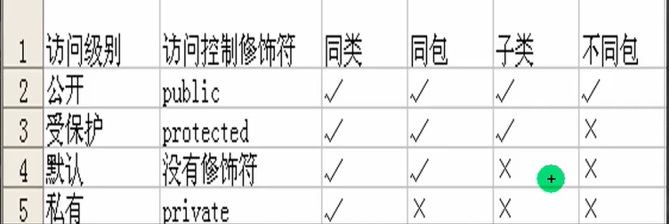
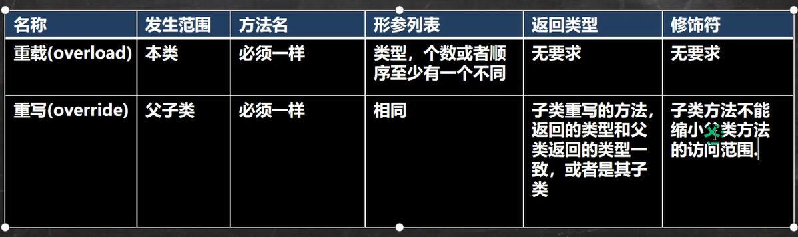

## Java常见基础知识

### Java概述

#### JDK,JRE,JVM的关系

JDK(Java Development Kits Java开发工具包) = JRE(Java Runtime Environment Java运行环境)+ java开发工具
JRE = JVM(Java Virtual Machine Java虚拟机) + 核心类库

#### Java编写步骤

1. 编写java的源代码
2. javac 编译，得到对应的 .class 字节码文件
3. java 运行，本质就是把 .class 加载到jvm 运行

#### Java编写7个规范

1. 类，方法的注释，使用javadoc的方式，即文档注释
2. 非javadoc注释，往往是对代码的说明（给程序的维护者），说明如何修改，注意事项
3. 使用tab，整体将代码右移，使用shift+tab整体左移
4. 运算符和 = 的两边，给空格，代码看上去清楚
5. 源码文件使用 utf-8编码
6. 行宽字符不要超过 80
7. 代码编程风格有两种风格

### 变量

#### 变量使用注意

1. 变量表示内存中的一个存储区域
2. 该区域有自己的名称和类型
3. 变量必须先声明，后使用，即有顺序
4. 该区域的数据/值可以在同一类型范围内不断变化
5. 变量在同一个作用域内不能重名
6. 变量=变量名+值+数据类型

#### 程序中 +号使用

当左右两边都是数值型时，则做加法运算
当左右两边有一方为字符串，则做拼接运算
System.out.println("100"+98);//10098
System.out.println(100+"98");/10098

#### 数据类型

* 基本数据类型
  * 数值型
    * [整数类型(byte[1],short[2],int[4],long[8])](#Integer)
    * [浮点类型(float[4],double[8])](#Float)
  * [字符型](#Char)
        char[2]
  * [布尔型](#boolean) 
        boolean[1]
* 引用数据类型
  * 类(class)
  * 接口(interface)
  * 数组([])

##### <span id="Integer">整数类型</span>

1. Java各整数类型有固定的范围和字段长度，不受具体OS的影响，以保证java程序的可移植性
2. Java的整型常量默认为int型，声明long型变量须后加“l”或“L”
3. java程序中变量声明为int型，除非不足以表示大数，才使用long
4. bit：计算机中的最小存储单位。byte：计算机中基本存储单元

##### <span id="Float">浮点类型</span>

1. 与整数类型类似，Java浮点类型也有固定的范围和字段长度，不受具体OS的影响
2. Java的浮点型常量默认为double型，声明float型常量，须后加“f”或“F"
3. 浮点型常量两种表示形式
   1. 十进制数形式：如5.12  512.0f .512
   2. 科学计数法形式：5.12e2
4. 通常情况下，应该使用double型，因为它比float型更精确
5. 浮点数使用陷阱：2.7 和 8.1/3 比较

##### <span id="Char">字符类型</span>

1. 字符常量是用单引号('')括起来的单个字符
2. Java中还允许使用转义字符'\'来将其后的字符转变为特殊字符型常量
3. 在java中，char的本质是一个整数，在输出时，是unicode码对应的字符
4. 可以直接给char赋一个整数，然后输出时，会按照对应的unicode字符输出
5. char类型是可以进行运算的，相当于一个整数，因为它都对应有Unicode码

##### <span id="boolean">布尔类型</span>

1. 布尔类型也叫boolean类型，boolean类型数据只允许取值true和false，无null
2. boolean类型占1个字节
3. boolean类型适用于逻辑运算，一般用于程序流程控制

#### 自动类型转换

当java程序在进行赋值或运算时，精度小的类型自动转换为精度大的数据类型，为自动类型转换

##### 基本数据类型转换

1. 有多种类型的数据混合运算时，系统首先自动将所有数据转换成容量最大的那种数据类型，然后再进行计算
2. 当我们把精度大的数据类型赋值给精度小的数据类型时，就会报错，反之就会进行自动类型转换
3. (byte,short)和char之间不会相互自动转换
4. byte,short,char 他们三者可以计算，在计算时首先转换为int类型
5. boolean不参与转换
6. 自动提示原则：表达式结果的类型自动提升为 操作数中最大的类型

##### 强制类型转换

1. 当进行数据的大小从大-->小，就需要使用强制转换
2. 强转符号只针对最近的操作数有效，往往会使用小括号提升优先级
3. char类型可以保存int的常量值，但不能保存int的变量值，需要强转
4. byte和short类型在进行运算时，当做int类型处理

### 运算符

#### 算术运算符

取模%的本质 a%b = a - a / b * b

#### 赋值运算符

#### 关系运算符

#### 逻辑运算符

&&与&的区别(||与|类似)

1. &&短路与：如果第一个条件为false，则第二个条件不会判断，最终结果为false
2. &逻辑与：不管第一个条是否为false，第二个条件都要判断
3. 开发中，基本使用&&

#### 位运算符

>>> 无符号右移  >> 算术右移 << 算术左移

#### 三元运算符

基本语法：条件表达式?表达式1：表达式2

表达式1和表达式2要为可以赋给接收变量的类型（或可以自动转换）

#### 进制

##### n进制转10进制

规则：从最低位开始，将每个位上的数据提取出来，乘以n的(位数-1)次方，然后求和

##### 10进制转n进制

规则：将该数不断除以n，直到商为0为止，然后将每步得到的余数倒过来，就是对应的n进制

##### 2进制转n进制

规则：从低位开始，将二进制数$sqrt(n)$位一组，转成对应的n进制数即可

##### n进制转2进制

规则：将n进制数每一位，转成对应点一个$sqrt(n)$位二进制数即可

#### 原码反码补码

1. 二进制的最高位是符号位：0表示正数，1表示负数
2. 正数的原码，反码，补码都一样
3. 负数的反码=它的原码符号位不变，其他位取反
4. 负数的补码=它的反码+1，负数的反码=负数的补码-1
5. 0的反码，补码都是0
6. java没有无符号数，换言之，java中的数都是有符号的
7. 在计算机运算的时候，都是以补码的方式来运算的
8. 但我们看运算结果的时候，要看它的原码

### 控制结构

#### 顺序结构

程序从上到下逐行地执行，中间没有任何判断和跳转

#### 分支控制

##### if else 分支结构

##### switch 分支结构

注意case穿透，当没有break时，会跳到下一个执行语句，一直下去

1. 表达式数据类型，应和case后的常量类型一致，或者是可以自动转成可以互相比较的类型，比如输入的是字符，而常量是int
2. switch中表达式的返回值必须是：(byte,short,int,char,enum,String)
3. case子句中的值必须是常量，而不能是变量
4. default子句是可选的，当没有匹配的case时，执行default
5. break语句用来在执行完一个case分支后使程序跳出switch语句块；如果没有写break，程序会顺序执行到switch结尾

#### 循环控制

##### for循环控制

基本语法
for(循环变量初始化;循环条件;循环变量迭代){
  循环操作(可以多条语句);
}

1. 循环条件是返回一个布尔值的表达式
2. for(;循环判断条件;)中的初始化和变量迭代可以写到其它地方，但是两边的分号不能省略
3. 循环初始值可以有多条初始化语句，但要求类型一样，并且中间用逗号隔开，循环变量迭代也可以由多条变量迭代语句，中间用逗号隔开

##### while循环控制

基本语法
while(循环条件){
  循环体(语句);
  循环变量迭代;
}

##### do-while循环控制

do{
  循环体(语句);
  循环变量迭代;
}while(循环条件)

##### break

```java
lable1:
for(int j = 0;j < 4;j++){
  lable2:
  for(int i = 0;i < 10;i++){
    if(i == 2){
      break lable1;
    }
    System.out.println("i="+i);
  }
}
```

1. break 语句可以指定退出哪层
2. lable1是标签，由程序员指定
3. break后指定到哪个lable就退出到哪里
4. 在实际的开发中，尽量不要使用标签
5. 如果没有指定break，默认退出最近的循环体

### 数组、排序和查找

#### 动态初始化

#### 静态初始化

语法：数据类型 数组名[] = {元素值，元素值，，，}

#### 数组使用注意事项和细节

1. 数组是多个相同类型数据的组合，实现对这些数据的统一管理
2. 数组中的元素可以是任何数据类型，包括基本类型和引用类型，但是不能混用
3. 数组创建后，如果没有赋值，有默认值int 0,short 0,byte 0,long 0,float 0.0,double 0.0,char \u0000,boolean false,String null
4. 使用数组的步骤1.声明数组并开辟空间 2 给数组各个元素负债 3 使用数组
5. 数组的下标是从0开始
6. 数组下标必须是在指定范围内使用，否则报：下标越界异常
7. 数组属引用类型，数组型数据是对象

#### 数组赋值机制

1. 基本数据类型赋值，这个值就是具体的数据，而且相互不影响
2. 数组在默认情况下是引用传递，赋的值是地址

#### 排序

##### 内部排序

指将需要处理的所有数据都加载到内部存储器中进行排序

##### 外部排序

数据量过大，无法全部加载到内存中，需要借助外部存储进行排序

#### 二维数组

##### 动态初始化

方式1 语法：类型[][] 数组名 = new 类型[大小][大小]

方式2
先声明：类型 数组名[][]
再定义数组名 = new 类型 [大小][大小]
赋值

### 面向对象

#### 类与对象

Java内存的结构分析

1. 栈：一般存放基本数据类型（局部变量）
2. 堆：存放对象
3. 方法区：常量池，类加载信息

形参列表

1. 一个方法可以有0个参数，也可以有多个参数，中间用逗号隔开
2. 参数类型可以为任意类型，包含基本类型或引用类型
3. 调用带参数的方法时，一定对应着参数列表传入相同类型或兼容类型的参数
4. 方法定义时的参数统称为形式参数，简称形参；方法调用时的传入参数称为实际参数，简称实参，实参和形参的类型要一致或兼容、个数、顺序必须一致

方法调用细节

1. 同一个类中的方法调用：直接调用即可
2. 跨类中的方法A类调用B类方法：需要通过对象名调用
3. 跨类的方法调用和方法的访问修饰符相关

#### 递归

##### 递归重要规则

1. 执行一个方法时，就创建一个新的受保护的独立空间（栈空间）
2. 方法的局部变量是独立的，不会相互影响，比如n变量
3. 如果方法中使用的是引用类型变量，就会共享该引用类型的数据
4. 递归必须向退出递归的条件逼近，否则就是无限递归
5. 当一个方法执行完毕，或者遇到return，就会返回，遵守谁调用，就将结果返回给谁，同时当方法执行完毕或者返回时，该方法也就执行完毕

#### 方法重载

同一个类中，多个同名方法的存在，但要求形参列表不一致

重载的好处

1. 减轻了起名的麻烦

注意事项

1. 方法名必须相同
2. 参数列表必须不同
3. 返回类型无要求

#### 可变参数

1. 可变参数的实参可以为0个或任意多个
2. 可变参数的实参可以为数组
3. 可变参数的本质就是数组
4. 可变参数可以和普通类型的参数一起放在形参列表，但必须保证可变参数在最后
5. 一个形参列表中只能出现一个可变参数

#### 构造器

构造方法又叫构造器，是类的一种特殊的方法，它的主要作用是完成对新对象的初始化

##### 特点

1. 方法名和类名相同
2. 没有返回值
3. 在创建对象时，系统会自动的调用该类的构造器完成对对象的初始化

##### 注意事项

1. 一个类可以定义多个不同的构造器，即构造器重载
2. 构造器名和类名要相同
3. 构造器没有返回值
4. 构造器是完成对象的初始化，并不是创建对象
5. 在创建对象时，系统自动的调用该类的构造方法
6. 如果程序员没有定义构造器，系统会自动给类生成一个默认无参构造方法
7. 一旦定义了自己的构造器，默认的构造器就覆盖了，就不能再使用默认的无参构造器，除非显式的定义一下

#### 对象创建流程

1. 加载类信息，只会加载一次
2. 在堆中分配空间(地址)
3. 完成对象初始化（默认初始化，显式初始化，构造器初始化）
4. 对象在堆中的地址，返回给p(p是对象名,也可理解为对象的引用)

#### this关键字

1. this关键字可以用来访问本类的属性、方法、构造器
2. this用于区分当前类的属性和局部布局
3. 访问成员方法的语法：this.方法名
4. 访问构造器语法：this(参数列表)；只能在构造器中使用(即只能在构造器中访问另外一个构造器，必须放在第一条语句)
5. this不能在类定义的外部使用，只能在类定义的方法中使用

#### 包

三大作用

1. 区分相同名字的类
2. 当类很多时，可以很好的管理类
3. 控制访问范围

命名规则：只能包含数字、字母、下划线、小圆点，不能用数字开头，不能是关键字或保留字

命名规范：com.公司名.项目名.业务模块名

#### 访问修饰符

公开级别：用public修饰
受保护级别：用protected修饰，对子类和同一个包中的类公开
默认级别：没有修饰符号，向同一个包的类公开
私有级别：用private修饰，只有类本身可以访问，不对外公开


1. 修饰符可以用来修饰类中的属性，成员方法以及类
2. 只有默认的和public才能修饰类，并且遵循上述访问权限的特点
3. 成员方法的访问规则和属性完全一样

#### 封装

封装就是把抽象出的数据[属性]和对数据的操作[方法]封装在一起，数据被保护在内部，程序的其他部分只有通过被授权的操作[方法]，才能对数据进行操作

##### 封装的理解与好处

1. 隐藏实现细节
2. 可以对数据进行验证，保证安全合理

##### 封装实现步骤

1. 将属性进行私有化private 【不能直接修改属性】
2. 提供一个公共的(public)set方法，用于对属性判断并赋值
3. 提供一个公共的get方法，用于获取属性的值

#### 继承

##### 继承基本语法

class 子类 extends 父类{
}
子类就会自动拥有父类定义的属性和方法
父类又叫超类，基类
子类又叫派生类

##### 细节

1. 子类继承了所有的属性和方法，非私有的属性和方法可以在子类直接访问，但是私有属性不能在子类直接访问，要通过父类提供公共的方法去访问
2. 子类必须调用父类的构造器，完成父类的初始化
3. 当创建子类对象时，不管使用子类的哪个构造器，默认情况下总会去调用父类的无参构造器，如果父类没有提供无参的构造器，则必须在子类的构造器中用super去指定使用父类的哪个构造器完成对父类的初始化工作，否则，编译不会通过
4. 如果希望指定去调用父类的某个构造器，则显式的调用一下
5. super在使用时，需要放在构造器第一行
6. super()和this()都只能放在构造器第一行，因此这两个方法不能共存在一个构造器
7. java所有类都是Object类的子类
8. 父类构造器的调用不限于直接父类！将一直往上追溯到Object类
9. 子类最多只能继承一个父类（指直接继承），即java中是单继承机制
10. 不能滥用继承，子类和父类之间必须满足is-a的逻辑关系

#### super关键字

1. 访问父类的属性，但不能访问父类的private属性 super.属性名
2. 访问父类的方法，不能访问父类的private方法 super.方法名(参数列表)
3. 访问父类的构造器：super(参数列表);只能放在构造器的第一句
4. 当子类中有和父类中的成员(属性和方法)重名时，为了访问父类的成员，必须通过super。如果没有重名，使用super、this、直接访问时一样的效果
5. super的访问不限于直接父类，如果爷爷类和本类中有同名的的成员，也可以使用super去访问爷爷类的成员；如果多个基类中都有同名的成员，使用super访问遵循就近原则

#### 方法重写/覆盖(override)

1. 子类的方法的形参列表，方法名称，要和父类方法的参数，方法名称完全一样
2. 子类方法的返回类型和父类方法返回类型一样，或者是父类返回类型的子类
3. 子类方法不能缩小父类方法的访问权限



#### 多态

##### 多态的具体实现

1. 方法的多态。重写和重载就体现多态
2. 对象的多态
   1. 一个对象的编译类型和运行类型可以不一致
   2. 编译类型在定义对象时，就确定了，不能改变
   3. 运行类型是可以改变的
   4. 编译类型看定义时 = 号 的左边，运行类型看 = 号的 右边

##### 多态细节

多态的前提是：两个对象存在继承关系
多态的向上转型

1. 本质：父类的引用指向了子类的对象
2. 语法：父类类型 引用名 = new 子类类型();
3. 特点：编译类型看左边，运行类型看右边。可以调用父类中的所有成员，不能调用子类中的特有成员；最终运行效果看子类的具体实现

多态的向下转型

1. 语法：子类类型 引用名 = （子类类型）父类引用;
2. 只能强转父类的引用，不能强转父类的对象
3. 要求父类的引用必须指向的是当前目标类型的对象
4. 可以调用子类类型中所有成员

属性没有重写之说，属性的值看编译类型
instanceOf比较操作符，用于判断对象的运行类型是否为xx类型或xx类型的子类型

##### 动态绑定机制

1. 当调用对象方法时的时候，该方法会和对象的内存地址/运行类型绑定
2. 当调用对象属性时，没有动态绑定机制，哪里声明，哪里使用

##### 多态应用

多态数组：数组定义类型为父类类型，里面保存的实际元素类型为子类类型
多态参数：方法定义的形参类型为父类类型，实参类型运行子类类型

#### Object类详解

##### equals方法

1. ==：既可以判断基本类型，又可以判断引用类型
2. ==：如果判断基本类型，判断的是值是否相等
3. ==：如果判断引用类型，判断的是地址是否相等，即判定是不是同一个对象
4. equals：是Object类中的方法，只能判断引用类型
5. equals默认判断的是地址是否相等，子类中往往重写该方法，用于判断内容是否相等

##### hashCode方法

1. 提高具有哈希结构的容器的效率
2. 两个引用，如果指向的是同一个对象，则哈希值肯定是一样的
3. 两个引用，如果指向的是不同对象，则哈希值是不一样的
4. 哈希值主要根据地址号来的！，不能完全将哈希值等价于地址

##### toString方法

默认返回：全类名+@+哈希值的十六进制，子类往往重写toString方法，用于返回对象的属性信息

##### finalize方法

1. 当对象被回收时，系统自动调用该对象的finalize方法，子类可以重写该方法，做一下释放资源的操作
2. 什么时候回收：当某个对象没有任何引用时，则jvm就认为这个对象是一个垃圾对象，就会使用垃圾回收机制来销毁对象，在销毁该对象前，会先调用finalize方法
3. 垃圾回收机制的调用，是由系统来决定，也可以通过System.gc()主动触发垃圾回收机制

##### 断点调试

在断点调试过程中，是运行状态，是以对象的运行类型来执行的