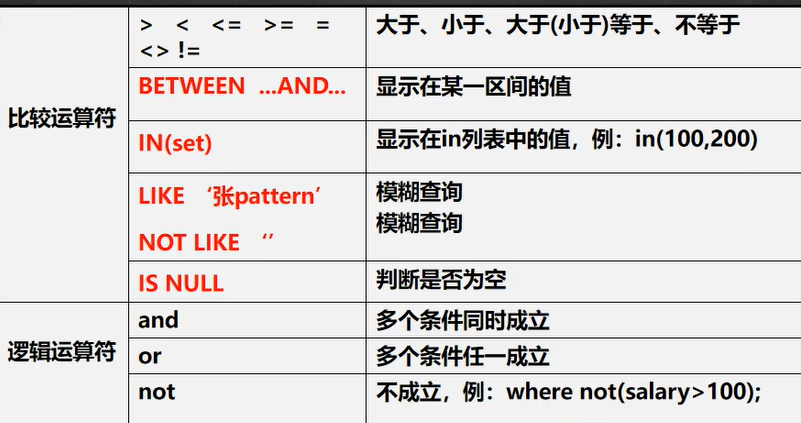
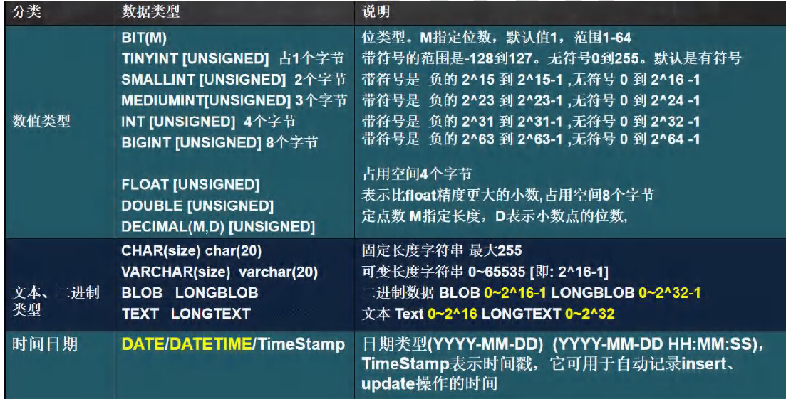
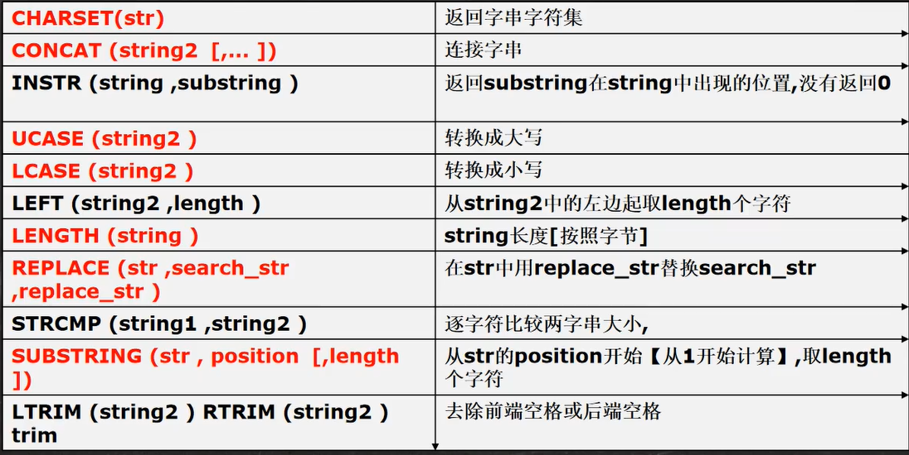
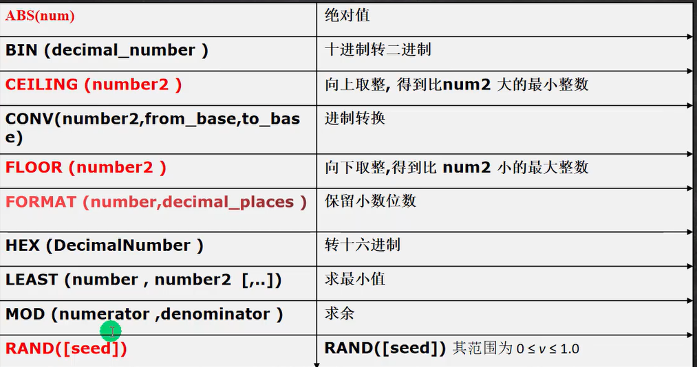
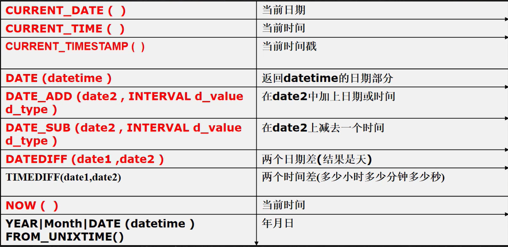
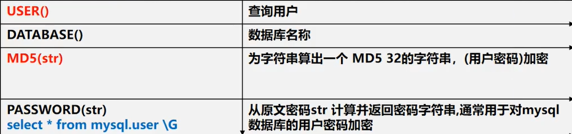
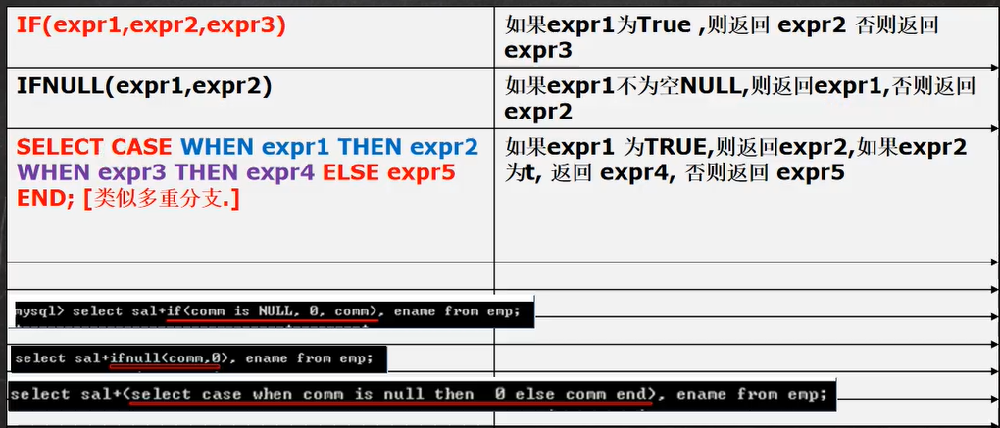
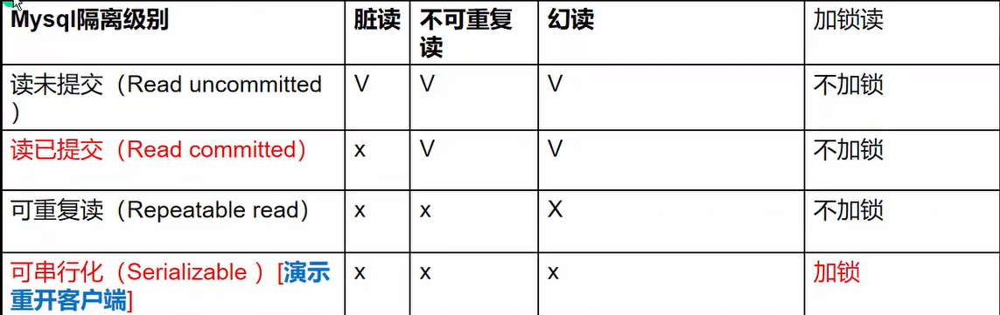

MySQL的较为系统语法学习。
<!--more-->
## MySQL语法

### 启动mysql数据库服务

1. 服务方式启动（界面）
2. net stop mysql服务名
3. net start mysql服务名

### 命令行窗口连接MySQL数据库

> mysql -u root(用户名) -P 端口(默认3306) -h 主机名(默认本机) -p(密码)  //(ryb)

**先输入set names gbk;**

### 数据库操作

#### 查看数据库

> show databases;

#### 创建数据库

**查看字符集**

> show charset;

**查看可用校对规则**
> show collation;

**创建数据库**

> create database 数据库名 [charset 字符集名称] [COLLATE 校对规则（一般不写）];

例：create database php charset utf8;

1. COLLATE默认为utf8_general_ci 不区分大小写，utf8_bin 区分大小写

**查看数据库**

> show databases

**显示数据库创建语句**

> show create database 数据库名;

其实就是能看到指定数据的完整创建语句（含默认值的选项，比如charset，collate）。

#### 删除现有数据库

> drop database 数据库名 [if exists];

#### 修改数据库

> alter database 数据库名 charset 新的字符集名称 collate 新的校对规则名;

#### 选择(使用)某个数据库

> use 数据库名;

### 数据表操作

#### 显示所有表

> show tables;

#### 创建数据表

> create table 数据表名1 （字段1，字段2....) [charset=字符集] [type/engine=表类型];

* 字段形式为： 字段名 字段类型 [字段属性]
* 字符集类型：utf,gbk,gb2312,big5等。默* 认是数据库字符集，可用不写
* 表类型：InnoDB,MyIsam等，默认是InnoDB，可以不写。

#### 查看数据表结构

> desc 表名;

#### 查看数据表的创建语句

> show create table 表名;

#### 删除数据表

> drop table 表名;

#### 修改数据表

**添加列：**
> alter table 表名 add 字段名 字段类型 [字段属性...] [after 某字段名 或first];

默认放到最后
**修改列**
> alter table 表名 change 旧字段名 新字段 字段类型 [字段属性...];
> alter table 表名 modify 要修改的字段名 字段类型 [字段属性..];

**删除列**
> alter table 表名 drop 要删除的字段名;

**修改表名**
> Rename table 表名 to 新表名

**修改字符集**
> alter table 表名 character set 新的字符集;

### 数据操作

#### 插入数据

> insert into 表名 (字段名1，字段名2，...) values (数据1，数据2，...);

#### 查询数据

> select [DISTINCT] 字段名1,字段名2,.... from 表名 [where 条件];

where子句常用运算符


#### 删除数据

> delete from 表名 [where 条件];

#### 修改数据

> update 表名 set 字段名1 = 新值，字段名=新值2，....[where 条件];

### 数值类型



#### 整型

> tinyint [1个字节] [-128,127] 或 [0,255]
> smallint [2个字节][-32768,32767]
> mediumint [3个字节][-8388608,8388607]
> int [4个字节]
> bigint [8个字节]

#### 小数型

> float[单精度 4个字节]
> double[双精度 8个字节]
> decimal[M,D] (M是小数位数的总数，D是小数点后面的位数) [大小不确定]

#### 二进制数据类型

> blob[0~2^16-1]
> longblob[0~2^32-1]

#### 日期时间型

> date 格式"0000-00-00"
> time 格式"00:00:00"
> datatime [年月日 时分秒 YYYY-MM-DD HH:mm:ss]
> timestamp 格式"0000-00-00 00:00:00"
> year 格式"0000"

#### 文本类型(字符串类型)

##### char

4个字符数，固定长度，最长设定255个字符

##### varchar

可变长度，最长65532个字符
本身还需要占用1-3个字节来记录存放内容长度

##### text

不能设置长度。
存储较长文本内容。,最长65535个字符
mediumtext(100万字）
longtext(40亿左右）
不能设置默认值

##### enum

枚举类型（单选项）
最多65535个选项

##### set

多选类型

#### 列属性

1. 一个列可以有多个列属性；
2. 多个列属性空格隔开就行；

* null,not null
  * 设定为空，或非空，表明该列数据是否可为空值（null）。
* default
  * 用于设定列默认值（不给值或给空值null,就会自动使用该值）
  * 使用形式：default 默认值。
* primary key
  * 用于设定主键
  * 主键就是一个表中数据的“关键值”，通过该关键值就可以找到该特定的数据行。
  * 一个表的主键值不能重复（相等），比如文章表中的文章编号id，比如用户表中的用户名。
  * 主键字段必须有值（不能为空）。
  * 一个表只能有一个主键（但一个主键可以是1个字段或2个以上的字段联合构成）
* foreign key
  * 用于设定外键
  * 外键指向的表的字段，要求是primary key或者是unique
  * 表的类型是innodb，这样的表才支持外键
  * 外键字段的类型要和主键字段的类型一致（长度可以不同）
  * 外键字段的值，必须在主键字段中出现过，或者为null
  * 一旦建立主外键的关系，数据不能随意删除了
* auto_increment
  * 用于设定一个整数字段的值是“自增长的”，通常用于一个表中的数据行的编号（比如文章编号）
  * 默认情况下自增长值从1开始
  * 一个表只能设定一个字段为自增长特性
* unique key
  * 用于设定“唯一键”的特性。
  * 唯一键表示一个表中的某字段的值是“唯一的”，“不重复的”。
  * 唯一键有点类似primay key，但其值可以为空（null）
* check
* comment
  * 用于设定字段的说明性内容，类似注释，但又不是注释（属于有效的代码）
  * 使用形式：comment ‘文字内容'

### 高级查询

#### 语法概述

```sql
select 子句
    [from 子句]
    [where 子句]
    [group by 子句]
    [having 子句]
    [order by 子句]
    [limit 子句]
    ;
```

#### 查询出的数据字段可以使用别名

例：
select 1 as dl,2+3 as d2;

#### 合计/统计函数

> select count(*)|count(列名) from table_name [where ...] (如果为null不会统计 )
> select sum(列名) from table_name [where ...]
> select avg(列名) from table_name [where ...]
> select max/min(列名) from table_name [where ...]

#### 字符串函数



#### 数学函数



#### 日期函数



#### 加密函数和系统函数



#### 流程控制函数



#### 使用distinct消除查询结果重复行

**语法形式：**
> select distinct 字段1，字段2,... from 表名;

#### 运算符

##### like模糊查找运算符

用于判断某个字符型字段的值是否包含给定的字符。
**语法形式：**
> xxx字段 like '%关键字%';

##### between 范围限定运算符

用于判断某个字段的值是否在给定的两个数据范围之间。
**语法形式：**
> xxx字段 between 值1 and 值2;

##### in运算符

用于判断某个字段的值是否在给出的若干个“可选值”范围。
**语法形式：**
> xxx字段 in (值1，值2,...);

##### is运算符

用于判断一个字段中的是“是否存在”只有两种写法：
> where content is null;
> where content is not null;

#### group by子句

**语法形式：**
> group by 字段1，字段2，...;

**含义：**
表示对所取得的数据，以所给定的字段来进行分组。
最后的结果就是将数据分成了若干组，每组作为一个“整体”成为一行数据。

#### having 子句

**语法形式：**
> having 筛选条件

**含义：**
having 的含义跟where的含义一样，只是having是用于对group by分组的结果进行的条件筛选。

#### order by子句

**语法形式：**
> order by 字段1 【asc或desc】,字段2 [asc或desc];

**含义**
对前面所取得的数据按给定的字段进行排序
排序方式有：正序：asc，倒序desc；

#### limit子句

**语法形式：**
> limit 起始行号，行数

**说明：**

1. limit表示对前面所取得的数据再进行数量上的筛选，取得从某行开始的多少行。
2. 行号就是前面所取得数据的“自然顺序号”，从0开始算起一一注意不是id，或任何其他实际数据。
3. 起始行号可以省略，此时limit后只用一个数字，表示从第0行开始去除多少行。
4. limit子句通常用到“翻页”功能上，用于找出“第n页”的数据，其公式为：limit (n-1) * pageSize,pageSize; 其中pageSize表示每页显示的条数。

### 高级插入

#### 同时插入多行记录

**语句形式：**
> insert into 表名（字段，字段2，...） values (值1，值2，..),(值1，值2，...),...;

#### 插入查询的结果数据

**语句形式：**
> insert into 表名（字段1，字段2，...），select（xx1,xx2,...）...;

要求：
    插入语句的字段个数，跟select语句的字段个数相等。
    插入语句的字段类型，跟select语句的字段类型相符。

#### set语法插入数据

**语句形式：**
> insert into 表名 set 字段1=值1,字段2=值2,....;

#### 蠕虫复制

所谓蠕虫复制，就是针对一个表的数据，进行快速的复制并插入到所需要的表中，以期在短时间内具备“大量数据”，以用于测试或其他特殊场合，比如：
1，将一个表的大量数据，复制到另一个表中；
2，将一个表的数据复制到本身表中以产生大量数据；

#### 插入时主键冲突

办法1：忽略
终止插入，数据不改变。
语法：
> insert ignore into 表名（字段...）values(值..);

办法2：替换
删除原纪录，插入新纪录。
语法：
> replace into 表名 (字段..) values(值..);

说明：此replace的用法跟insert一样，也可以插入新纪录，只是如果新纪录出现主键冲突，就会删除原纪录后，再插入该新纪录。

办法3：更新
设置为去更新原有数据（而并不插入）。
语法：
> insert into 表名 （字段...） values(值..) on duplicate key update xx字段=新的值;

### 高级删除

#### 按指定顺序删除

**语句形式：**
> delete from 表名 where ...[order by 字段名, ..] [limit 数量 n];

说明：
1，order by用于设定删除数据时的删除顺序，跟select 语句中的orderby子句道理一样。
2，limit 用于设定删除数据时要删除的行数，即删除的数据可能少于条件筛选出来的数据。

#### truncate清空

**语法形式:**
> truncate 表名;

说明：
表示清空指定表中的所数据并将表恢复到“初始状态”（就类似刚刚创建一样）。

### 高级更新

**语法形式：**
> update 表名 set 字段名=字段值,... where ... [order by 字段名] [limit 数量n];

说明：
1，order by用于设定更新数据时的更新顺序，跟select 语句中的orderby子句道理一样。
2，limit 用于设定更新数据时要更新的行数，即更新的数据量可能少于条件筛选出来的数据量。

### 分页查询

```sql
select ... limit start,rows // 表示从start + 1行开始去，取出rows行，start从0开始计算
```

### 多表查询

默认情况下，当两个表查询时，规则

1. 从第一张表中，取出一行和第二张表的每一行进行组合，返回结果
2. 一共返回的记录数 第一张表行数*第二张表的行数
3. 这样多表查询默认吹返回的结果，称为迪卡尔集

### 联合查询

#### 联合查询概念

联合查询是指将2个或2个以上的字段数量相同的查询结果，“纵向堆叠”后合并为一个结果。

#### 联合查询语法

**语法形式**

```sql
select 查询1
union [all 或 distinct]
select 查询2
union [all 或 distinct]
.....
[order by 字段 [asc 或 desc]]
[limit 起始行号，数量];
```

说明：
1，所有单个查询结果应该具有相等的列数。
2，所有单个查询的列类型应该具有一致性（即每个查询的第n列的数据类型一致）。
3，单个查询的列名可以不同，但最终的列名是第一个查询的列名（可以使用别名）。
4，union可以带all或distinct参数，如果省略就是distinct，即默认已经消除重复行了。
5，最后的order by或 limit是对整个联合之后的结果数据进行排序或数量限定。
6，orderby子句中的排序字段应该使用第一个查询中的字段名，如果有别名就必须使用别名。
7，可见，假设：
查询1有n1行，m列；查询2有n2行，m列；则两个表“联合”之后的结果，有最多n1+m2行，m列。

### 连接查询

#### 连接查询概述

连接查询，是将两个查询（或表）的每一行，以“两两横向对接”的方式，所得到的所有行的结果。
即一个表中的某行，跟另一个表中的某行，进行“横向对接”，而得到一个新行。

基本形式：
> select ... from 表1 [连接方式] join 表2 [on连接条件] where.…；

#### 交叉连接(cross join)

**语法形式：**
> from 表1 [cross] join 表2;

说明：
1，交叉连接其实可以认为是连接查询的“完全版本”，即所有行都无条件地都连接起来了。
2，关键字“cross”可以省略；
3，交叉连接又称为“笛卡尔积”，通常应用价值不大。

#### 内连接(inner join)

**语句形式：**
> from 表1 [inner] join 表2 on 连接条件;

说明：
1，内连接其实是交叉连接的基础上，再通过on条件而筛选出来的部分数据。
2，关键字“inner”可以省略，但建议写上。
3，内连接是应用最广泛的一种连接查询，其本质是根据条件筛选出“有意义的数据”。

#### 外连接

**左外连接**
语法形式：
> select .. from 表1 left [outer] join 表2 on 连接条件

说明：

1. 左外连接其实是保证左边表的数据都能够取出的一种连接
2. 左外连接其实是在内连接的基础上，再加上左边表中所有不能满足条件的数据3，关键字“outer”可以省略

**右外连接**
语法形式：
> select from 表1 right [outer] join 表2 on 连接条件

说明：
1，右外连接其实是保证右边表的数据都能够取出的一种连接。
2，右外连接其实是在内连接的基础上，再加上右边表中所有不能满足条件的数据3，关键字“outer”可以省略。

#### 自连接

**语法形式**
> from 表名 as a [连接形式] join 表 as b on a.xx字段 = b.xx字段

说明：
1，自连接其实还是两个表连接，只是将一个表用不同的别名，当做两个表。
2，自连接适用于一个表中的某个字段的值“来源于”当前表的另一个字段的情况。

### 子查询

子查询就是指一个“正常查询语句”中的某个部分（比如select部分，from部分，where部分）又出现了查询的一种查询形式。

#### 标量子查询

含义：
标量子查询就是指子查询的结果是“单个值”（一行一列）的查询。

使用：
标量子查询通常用在where子句中，作为主查询的一个条件判断的数据。
本质上，标量子查询的结果，就可以直接当做“一个值”来使用。

#### 列子查询

含义：列子查询查出的结果为“一列数据”
使用：列子查询通常用在where子句的in运算符中，代替in运算符中的“字面值”列表数据。

#### 行子查询

含义：行子查询查出的结果通常是一行。
使用：行子查询的结果通常更“行构造符”一起，在where子句中作为条件数据。

#### 表子查询

含义：
当一个子查询查出的结果是“多行多列”的时候，就是表子查询。
表子查询的结果相当于一个表，可以直接当做一个表来使用。
使用：
表子查询通常用在主查询的from子句中，作为一个“数据源”。
注意：
此时需要给该子查询设置一个别名，类似这样：
from（select…子查询）as tab1

#### 有关子查询的特定关键字

**in关键字**
in 关键字在子查询中主要用在列子查询中代替人为手工罗列出来的多个“字面值”数据。

**any关键字**
any关键字用在比较操作操符的后面，表示查询结果的多个数据中的任一个满足该比较操作符就算满足。

**all关键字**
all 关键字用在比较操作操符的后面，表示查询结果的多个数据中的所有都满足该比较操作符才算满足。

#### exists子查询

形式
> where exists （任何子查询）

含义：
该子查询如果“有数据”，则该existsO的结果为“true”，即相当于 where true（恒真）该子查询如果“没有数据”，则该exists0的结果为“false”，即相当于where
false（恒假）
说明： 此子查询语句通常需要用到主查询语句中的字段作为查询条件。

### 索引

提高数据库性能

1. 主键索引，主键自动的为主索引
2. 唯一索引
3. 普通索引
4. 全文索引（开发中考虑：全文搜索Solr和ElasticSearch）

#### 索引使用

添加索引

> create [unique] index index_name on tbl_name (col_name[(length)]) [ASC|DESC],...)
> alter table table_name ADD INDEX [index_name] (index_col_name,...)

添加主键索引

> alter table 表名 add primary key(列名,..)

删除索引

> drop index index_name on tbl_name
> alter table table_name drop index index_name

删除主键索引

> alter table t_b drop primary key

查询索引

> show index from table_name
> show indexes from table_name
> show keys from table_name

### 事务

事务用于保证数据的一致性，它由一组相关的dml语句组成，该组的dml语句要么全部成功，要么全部失败

#### mysql数据库控制台事务的几个重要操作

1. start transaction  -- 开始一个事务
2. savepoint 保存点名--设置保存点
3. rollback to 保存点名 --回退事务
4. rollback --回退全部事务
5. commit --提交事务，所有的操作生效，不能回退

#### 注意事项

1. 如果不开始事务，默认情况下，dml操作是自动提交的，不能回滚
2. 如果开始一个事务，没有创建保存点，可以执行rollback，默认是回退到事务开始的状态
3. 可以在这个事务没有提交时，创建多个保存点
4. 可以在事务没有提交前，选择回退到哪个保存点
5. mysql的事务机制需要innodb的存储引擎才可以使用
6. 开始一个事务 start transaction，set autocommit=off

#### 事务隔离

多个连接开启各自事务操作数据库中数据时，数据库系统要负责隔离操作，以保证各个连接在获取数据时的准确性

脏读：当一个事务读取另一个事务尚未提交的修改时，产生脏读

不可重复读：同一查询在同一事务中多次进行，由于其他提交事务所做的修改或删除，每次返回不同的结果集，此时发生不可重复读

幻读：同一查询在同一事务中多次进行，由于其他提交事务所做的插入操作，每次返回不同的结果集，此时发生幻读



### 数据管理

#### 数据备份

**备份整个数据库**
> mysqldump.exe -h 主机地址 -u 用户名 -p 密码(不输入) -B 数据库名 > 备份文件名.sql（含路径）

说明：
1，跟登录mysql类似，密码可以不写，则随后会提示输入
2，该语句是mysql/bin中的一个命令，不是sql语句（即不应该登录mysql后使用）

**备份单个表**
命令形式：
> mysqldump.exe -h 主机地址 -u 用户名 -p 密码 数据库 表1 表2 > 备份文件名.sql（含路径）

说明：
1，跟登录mysql类似，密码可以不写，则随后会提示输入2，该语句是mysql/bin中的一个命令，不是sql 语句（即不应该登录mysql后再去使用）

#### 数据还原

数据还原（恢复）是指将一个之前份过的数据文件，恢复（还原）到某个数据库的过程。
还原其实不分整个库还是单个表，都是一样的。
命令形式：
> mysql.exe -h 主机地址 -u 用户名 -p 密码 目标数据库名 < 想要还原的备份文件名（含路径）
> 或(Source 文件名.sql)

### 用户管理

#### 查看用户

mysql数据库管理系统中有个数据库叫做“mysql”，绝对不能删除！
其中有个表“user”，就是存储了当前数据库系统中的所有用户信息。
初始时只有一个用户：root。
查看用户：
> use mysql；
> select * from user；

#### 创建用户

语法形式：

> create user '用户名'[@'允许登录的地址'] identified by '密码';

说明:
1，创建用户之后，数据库mysql中的user表中就会多一个用户。
2，‘允许登录的地址’，就是允许登录的客户端的ip地址，或
①"localhost”表示只能本地登录；
②%”表示任何位置都可以登录；
③该部分可以省略，如果省略，默认就是”%”；
④后续涉及到用户的操作，都是这个格式。

#### 删除用户

语法形式：
> drop user 用户[@'允许登录的地址'];

删除用户后，数据库mysql中的user表中就会少一个用户。

#### 修改/设置用户密码

语法形式：
> set password for 用户[@'允许登录的地址'] = password('密码');

#### 授予用户权限

语法形式
> grant 操作1，操作2，... on *.*或数据库名.\* 或 数据库名.表名 to 用户[@'允许登录的地址'];

#### 取消用户授权

语法形式
> revoke 操作1，操作2，... on *.*或数据库名.\* 或 数据库名.表名 from 用户[@'允许登录的地址'];
