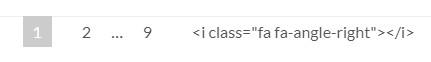

该文介绍一些Next主题的配置信息
<!--more-->
## 页面显示问题

### 设置站点建立时间

在 主题配置文件 中，搜索：since，修改 since 后面的值即可，例如：

```hexo
since: 2013
```

### subnav链接错误

修改主题配置文件后,运行时,出现subnav子导航 链接中多了%20这样的字样，这是主题内置字符串切割时出现错误，可以修改配置,将空格去掉,如： 将

```markdown
menu:
  home: / || home
  # about: /about/ || user
  tags: /tags/ || tags
  categories: /categories/ || th
```

改为:

```markdwon
menu:
  home: /||home
  # about: /about/||user
  tags: /tags/||tags
  categories: /categories/||th
```

### 站点概览中的链接错误(包括右边栏“日志”菜单部分URL的乱码)

在**thems\next\layout_macro**中，打开**sidebar.swig**文件，找到

```html
<div class="site-state-item site-state-posts">
```

将

```html
<a href="{ { url_for(theme.menu.archives).split('\|\|')[0] | trim } }">
```

改为：

```html
<a href="{ { url_for(theme.menu.archives.split('\|\|')[0]) | trim } }">
```

### 文章目录编号显示问题


在主题配置文件中找到 toc 节点，修改 number 为 false

### 分页显示问题



主题配置页面进入layout/_partials/pagination.swig,修改为

```swig

 <nav class="pagination">
   {{
     paginator({
       prev_text: '<i class="fa fa-angle-left" aria-label="'+__('accessibility.prev_page')+'"></i>',
       next_text: '<i class="fa fa-angle-right" aria-label="'+__('accessibility.next_page')+'"></i>',
       mid_size: 1,
       escape: false
     })
   }}
 </nav>

```


### 文章添加阴影

打开/themes/next/source/css/_custom/custom.styl，添加：

```swig
.post {
   margin-top: 60px;
   margin-bottom: 60px;
   padding: 25px;
   -webkit-box-shadow: 0 0 5px rgba(202, 203, 203, .5);
   -moz-box-shadow: 0 0 5px rgba(202, 203, 204, .5);
  }
```

### Local Search 本地搜索

在站点的根目录执行以下命令：

```npm
npm install hexo-generator-searchdb --save
```

编辑站点配置文件，新增以下内容到任意位置：

```hexo
search:
  path: search.xml
  field: post
  format: html
  limit: 10000
```

编辑主题配置文件，启用本地搜索功能：

```next
# Local search
local_search:
  enable: true
```

### 文章图片显示问题

1. 设置站点配置文件_config.yml中 post_asset_folder:true。

Hexo 提供了一种更方便管理 Asset 的设定：post_asset_folder当您设置post_asset_folder为true参数后，在建立文件时，Hexo会自动建立一个与文章同名的文件夹，您可以把与该文章相关的所有资源都放到那个文件夹。

2. 安装插件：在hexo的目录下执行

```npm
npm install https://github.com/CodeFalling/hexo-asset-image --save
```

1. 完成安装后用hexo新建文章的时候会发现_posts目录下面会多出一个和文章名字一样的文件夹。图片就可以放在文件夹下面。

2. 文章中插入图片方式：

* 方式一：

```js
{%asset_img example.jpg examplename}
```

* 方式二：

```js
![description][1]
[1]:picture_path "picture_name"
```

### 文章内容显示不全

在主题目录中，找到主题配置文件，搜索 motion，修改如下：

```markdown
motion:
  enable: true
  async: true
```

### 修改文章内链接文本样式

修改文件themes\next\source\css\_common\components\post\post.styl，在末尾添加如下css样式，：

```css
// 文章内链接文本样式
.post-body p a{
  color: #0593d3;
  border-bottom: none;
  border-bottom: 1px solid #0593d3;
  &:hover {
    color: #fc6423;
    border-bottom: none;
    border-bottom: 1px solid #fc6423;
  }
}
```

其中选择.post-body 是为了不影响标题，选择 p 是为了不影响首页“阅读全文”的显示样式,颜色可以自己定义。

## 页面背景设置

打开文件 themes/next/source/css/_custom/custom.styl，添加：

```css
// 修改背景图片
body {
  background:url(https://source.unsplash.com/random/1600x900?wallpapers);
  background-repeat: no-repeat;
  background-attachment:fixed;
  background-position:50% 50%;
}

// 修改主体透明度
.main-inner {
  background: #fff;
  opacity: 0.8;
}

// 修改菜单栏透明度
.header-inner {
  opacity: 0.8;
}
```

## 在每篇文章末尾统一添加“本文结束”标记

在路径 \themes\next\layout\_macro 中新建 passage-end-tag.swig 文件,并添加以下内容：

```swig
<div>
    
        <div style="text-align:center;color: #ccc;font-size:14px;">-------------本文结束<i class="fa fa-paw"></i>感谢您的阅读-------------</div>
    
</div>
```

接着打开\themes\next\layout\_macro\post.swig文件，在post-body 之后,post-footer 之前添加如下画红色部分代码（post-footer之前两个DIV）：

```css
<div>
  
    
  
</div>
```

然后打开主题配置文件（_config.yml),在末尾添加：

```next
# 文章末尾添加“本文结束”标记
passage_end_tag:
  enabled: true
```

## 加入代码块复制功能

### 添加 copy-code.swig 文件

在 themes/next/layout/_third-party/ 下，新建 copy-code.swig 文件，内容如下：

```js

  <style>
    .copy-btn {
      display: inline-block;
      padding: 6px 12px;
      font-size: 13px;
      font-weight: 700;
      line-height: 20px;
      color: #333;
      white-space: nowrap;
      vertical-align: middle;
      cursor: pointer;
      background-color: #eee;
      background-image: linear-gradient(#fcfcfc, #eee);
      border: 1px solid #d5d5d5;
      border-radius: 3px;
      user-select: none;
      outline: 0;
    }

    .highlight-wrap .copy-btn {
      transition: opacity .3s ease-in-out;
      opacity: 0;
      padding: 2px 6px;
      position: absolute;
      right: 4px;
      top: 8px;
    }

    .highlight-wrap:hover .copy-btn,
    .highlight-wrap .copy-btn:focus {
      opacity: 1
    }

    .highlight-wrap {
      position: relative;
    }
  </style>
  
  <script>
    $('.highlight').each(function (i, e) {
      var $wrap = $('<div>').addClass('highlight-wrap')
      $(e).after($wrap)
      $wrap.append($('<button>').addClass('copy-btn').append('{{__("post.copy_button")}}').on('click', function (e) {
        var code = $(this).parent().find('.code').find('.line').map(function (i, e) {
          return $(e).text()
        }).toArray().join('\n')
        var ta = document.createElement('textarea')
        document.body.appendChild(ta)
        ta.style.position = 'absolute'
        ta.style.top = '0px'
        ta.style.left = '0px'
        ta.value = code
        ta.select()
        ta.focus()
        var result = document.execCommand('copy')
        document.body.removeChild(ta)
        
          if(result)$(this).text('{{__("post.copy_success")}}')
          else $(this).text('{{__("post.copy_failure")}}')
        
        $(this).blur()
      })).on('mouseleave', function (e) {
        var $b = $(this).find('.copy-btn')
        setTimeout(function () {
          $b.text('{{__("post.copy_button")}}')
        }, 300)
      }).append(e)
    })
  </script>

```

### 编辑_layout.swig文件

返回上一层，在layout文件夹下，修改 _layout.swig，在\</body>上面，加上：

```js

```

### 添加复制按钮显示的文字

在 themes/next/languages/ 目录下，找到 在zh-CN.yml 或 在zh-Hans.yml 文件中的 post 节点，向其中添加：

```markdown
copy_button: 复制
copy_success: 复制成功
copy_failure: 复制失败
```

在 en.yml 文件中同一节点位置，添加：

```markdown
copy_button: Copy
copy_success: success
copy_failure: Copy failed
```

### 修改主题配置文件

更新 themes/next/_config.yml，添加：

```markdown
codeblock:
  border_radius:
  # Add copy button on codeblock
  copy_button:
    enable: true
    # Show text copy result
    show_result: true
```

## 流动线条

在主题配置文件中，修改：

```markdown
# 动态线条效果，会向鼠标集中
canvas_nest:
  enable: true
  color: '0,0,255'        # color of lines, default: '0,0,0'; RGB values: (R,G,B).(note: use ',' to separate.)
  pointColor: '249, 72, 137'     # color of points, default: '0,0,0'; RGB values: (R,G,B).(note: use ',' to separate.)
  opacity: '0.8'               # the opacity of line (0~1), default: 0.5.
  count: '99'                  # the number of lines, default: 99.
  zIndex: '-2'                 # z-index property of the background, default: -1. 底层
```

在文件 themes\next\layout\_scripts\vendors.swig 中添加：

```markdown
{# 动态线条效果 #}

  
  <script
    type="text/javascript"
    color="{{ theme.canvas_nest.color }}"
    opacity="{{ theme.canvas_nest.opacity }}"
    zIndex="{{ theme.canvas_nest.zIndex }}"
    count="{{ theme.canvas_nest.count }}"
    src="//cdn.bootcss.com/canvas-nest.js/1.0.0/canvas-nest.min.js" >
  </script>

```

## 静态资源压缩

* 安装

```npm
npm install hexo-neat --save-dev
```

* 在站点目录下的_config.yml的末尾，添加配置信息:

```markdown
# hexo-neat
# 博文压缩
neat_enable: true
# 压缩html
neat_html:
  enable: true
  exclude:  #排除的文件
  
# 压缩css  跳过min.css
neat_css:
  enable: true
  # exclude:
    # - '**/*.min.css'

# 压缩js 跳过min.js
neat_js:
  enable: true
  mangle: true
  output:
  compress:
  # exclude:
    # - '**/*.min.js'
    # - '**/jquery.fancybox.pack.js'
    # - '**/index.js'  
# 压缩博文配置结束
# 注意上面的路径 **/* ,需要自己去配置正确的路径。，不然生成的是空白页面，当然你也可以删掉，全部压缩。
```

## 设置字数统计和预计阅读时间

### 方式一：post_wordcount(不推荐)

```npm
#打开cmd，进入博客根目录

# 安装统计插件
npm install hexo-wordcount --save
```

主题配置文件：开启统计功能

```next
# 实现字数统计和阅读时长的功能
post_wordcount:
  item_text: true
  wordcount: true # false/true
  min2read: true # false/true
  totalcount: false
  separated_meta: true
```

### 方式二：symbols_count_time(推荐)

```npm
#打开cmd，进入博客根目录

# 安装统计插件
npm install hexo-symbols-count-time

#下载
git clone https://github.com/theme-next/hexo-symbols-count-time.git /node_modules/hexo-symbols-count-time
#进入目录
cd node_modules/hexo-symbols-count-time
#Test 测试
npm install mocha chai --save-dev
npm test
#Tests with coverage 覆盖率测试
npm install -g nyc
nyc --print both node_modules/.bin/_mocha -- test/index.js

```

主题配置文件： 开启统计功能

```next
# Post wordcount display settings
# Dependencies: https://github.com/theme-next/hexo-symbols-count-time
# 实现字数统计和阅读时长的功能 （参考 https://github.com/theme-next/hexo-symbols-count-time）
symbols_count_time:
  separated_meta: true
  item_text_post: true
  item_text_total: false # false/true # 总字数
  awl: 4
  wpm: 275
```

### 方式三：不蒜子统计

主题配置文件

```npm
# 统计访客量以及文章阅读量
# NexT主题集成了不蒜子统计功能
busuanzi_count:
  # count values only if the other configs are false
  enable: true # false/true 是否开启不蒜子统计功能
  # custom uv span for the whole site
  # 效果：本站访客数12345人次
  site_uv: true
  #本站访客数
  site_uv_header: 本站访客数 <i class="fa fa-user"></i>
  site_uv_footer: 人次
  # custom pv span for the whole site
  # 效果：本站总访问量12345次（一般不开启这个）
  site_pv: true
  #本站总访问量
  site_pv_header: 本站总访问量 <i class="fa fa-eye"></i>
  site_pv_footer: 次
  # custom pv span for one page only
  ## 效果：本文总阅读量12345次
  page_pv: true
  #本文总阅读量
  page_pv_header: 本文总阅读量 <i class="fa fa-file-o"></i>
  page_pv_footer: 次
```

hexo博客解决不蒜子统计无法显示问题：

首先需要先找到NexT下引用不蒜子统计的方法。文件路径为/theme/next/layout/_third-party/analytics/busuanzi-counter.swig文件：

```swig
<!--修改前-->
  <script async src="https://dn-lbstatics.qbox.me/busuanzi/2.3/busuanzi.pure.mini.js"></script>
<!--修改后-->
  <script async src="https://busuanzi.ibruce.info/busuanzi/2.3/busuanzi.pure.mini.js"></script>

```

## 版权声明

主题文件中搜索，post_copyright,改为true即可。

```next
# Declare license on posts
post_copyright:
  enable: true
  license: CC BY-NC-SA 3.0
  license_url: https://creativecommons.org/licenses/by-nc-sa/3.0/
```

## 添加Live2D 萌宠

### Step1

进入到工程目录下，安装 Hexo 插件：

```npm
npm install hexo-helper-live2d --save
```

### Step2

在 插件作者的博客 中挑选一个模型，记录该模型的名字。模型资源名称为 live2d-widget-model-模型名称，例如选择模型 shizuku ，则其对应的 Live2D 资源名称为 live2d-widget-model-shizuku，然后直接在站点根目录下安装该模型，命令如下:

```npm
npm install live2d-widget-model-shizuku --save
```

### Step3

编辑站点配置文件，添加以下内容：

```npm
# Hexo plugin: hexo-helper-live2d
## https://github.com/EYHN/hexo-helper-live2d
live2d:
  enable: true #控制live2d插件是否生效
  pluginRootPath: live2dw/ # Root path of plugin to be on the site (Relative)
  pluginJsPath: lib/ # JavaScript path related to plugin's root (Relative)
  pluginModelPath: assets/ # Relative model path related to plugin's root (Relative)
  scriptFrom: local # Default l2dwidget.js使用的CDN地址，local表示使用本地地址
  #scriptFrom: jsdelivr # jsdelivr CDN
  #scriptFrom: unpkg # unpkg CDN
  #scriptFrom: https://cdn.jsdelivr.net/npm/live2d-widget@3.x/lib/L2Dwidget.min.js # Your custom url
  tagMode: false # Whether only to replace live2d tag instead of inject to all pages
  log: false # Whether to show logs in console
  model:
    use: live2d-widget-model-shizuku # npm-module package name
    #use: wanko # folder name in (hexo base dir)/live2d_models/
    #use: ./wives/wanko # folder path relative to hexo base dir
    #use: https://cdn.jsdelivr.net/npm/live2d-widget-model-wanko@1.0.5/assets/wanko.model.json # Your custom url
    scale: 1
    hHeadPos: 0.5
    vHeadPos: 0.618
  display:
    superSample: 2 #超采样等级
    width: 150 #宽度
    height: 300 #canvas的高度
    position: right #显示位置左或右
    hOffset: 0 #canvas水平偏移
    vOffset: -10 #canvas水平偏移
  mobile:
    show: false #控制是否在移动设备上显示
    scale: 0.05 #移动设备上的缩放
  react:
    opacityDefault: 0.7 #默认透明度
    opacityOnHover: 0.2 #鼠标移上透明度
```

## hexo博客备份

1. 在博客仓库创建一个分支hexo（命名随意）
2. 设置hexo为默认分支
3. 将此时的博客仓库clone到本地（使用github桌面版），将之前的本地博客文件夹中的_config.yml，themes/，source，scffolds/，package.json，.gitignore复制到刚刚克隆下来的仓库文件夹，即Username.github.io；（Username为自己的用户名）
4. 将themes/next/(我用的是Next主题)中的./git删除，否则无法将主题文件夹push
5. 在刚刚克隆的文件夹中执行npm install,npm install hexo-deployer-git（这里看看分支是不是显示hexo）
6. 执行(git add .),git commit -m "提交文件",git push origin hexo 来提交hexo网站源文件
7. 执行hexo g -d生成静态网页部署到github上

这样，Username.github.io仓库就有master分支保存静态网页，hexo分支保存源文件。

## 修改

在本地对博客修改（包括修改主题样式、发布新文章等）后

1. 执行git add，git commit -m “提交文件”，git push origin Hexo来提交Hexo网站源文件；

2. 执行hexo g -d 生成静态网页部署到github上；

（每次发布重复这两步，它们之间没有严格的顺序）

参考链接：https://blog.csdn.net/weixin_41599858/java/article/details/104806723