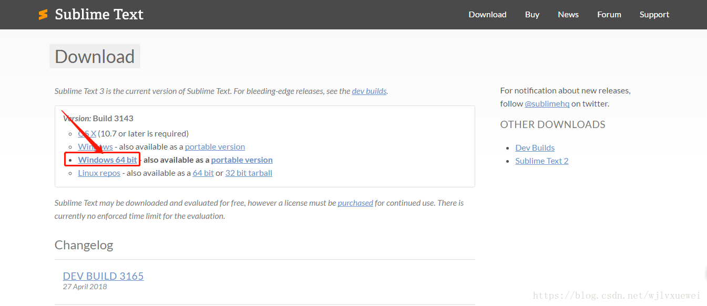
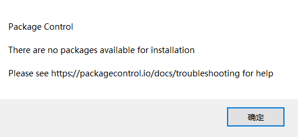

### Sublime Text3 一次能够安装好的教程详解。
<!--more-->

### Sublime Text3 安装教程

#### 下载安装

去官网下载：[http://www.sublimetext.cn/](http://www.sublimetext.cn/)



用IDM会很慢，可以复制下载链接，用迅雷下载，3秒下载完毕。
下载完毕，双击安装。选择"Add to explorer context menu”.

#### 安装package control插件
这是安装sublime的重点。

手动安装：
1 点击
[https://github.com/wbond/package_control](
https://github.com/wbond/package_control)去github下载Package Control安装报下载到本地，下载的文件名为：
package_control-master.zip。解压后将文件名改为Package Control；

2.打开Sublime的Preferences -> Browse Packages菜单，将上面改好名字的Package Control文件夹复制过去,重启就会发现package control。



3.但是你会发现你点击package control后Install Package不成功，There are no packages available for installation的提示。

失败原因为官网地址被墙，导致channel_v3文件无法访问。

解决方法：点击Preferences——>Package Settings——>Package Control——>Settings - User，


打开配置文件添加地址：

```
"channels":
[
"https://github.com/JavenZ/channel_v3/raw/master/channel_v3.json"
],
```

以下两个地址任选一

GitHub地址：https://github.com/JavenZ/channel_v3/raw/master/channel_v3.json

国内地址：https://attachments-cdn.shimo.im/OykO0AIRnX0aeB4d/channel_v3.json

以上json文件引用地址由简书作者Javen_01（知乎ID孙悟菜）提供，如果地址失效可以去他的GitHub查看最新地址。

下载完就可以下载插件。