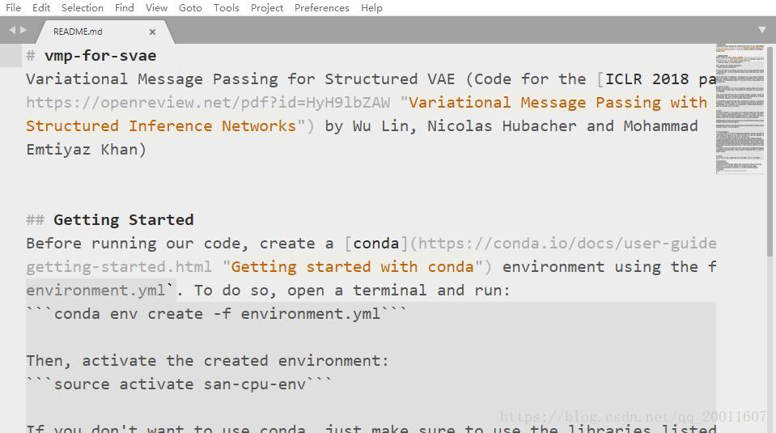
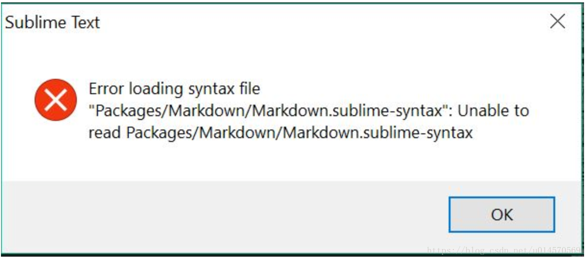
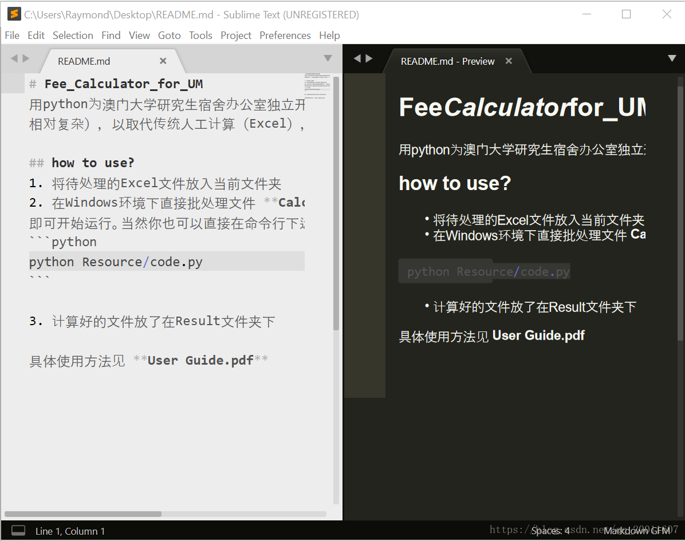

### Sublime Text3 Markdown插件推荐
<!--more-->

### Markdown插件安装

|插件|功能|
|----|-----|
|MarkdownEditing|一个提高Sublime中Markdown编辑特性的插件|
|MarkdownPreview|Markdown转HTML，提供在浏览器中的预览功能|
|MarkdownLivePreview|提供在编辑框中实时预览的功能|
|LiveReload|一个提供md/html等文档的实时刷新预览的插件|

#### MarkdownEditing
##### 功能：
可以高亮显示Markdown语法还支持很多编程语言的语法高亮显示。

**特别注意**：MarkdownEditing只针对 md\mdown\mmd\txt 格式文件才启用。

##### 效果图：


#### 安装报错解决：
报错问题


##### 解决方法

./Data/Local/ 清理掉
Session.sublime_session
Auto Save Session.sublime_session

去Local文件夹里删除掉这两个文件，我的只有第一个，删除后重启就可以。

#### MarkdownLivePreview

##### 功能：

实时预览Markdown文件，左侧为md文件，右侧为预览结果。

##### 使用：

MarkdownLivePreview默认关闭实时预览，既然安装这个插件了，那肯定是要用的。打开方式为在Preferences -> Package Settings -> MarkdownLivePreview -> Settings 的设置的右侧加一条 "markdown_live_preview_on_open": true,，重启sublime即可。

为什么不能直接将左侧对应的false改为true，这是因为左侧为默认配置，是不能改的（只读），右侧的编辑区才是用户自定义区。

##### 效果图：



但是预览效果并不是很好，不能横向滚动。推荐下面插件。

##### MarkdownPreview

###### 将md文件用浏览器预览——1.常规方法

1 组合键 Ctrl+Shift+P 调出命令面板

2 输入mdp找到并选中Markdown Preview： Preview in Browser

3 出现两个选项：github和markdown。任选其一即可，github是利用GitHub的在线API来解析.md文件，支持在线资源的预览，如在线图片它的解析速度取决于你的联网速度。该方式据说一天只能打开60次。markdown就是传统的本地打开，不支持在线资源的预览。

4 默认浏览器中显示预览结果

###### 将md文件用浏览器预览——2.用快捷键打开

Sublime Text支持自定义快捷键，Markdown 

Preview默认没有快捷键，我们可以自己为Markdown Preview： Preview in Browser设置快捷键。

方法是在Preferences -> Key Bindings打开的文件的右侧栏的中括号中添加一行代码：

```
{ 
    "keys": ["alt+m"],  
    "command":"markdown_preview",
    "args": 
        {
            "target": "browser",      
            "parser":"markdown"
        }  
}
```

这里：
> "alt+m" 可设置为自己喜欢的按键。"parser": "markdown"也可设置为"parser":"github"，改为使用Github在线API解析markdown

以上两种方式都有个问题：每次预览都要打开一个新的网页，而且需要手动操作。有没有一个方法，可以打开一个网页后，之后再也不用管，让它实时刷新预览呢？

有，还很简单，答案就是MarkdownPreview+LiveReload！
LiveReload是一个可实时刷新的插件，不仅可用于Markdown，也可用于HTML等。

##### (最强）实时自动刷新预览：MarkdownPreview+LiveReload
**先安装并配置Markdown Preview**

如前Markdown Preview安装成功后，设置前文所述的快捷键（如需），打开其配置文件 Preferences -> Package Settings -> Markdown Preview -> Settings，检查左侧enable_autoreload条目是否为true，若是，跳过。若不是，右侧栏加一条下面这个后重启Sublime:
```
{
    "enable_autoreload": true
}
```
**安装并配置LiveReload**

Ctrl+Shift+p, 输入 Install Package，输入LiveReload, 回车安装

安装成功后, 再次Ctrl+shift+p, 输入LiveReload: Enable/disable plug-ins, 回车, 选择 Simple Reload with delay (400ms)或者Simple Reload，两者的区别仅仅在于后者没有延迟。

**开始使用**

原文链接：[https://blog.csdn.net/qq_20011607/article/details/81370236](https://blog.csdn.net/qq_20011607/article/details/81370236)

