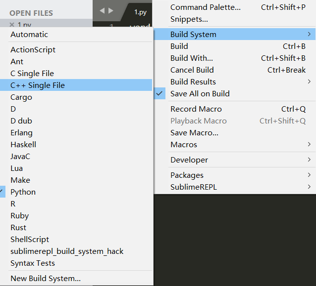
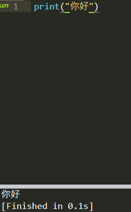
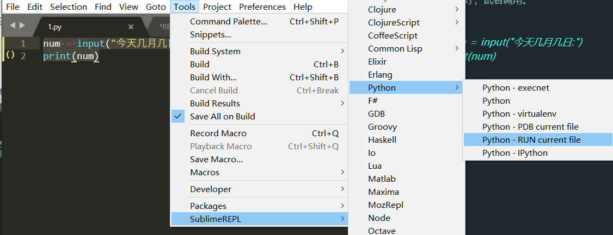
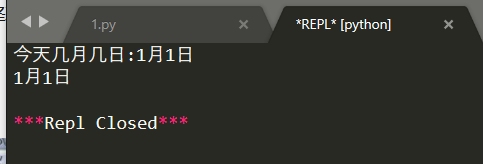
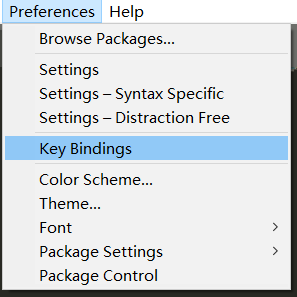
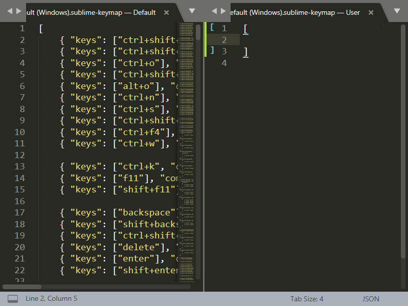
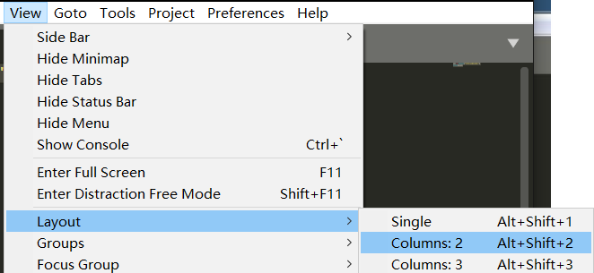

### Sublime Text3 配置python环境详解。
<!--more-->

#### Sublime Text3配置python环境

安装参考以前文章，下面说配置

打开安装好的 sublime text 3，选择编译环境



然后输入
> print("你好")

然后保存为.py后缀文件

回到主界面，Ctrl+B运行




中文成功输出，证明配置好了，但还需要按一个插件来支持 input

安装SublimeREPL插件，使Sublime支持input

安装好，试着调用。

```
num = input("今天几月几日:")
print(num)
```

跟 Ctrl+B 直接编译不同，利用插件来编译需要先手动 Ctrl+S 保存

**常规调用：**



然后弹出一个新的框，进行输入输出。



**设置快捷键调用：**



左边是系统默认设置，我们在右边窗口输入以下设置（另一个 Alt + End 是终止编译的快捷键），Ctrl+S 保存



```markdown
[ 
    { 
        "keys": ["f4"], 
        "caption": "SublimeREPL: Python - RUN current file", 
        "command": "run_existing_windoww_command", 
        "args": { 
            "id": "repl_python_run", 
            "file": "config/Python/Main.sublime-menu"
        } 
    },
        { 
            "keys": ["alt+end"], 
            "command": "exec", 
            "args": {"kill": true} 
        } 
]
```

切换不方便，可以打开两个视图：



本文参考：
链接：[https://www.zhihu.com/question/22904994/answer/800236870](https://www.zhihu.com/question/22904994/answer/800236870)
