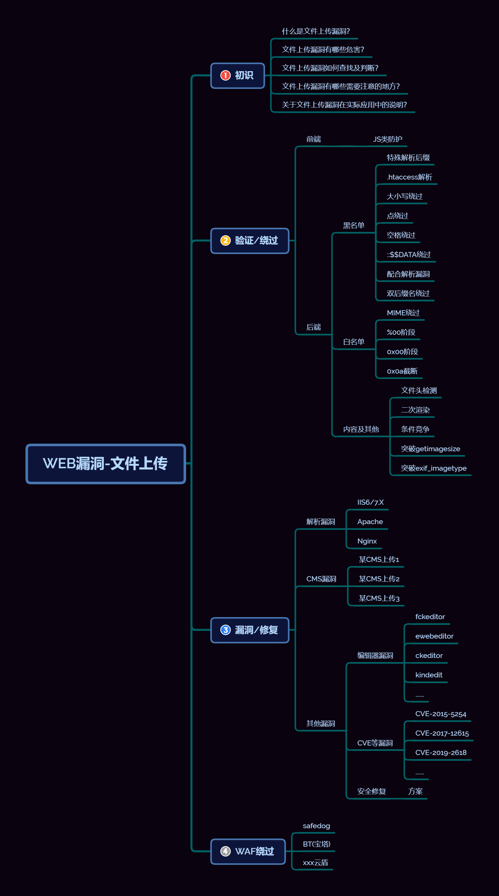
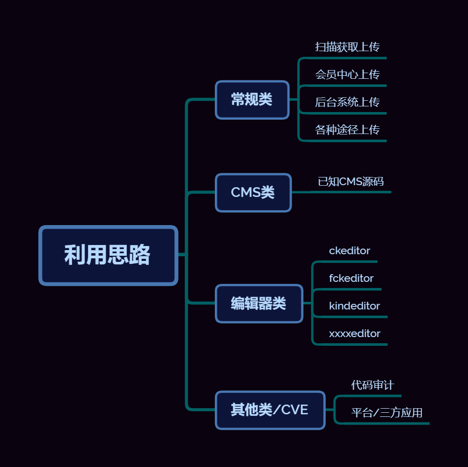

## 文件上传漏洞介绍

### 什么是文件上传漏洞

凡是存在文件上传的地方均有可能存在文件上传漏洞，关于上传文件操作的时候对方代码写的是否完整、是否安全，一旦疏忽了某个地方可能会造成文件上传漏洞

### 文件上传的原理

网站Web应用都有一些文件上传功能，比如文档、图片、头像、视频上传，当上传功能的实现代码没有严格校验上传文件的后缀和文件类型，此时攻击者就可以上传一个webshell到一个Web可访问的目录上，并将恶意文件传递给如PHP解释器去执行，之后就可以在服务器上执行恶意代码，进行数据库执行、服务器文件管理，服务器命令执行等恶意操作。还有一部分是攻击者通过Web服务器的解析漏洞来突破Web应用程序的防护

### 文件上传漏洞的危害

文件可以自定义，可以成为webshell，通过文件上传来上传网站后门，直接获取网站权限，属于高危漏洞。上传漏洞与SQL注入或 XSS相比 , 其风险更大 。可以获取数据库信息，可以对服务器提权，获取内网权限

### 文件上传漏洞如何查找和判断

1. 黑盒查找
文件后台
    进入网站后台不一定获得网站权限，可以从后台获取网站权限
会员中心
    通过图片上传
文件扫描
    使用工具扫描出后台路径
2. 白盒查找
通过代码分析到上传漏洞
查找文件上传功能

## 文件上传的实现

### 利用思路

### 文件上传在实际应用中的方式

**方式一**

 先直接传一个PHP，实战先传马
实战先传一个正常的图片，看看有无返回存储地址
如果能直接上传并解析，已离成功不远

**方式二**

先传一个shell，然后进行修改
connect-Type:image/jpeg，看看是否可以进行绕过，如果不行，在上传内容添加GIF89a
当然上传了还得看是否能够被解析为php，所有的上传都要考虑是否能够被解析

**方式三**

* 上传一个abc.abcd，目的只是为了查看是否为白名单还是黑名单绕过。黑名单限制一般为此文件类型不允许上传，考虑双写，大小写，空格，php2,php3,php4,php5,pht,phtml,等方式
* 我们继续上传一个/htaccess文件.htaccess文件能够设置服务器的解析文件的格式，匹配到dudu就已php的格式来解析，继而上传马
* 如果说.htaccess不能上传，接下来上传一个.user.ini，继而上传一个马

**方法四**

如果白名单限制上传

* 考虑00截断上传
* 文件包含漏洞+图片马
* 文件包含漏洞+二次渲染+图片马

**方法五**

上传的东西是否被服务器很快的删除或者移除，或者说上传成功，但是无法访问，就得考虑条件竞争
以上均不行，考虑逻辑层面的思路

## 文件上传常见验证

### 前端

JS类防护

### 后端

**后缀名**

黑名单：明确不允许上传的格式后缀，asp、php、jsp、aspx等。
白名单：明确可以上传的文件后缀。jpg、png、zip、gif等

**文件类想**

MIME信息：

Content-Type称之为MIME信息，通过伪造Content-Type等来进行上传

**文件头**

内容头信息

### 文件上传绕过

#### 黑名单绕过

**特殊解析信息**

使用yijuhua.jpg.zip.php等多后缀，如果没有添加strrchr()、和deldot()的话可以绕过
deldot():删除文件名末尾的点，防止多后缀
strchr(string1,string2):查找字符串在另一个字符串中最后一次出现的位置，并返回从该位置到字符串结尾的所有字符

如果php3、php5、phtml没有定义到黑名单中，且apache开启解析，则可以用这种格式进行绕过

**.htaccess解析**

仅存在于Apache中
htaccess文件时apache服务器中的一个配置文件，负责相关目录下的网页配置。通过htaccess文件，可以帮助我们实现：网页301重定向、自定义404错误页面、改变文件扩展名、允许/阻止特定的用户或者目录的访问、禁止目录列表、配置默认文档等功能

**大小写绕过**

对大小写进行强制转换，后缀修改大小写即可绕过

**空格绕过**

源码中缺少收尾去空函数，则可以通过加空格进行绕过
trim():去除字符串中的空格

**点绕过**

windows中1.txt和1.txt.两者是一个文件，所以就和空格绕过是一个思路

**::$DATA绕过**

利用Windows特性
在windows的时候如果文件名+"::$DATA"会把::$DATA之后的数据当成文件流处理，不会检测后缀名，且保持::$DATA之前的文件名，他的目的就是不检查后缀名
例如："phpinfo.php::$DATA"Windows会自动去掉末尾的::$DATA变成"phpinfo.php"

**点空格点绕过**

利用的就是程序员写代码时可能只会过滤一次特殊的关键词等，所以可以通过多次输入重复的关键词或者混着输入关键词来进行绕过

比如：

一次过滤
a.php->a.
a.pphphp->a.php 将中间的php过滤掉，还有一个php
但是当编写的是循环过滤的话，这个就会失效
a.pphphp->a.只要出现php就会过滤

**双后缀名绕过**

.pphphp

#### 白名单绕过

**%00截断——GET**

原理：
www.xxx.com/qq.jpg
www.xxx.com/qq.php%00.jpg=>www.xxx.com/qq.php
%00是被服务器解码为0x00发挥了截断作用
0x00是十六进制表示方法，是ascii码为0的字符，在有些函数处理时，会把这个字符当做结束符
%00和0x00是由区别的；%00是URL中的，0x00是文件命名
%00需要PHP版本小于5.3.4，且打开的配置文件php-ini，将magic_quotes_gpc设置为Off

**%00截断——POST**

post不会解码%00->url编码

参考资料：[https://www.yuque.com/samxara/swro13/tqdn5k](https://www.yuque.com/samxara/swro13/tqdn5k)