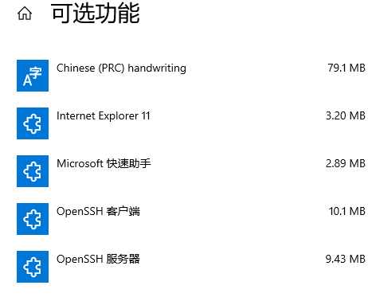

# 介绍

## Xshell

Xshell 是一个强大的安全终端模拟软件，它支持SSH1, SSH2, 以及Microsoft Windows 平台的TELNET 协议。Xshell 通过互联网到远程主机的安全连接以及它创新性的设计和特色帮助用户在复杂的网络环境中享受他们的工作。 
Xshell可以在Windows界面下用来访问远端不同系统下的服务器，从而比较好的达到远程控制终端的目的。

## xftp

Xftp是一个软件应用程序,可以帮助您通过网络传输文件。 尽管它是为工作在Windows系统上而设计的，用户还可以安全地传输文件到使用Unix /Linux系统的主机。 它还支持SFTP协议，因此所有通过该软件的网络流量都是加密的。

<!--more-->

# 安装和连接

Xshell和Xftp可以通过教育邮箱申请免费使用。

## 虚拟机安装ssh

由于xshell远程连接ubuntu是通过ssh协议的，所以，需要给虚拟机安装ssh服务器

```linux
Ubuntu安装ssh
sudo apt-get openssh-server （若没有ssh，首先要执行sudo apt-get install ssh）
```

Centos安装ssh

```linux
yum install openssh-server -y(Centos 系统默认安装Openssh）
```

window安装ssh

```linux
打开设置-应用-应用和功能-管理可选功能-添加功能
安装OpenSSH服务器和客户端
```



## 启动SSH

### windows

需要管理员模式进cmd

```linux
net start sshd
OpenSSH SSH Server 服务正在启动 . OpenSSH SSH Server 服务已经启动成功。

net stop sshd 
OpenSSH SSH Server 服务已成功停止。
```

### Ubuntu

```linux
查看是否启动
ps -e | grep ssh
启动
sudo systemctl start ssh
关闭
sudo systemctl stop ssh
开机启动
sudo systemctl enable/disable ssh
```

### Centos

```linux
ps -e | grep ssh
启动
sudo systemctl start ssh
关闭
sudo systemctl stop ssh
开机启动
sudo systemctl enable/disable ssh
```

## 连接

**虚拟机网络需要是nat模式**

**需要主机和虚拟机可以相互ping通**,可以的话继续。

打开xshell或xftp，点击新建。
名称可以自己随意填，主机填上虚拟机ip地址。
然后确定。
连接，输入用户名和密码即可。

## 防火墙

### Centos

```linux
临时关闭
systemctl stop firewalld.service
永久关闭
systemctl disable direwalld.service
```

### Ubuntu

```linux
查看状态
sudo ufw status
禁用
sudo ufw disable
启用
sudo ufw enable
```