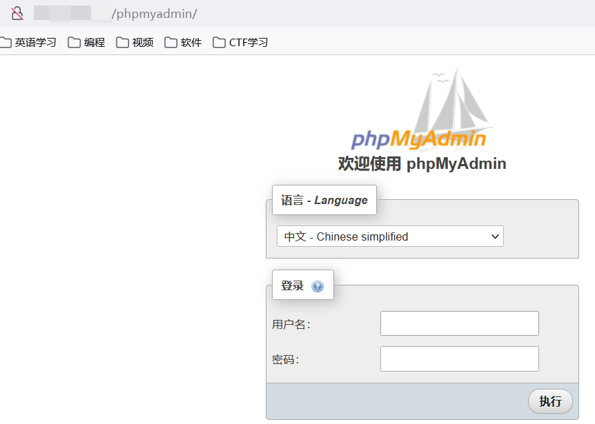

这里使用阿里云ECS服务器Ubuntu20.04版本进行搭建

首先看看有哪些lamp的使用的较多，使用docker search lamp

```linux
# docker search lamp
NAME                                    DESCRIPTION                                     STARS     OFFICIAL   AUTOMATED
mattrayner/lamp                         A simple LAMP docker image running the prere…   285                  [OK]
linode/lamp                             LAMP on Ubuntu 14.04.1 LTS Container            181                  
tutum/lamp                              Out-of-the-box LAMP image (PHP+MySQL)           148                  
fauria/lamp                             Modern, developer friendly LAMP stack. Inclu…   110                  [OK]
greyltc/lamp                            a super secure, up-to-date and lightweight L…   103                  [OK]
lioshi/lamp                             Docker image for LAMP under debian              14                   [OK]
dgraziotin/lamp                                                                         11                   [OK]
linuxconfig/lamp                        Automated build LAMP stack environment for f…   5                    [OK]
jakubboucek/lamp-devstack-php           Prepared images for local development in LAM…   5                    
thiagobarradas/lamp                     Use PHP (5.4, 5.5, 5.6, 7.0, 7.1, 7.2, 7.3, …   4                    
lampson0505/ubuntu-phy                  An Ubuntu image with teamd for network inter…   3                    
shelleyma/lampp2                        lampp from github                               3                    [OK]
lead4good/lamp-php                      LAMP Stack PHP                                  2                    [OK]
...
```

这里我们使用第一个进行安装

```linux
# docker pull mattrayner/lamp
Using default tag: latest
latest: Pulling from mattrayner/lamp
35807b77a593: Pull complete 
ccfecfa17ed6: Pull complete 
499764c8dc6b: Pull complete 
c6b0ddc4cdc0: Pull complete
...
Digest: sha256:f7caeba589eaea7e3d20f4ae3e3bf88233e66e7df59eb5adb49161a5365f9f90
Status: Downloaded newer image for mattrayner/lamp:latest
docker.io/mattrayner/lamp:latest
```

启用名字mylamp，以便以后可以直接使用名字重启

```linux
# docker run --name mylamp -p 80:80 -p 3306:3306 -d mattrayner/lamp
e9c27bbc28366f0b00018a03b0b31be2f1ac1f1355ea31796b970c312e7f17cf
```

测试运行结果



查看dklamp中的mysql的root密码，使用命令

```linux
# docker logs mylamp
Updating for PHP 8.0
Replacing CLI php.ini values
Editing APACHE_RUN_GROUP environment variable
Editing phpmyadmin config
Setting up MySQL directories
Allowing Apache/PHP to write to the app
Allowing Apache/PHP to write to MySQL
Editing MySQL config
=> An empty or uninitialized MySQL volume is detected in /var/lib/mysql
=> Installing MySQL ...
=> Done!
=> Waiting for confirmation of MySQL service startup
=> Creating MySQL admin user with random password
ERROR 1064 (42000) at line 1: You have an error in your SQL syntax; check the manual that corresponds to your MySQL server version for the right syntax to use near 'IDENTIFIED BY ''' at line 1
=> Done!
========================================================================
You can now connect to this MySQL Server with 46W9QD9oC5Co

    mysql -uadmin -p46W9QD9oC5Co -h<host> -P<port>

Please remember to change the above password as soon as possible!
MySQL user 'root' has no password but only allows local connections

enjoy!
```

查看密码为46W9QD9oC5Co，用户名为admin

### docker常用命令

查看所有镜像:docker image ls
查看是否有容器在运行:docker ps
容器停止：docker stop mylamp
容器开始：docker start mylamp