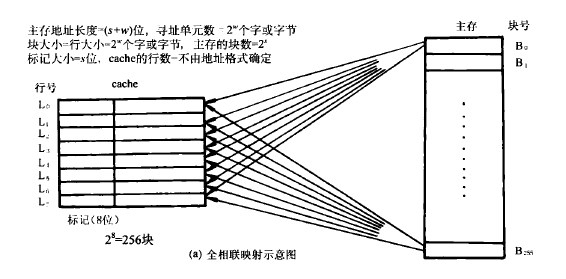
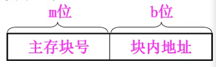
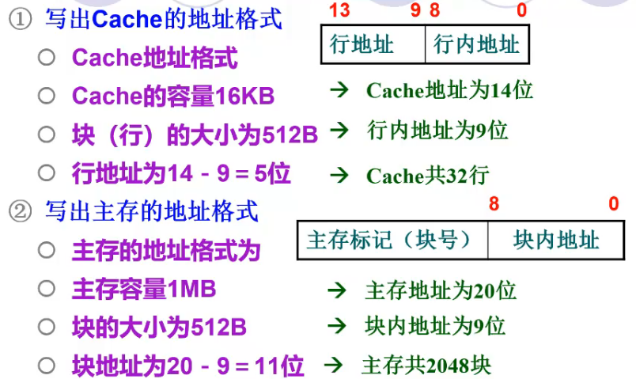
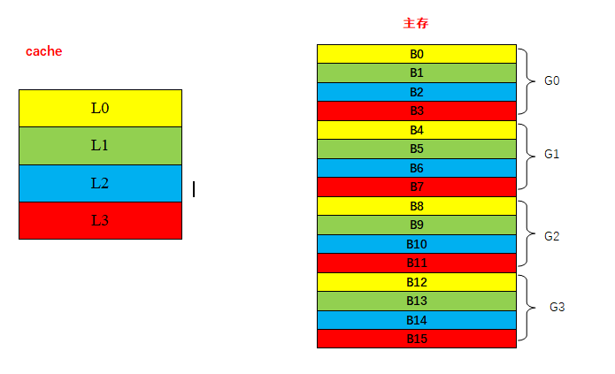
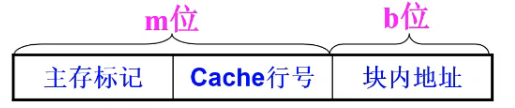
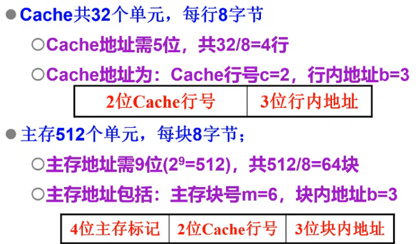
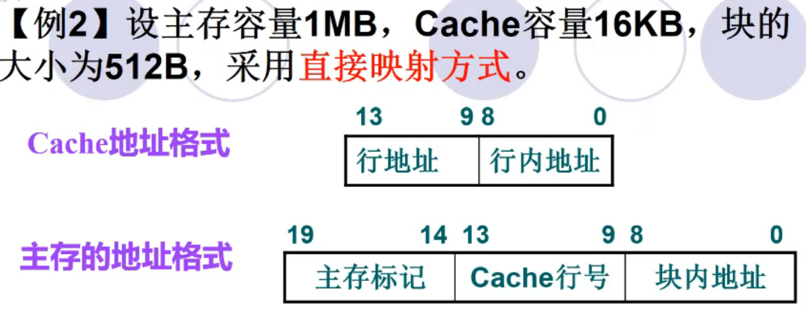
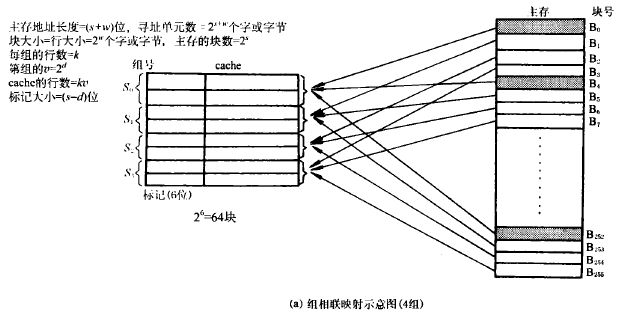
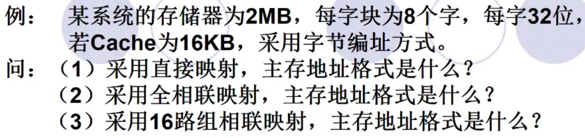
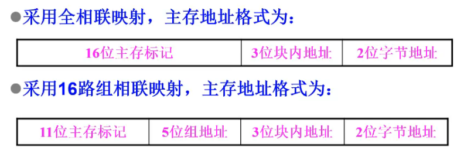

**概念：**

与主存容量相比，cache的容量很小，它保存的内容只是主存内容的一个子集，且cache 与主存的数据交换是以块为单位。为了把主存块放到cache中，必须应用某种方法把主存地址定位到cache中，称做地址映射。

<!--more-->

习惯上，cache中的“块”称“行”，主存中称“块”。cache的“行”与主存的“块”存储容量相同。

### 全相联映射

理念：主存中的一块可以拷贝到cache中的任意一行。

设主存共分为2^m个块，每块单元数为2^b个

**主存地址格式：** 主存块号（m块）+块内偏移地址（b位）

**cache地址格式：** cache行号（c位）+行内偏移地址（b位）

**cache标记tag：** 主存块号

优点：块冲突概率低，cache利用率高
缺点：硬件控制复杂，尤其是用于比较“主存块号”与tag时的比较器电路难于设计与实现。

【例1】设主存容量1MB，Cache容量16KB，块的大小为512B，采用全相联映射方式。

### 直接映射

**理念：** 一个主存块只能拷贝到cache的一个特定行位置去。

**直接映射函数为：i = j mod(2^c)**

将每一区（组）的数据块在区（组）内重新进行编号。使区（组）内各块只能映射到与它区（组）内编号相同的cache行去。

假定主存共2^m块，Cache共2^c行，每块/行单元数为2^b。

主存地址为m+b位；Cache地址为c+b位

**主存地址格式：** 主存组号+组内块号+块内偏移地址

**cache地址格式：** cache行号+行内偏移地址

**cache标记tag：** 映射到该行的主存块的主存地址的“组号”

优点：硬件简单，容易实现，成本低。
缺点：发生块冲突的概率较大，导致cache的命中率、效率下降。
适用情况：大容量的cache，更多的行数可以减小冲突发生的机会。

【例2】设主存共512个单元（字节），Cache共32个单元，块大小为8个字节，试用直接映射方式组织Cache。

### 组相联映射

**理念：** 将cache的空间分为若干组，主存块与cache组之间直接映射，而组内各块之间全相联映射。

设Cache共u组，每组r行，则映射函数如下：

**组号 q = j mod u （j为主存块号）**
当Cache的一组包含r行时，通常称为r路组相联映射

**关键：** cache的分组数=主存每一组的块数

**主存地址格式：** 主存组号+组内块号+块内偏移地址

**cache地址格式：** cache组号+组内行号+行内偏移地址
**cache标记tag：** 组号

