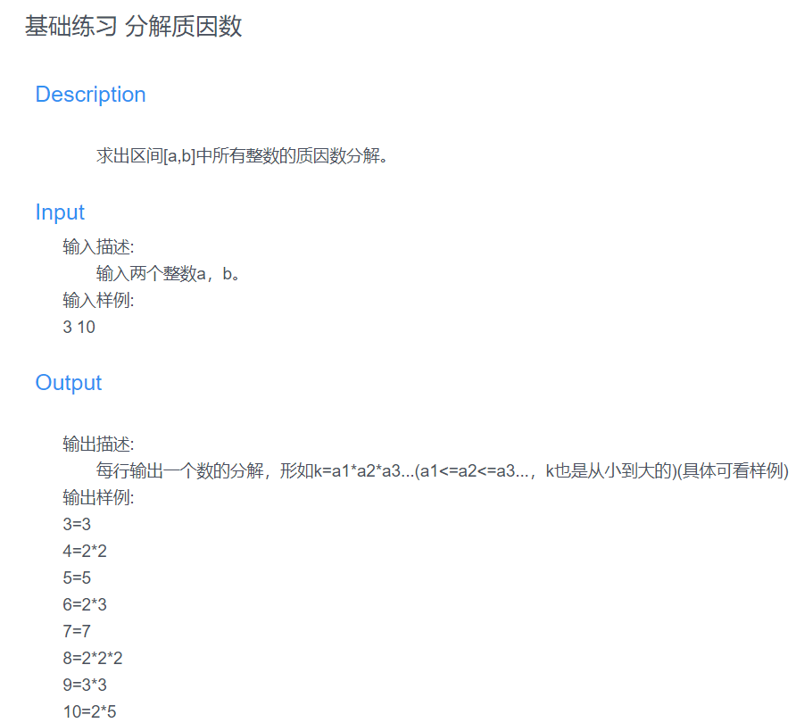
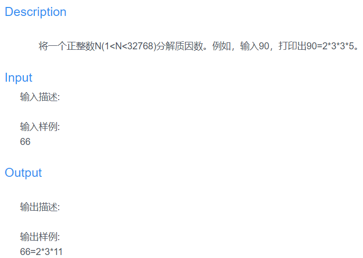

# 基础练习 分解质因数


这里用了两种方法，第一种是暴力解法，超时了，第二种递归，成功AC
<!--more-->
## 第一种解法 暴力解法：

```
#第一种 暴力解法 超时
def isPrime(x): #判断是否为质数
    for i in range(2,int(x ** (1/2))+1):
        if x % i == 0:
            return False
    return True

str1 = input() #接收输入
arr = str1.split(' ') #分割成数组
a = int(arr[0]) #取出开始值
b = int(arr[1]) #取出结束值
for i in range(a,b+1): #循环输出每一次的结果
    str1 = ''.join([str(i),'=']) #先得出前面的
    if isPrime(i): #是质数的话就是本身
        str1 = ''.join([str1,str(i)])
        print(str1)
    else: #不是质数
        tmp = [] #一个空列表
        t = i
        while t != 1: #经过一次一次除，最后除到1结束
            j = 2 #最小的质数为2，从2开始
            while j <= t: #从2开始找最小能整除t的值
                if isPrime(j) and t % j == 0:
                    tmp.append(j)
                    t /= j
                    break #找到一个就结束，重新开始找
                else:
                    j += 1 #不符合要求加1
            if t == 1: #当等于1时跳出循环
                break
        #tmp = sorted(tmp) #因为是从小到大找的，不用排序也行
        for j in range(len(tmp)): #然后按照列表开始输出
            if j == 0:
                str1 = str1 + str(tmp[j])
            else:
                str1 = str1 + '*' + str(tmp[j])
        print(str1)
```
## 第二种解法 递归
用乘积的方式进行计算，等于值时得到对应的质因数分解
```
#第二种方法 递归
def isPrime(num): #判断是否为质数
    for i in range(2,num):
        if num % i == 0:
            return False
    return True
def calcuate(num,tmp):
    for i in range(2,int(num ** (1/2)) + 1):
        if num % i == 0 and isPrime(i):
            tmp.append(i)
            num = num // i
            return calcuate(num,tmp)
    tmp.append(num)
    str1 = ''
    for i in range(len(tmp)): #循环列表返回值
        if i == 0:
            str1 += str(tmp[i])
        else:
            str1 += '*' + str(tmp[i])
    return str1    
str1 = input()
arr = str1.split(' ')
a = int(arr[0])
b = int(arr[1])
for i in range(a,b+1):
    tmp = []
    str1 = ''.join([str(i),'='])
    str1 += calcuate(i,tmp)
    print(str1)
```
# 算法提高 质因数

这个就是上个题的简写版，按照同样的递归方法即可
```
def isPrime(num): #判断是否为质数
    for i in range(2,int(num ** (1/2))+1):
        if num % i == 0:
            return False
    return True
def calcuate(num,tmp): #进行递归求解
    for i in range(2,int(num ** (1/2))+1):
        if isPrime(i) and num % i == 0:
            tmp.append(i)
            #num = num // i
            return calcuate(num//i,tmp)
    tmp.append(num)
    str1 = ''
    for i in range(len(tmp)):
        if i == 0:
            str1 += str(tmp[i])
        else:
            str1 += '*' + str(tmp[i])
    return str1
a = eval(input())
tmp = []
str1 = str(a) + '=' + calcuate(a,tmp)
print(str1) #打印值

```