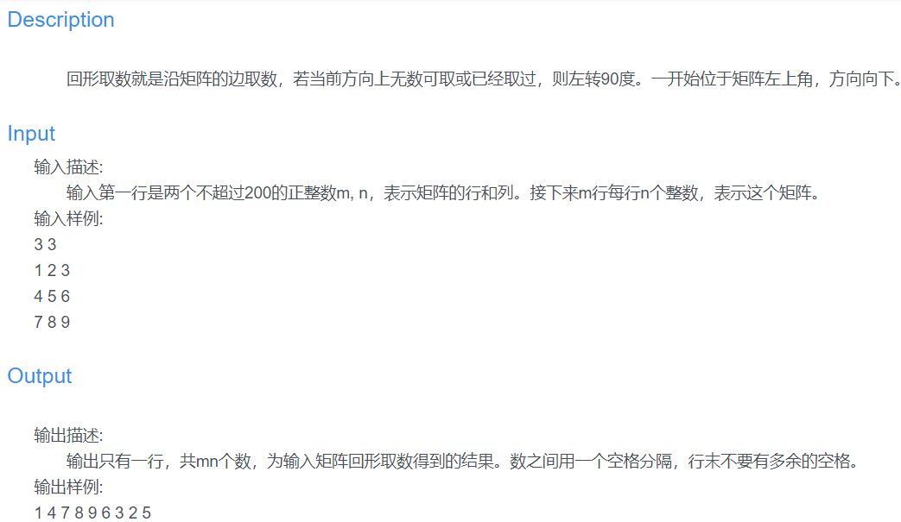

### 本题为蓝桥杯回形取数的python题解。
<!--more-->

这个题目按照下右上左的顺序取数，并对每个取过的数进行标记。
一下代码提交后为runtime error，不太清楚为啥。之后再继续找找原因
```
# str1 = input()
# arr1 = str1.split(' ')
# m = int(arr1[0])
# n = int(arr1[1])
m,n = map(int,input().split()) #简单写法
Arr = [[] for i in range(m)]
Arr = [[] * n] * m
for i in range(m):
    Arr[i] = [int(j) for j in input().split()]
#for i in range(m):
#    str2 = input()
#    Arr[i] = str2.split(' ')
sum = m * n
i = 0
j = 0
while sum > 0: #取过的数赋值为-1
    while i < m and Arr[i][j] != -1: #向下取数
        print(Arr[i][j],end=' ')
        Arr[i][j] = -1
        sum -= 1
        i += 1
    i -= 1
    j += 1
    while j < n and Arr[i][j] != -1: #向右取数
        print(Arr[i][j],end=' ')
        Arr[i][j] = -1
        sum -= 1
        j += 1
    j -= 1
    i -= 1
    while i >= 0 and Arr[i][j] != -1: #向上取数
        print(Arr[i][j],end=' ')
        Arr[i][j] = -1
        sum -= 1
        i -= 1
    i += 1
    j -= 1
    while j >= 0 and Arr[i][j] != -1: #向左取数
        print(Arr[i][j],end=' ')
        Arr[i][j] = -1
        sum -= 1
        j -= 1
    j += 1

```