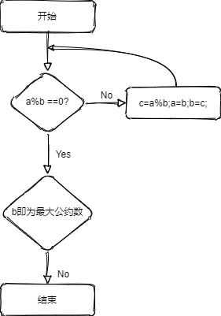
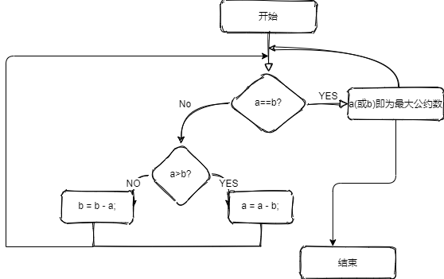
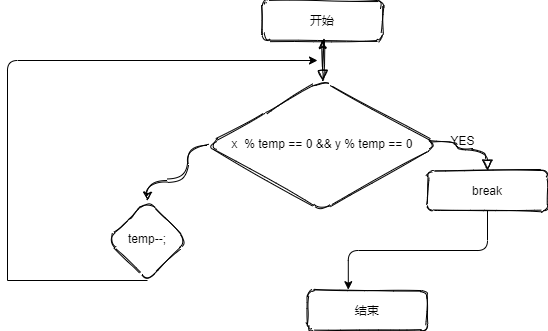

## 编程时经常需要求两个数的最大公约数，本文进行一个简单的整理

<!--more-->

## 辗转相除法（欧几里得算法）



代码块

```c++
int measure(int x, int y)
{
    int z = y;
    while(x%y!=0)
    {
    z = x%y;
    x = y;
    y = z;
    }
    return z;
}

```

## 辗转相减法



代码块

```c++
int measure(int a,int b)
{
    while(a != b)
    {
        if(a>b)
        {
            a = a - b;
        }
        else
        {
            b = b - a;
        }
}
return a;
```

## 穷举法



代码

```c++
int measure(int x,int y)
{
    int temp = 0;
    for(temp = x ; ; temp-- )
    {
        if(x%temp == 0 && y%temp==0)
            break;
    }
    return temp;
}
```

