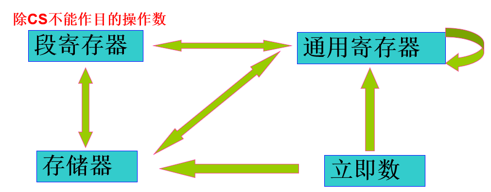

### 汇编的简单学习笔记
<!--more-->

#### 简单传送指令

##### 传送指令

**MOV DEST，SRC** （DEST <= SRC）
操作数尺寸必须保持一致
立即数永远不能作为目的操作数，CS寄存器不能做目的操作数。EIP不能作为操作数。
不影响各标志位状态。

##### 交换指令

**XCHG OPRD1,OPRD2**
内容交换
不能同时是存储单元，也不能有立即数。操作数尺寸一致。

#### 简单加减指令

##### 加法指令
**ADD DEST，SRC** （DEST <= DEST + SRC）
带进位的加法指令
**ADC DEST，SRC** （DEST <= DEST + SRC + CF）
加法指令ADD，ADC影响标志寄存器中的有关状态标志。

##### 减法指令

**SUB DEST，SRC** （DEST <= DEST-SRC）
带借位的减法指令
**SBB DEST，SRC** （DEST - SRC - CF = DEST）
减法指令SUB，SBB影响标志寄存器中的有关状态标志。

##### 加一指令

**INC DEST**  （DEST <= DEST + 1）
不影响标志寄存器中的进位标志（CF），会影响其他状态标志。

##### 减一指令

**DEC DEST** （DEST <= DEST -1)
不影响标志寄存器中的进位标志（CF），会影响其他状态标志。

##### 去补指令

**NEG OPRD** （OPRD <= 0-OPRD)
会影响标志寄存器中的有关状态标志。如果操作数为0，那么使得进位标志为0，否则进位标志为1。

#### 状态标志

| **状态标志** | **作用**|
| ------| ------|
|进位标志（CF）| 主要反应算数运算是否产生进位或借位。如果运算结果的最高位产生一个进位或借位，则CF被置1，否则CF被清0。|
| 零标志（ZF） | 反应运算结果是否为0. 如果运算结果为0，则ZF被置1，否则ZF被清0。|
|符号标志（SF）| 反应运算结果的符号位。SF与运算结果的最高位相同，如果运算结果的最高位为1，则SF被置1，否则被清0。**二进制表示的最高位**|
| 溢出标志（OF）| 反应**有符号数**加减运算是否引起溢出。如果溢出，OF置1，否则清0 （正数加上正数变成负数，负数加上负数变成正数。正数减去负数变成负数，负数减去正数变成正数）|
|奇偶标志（PF）| 反应运算结果**最低字节**中含有“1”的位数是偶数还是奇数。是偶数，PF置1，否则，清0. （可进行奇偶校验）|
|辅助进位标志（AF）| 反应算术运算中第3位是否产生进位或借位，或者最低的4位是否有进位或借位。如果产生进位或借位，AF置1，否则清0。|

#### 状态标志操作指令

|指令|作用|
|---|----|
|清进位标志指令（CLC）| 使进位标志CF为0|
|置进位标志指令（STC）| 使进位标志CF为1|
|进位标志取反指令（CMC）| 使进位标志CF取反|
|获取状态标志操作（LAHF）| 把标志寄存器的低8位，送到通用寄存器AH中。对标志位自身不产生影响。|
|设置状态标志操作指令（SAHF）| 对标志寄存器中低8位状态标志产生影响，使得SF，ZF，AF，PF和CF分别成为来自寄存器AH中对应位的值，但保留位（位1，位3和位5）不受影响|

#### 寻址方式

**立即寻址**
操作数是立即数。
**寄存器寻址**
**直接寻址**
操作数在存储器中。直接寻址的地址要放在括号中，在源程序中，往往用变量名表示。
**寄存器间接寻址**
操作数在存储器中。

#### 取有效地址指令

**LEA REG，OPRD**
把操作数OPRD的有效地址传送到操作数REG，原操作数OPRD必须是一个存储器操作数，目的操作数REG必须是一个16位或者32位通用寄存器。 
**不影响各标志。**

#### 条件转移指令

|指令格式|转移条件|转移说明|其他说明|
|---------|---------|---------|---------|
|JZ |ZF=1|等于0转移（jump if zero|单个标志|
|JE| ZF = 1|相等转移（jump if equal）|单个标志|
|JNZ|ZF=0|不等于0转移（Jump if not zero）|单个标志|
|JNE|ZF=0|不相等转移（Jump if not equal）|单个标志|
|JS|SF=1|为负转移（jump if sign）|单个标志|
|JNS|SF=0|为正转移（Jump if not sign）|单个标志|
|JO|OF=1|溢出转移（Jump if overflow）|单个标志|
|JNO|OF=0|不溢出转移（Jump if not overflow）|单个标志|
|JP|PF=1|偶转移（Jump if parity）|单个标志|
|JPE|PF=1|偶转移（Jump if parity even）|单个标志|
|JNP|PF=1|奇转移（Jump if not parity）|单个标志|
|JPO|PF=1|奇转移（Jump if parity odd）|单个标志|
|JB|PF=1|低于转移（Jump if below）|单个标志（无符号数）|
|JNAE|PF=1|不高于等于转移（Jump if not above or equal）|单个标志（无符号数）|
|JC|PF=1|进位位被置转移（Jump if carry）|单个标志（无符号数）|
|JNB|CF=0|不低于转移（Jump if not below）|单个标志（无符号数）|
|JAE|CF=0|高于等于转移（Jump if above or equal）|单个标志(无符号数）|
|JNC|CF=0|进位位被清转移（Jump if not carry）|单个标志（无符号数）|
|JBE|CF=1或者ZF=1|低于等于转移（Jump if below or equal）|两个标志（无符号数）|
|JNA|CF=1或者ZF=1|不高于转移（Jump if not above）|两个标志（无符号数）|
|JNBE|CF=0并且ZF=0|不低于等于转移（Jump if not below or equal）|两个标志（无符号数）|
|JA|CF=0并且ZF=0|高于转移（Jump if above）|两个标志（无符号数）|
|JL|SF！=OF|小于转移（jump if less）|两个标志（有符号数）|
|JNGE|SF！=OF|不大于等于转移（Jump if not greater or equal）|两个标志（有符号数）|
|JNL|SF=OF|不小于转移（Jump if not less）|两个标志（有符号数）|
|JGE|SF=OF|大于等于转移（Jump if greater or equal）|两个标志（有符号数）|
|JLE|ZF=1或者SF！=OF|小于等于转移（Jump if not less）|三个标志（有符号数）|
|JNG|ZF=1或者SF！=OF|不大于转移（Jump if not greater）|三个标志（有符号数）|
|JNLE|ZF=0并且SF=OF|不小于等于转移（Jump if not less or equal）|三个标志（有符号数）|
|JG|ZF=0并且SF=OF|大于转移（Jump if greater）|三个标志（有符号数）|
|JCXZ|CX=0|计数器CX为0转移|与标志无关|
|JECXZ|ECX=0|计数器ECX为0转移|与标志无关|
|JMP OPRD/LABEL||无条件跳转指令||

##### 比较指令

**CMP DEST，SRC**
根据DEST-SRC的差来**影响标志寄存器中的各状态标志**，但不把作为结果的差发送到目的操作数DEST。

##### 无条件转移指令

**JMP LABEL**
无条件转移，不影响标志。

##### 堆栈的主要用途

* 保护寄存器内容或者保护现场
* 保护返回地址
* 传递参数
* 安排局部变量或者临时变量

**PUSH SRC**
将源操作数SRC压入堆栈。
**POP DEST**
从栈顶弹出一个双字或者字数据到目的操作数DEST。
**堆栈指令不影响标志位**
压入或弹出16位或32位数应加前缀WORD PTR或DWORD PTR.(寄存器除外）
##### 通用寄存器全进栈指令和全出栈指令

**PUSHA**
**POPA**
16位通用寄存器指令。压入顺序为AX，CX，DX，BX，SP，BP，SI，DI。
出栈顺序相反。
**PUSHAD**
**POPAD**
32位通用寄存器指令。压入顺序EAX，ECX，EDX，EBX，ESP，EBP，ESI，EDI。
出栈顺序相反。
#### 乘除运算指令
##### 无符号数乘法指令
**MUL OPRD**
OPRD是字节操作数，则把AL中的无符号数与OPRD相乘，16位结果送到AX中；如果OPRD是字操作数，则把AX中的无符号数与OPRD相乘，32位结果送到寄存器对DX：AX中，DX含高16位，AX含低16位。如果OPRD是双字操作数，则把EAX中的无符号数与OPRD相乘，64位结果送到寄存器对EDX：EAX中，EDX含高32位，EAX含低32位。
**OPRD不能是立即数。**
##### 有符号数乘法指令
**IMUL OPRD**
隐含操作数 AL，AX和EAX，跟OPRD尺寸有关
**IMUL DEST，SRC**（DEST <= DEST * SRC）
SRC可以为立即数。
**IMUL DEST，SRC1，SRC2**（DEST <= SRC1 * SRC2）
SRC1不能是立即数，SRC2只能是立即数

如果乘积的高半部分（字节相乘时为AH）不等于0，则标志CF=1，OF=1；否则CF=0，OF=0.对其他标志为无定义。
##### 无符号数除法指令
**DIV OPRD**
如果OPRD是字节操作数，则把AX中的无符号数除以OPRD，所得商送到AL中，余数送到AH中；如果OPRD是子操作数，则把寄存器对DX：AX中的无符号数除以OPRD，所得商送到AX，余数送到DX中。如果OPRD是双字操作数，则把寄存器对EDX：EAX中的无符号数除以OPRD，所得商送到EAX中，余数送到EDX中。
**OPRD不能是立即数**
##### 有符号数除法指令
**IDIV OPRD**

除法指令对状态标志的影响无定义。

#### 符号扩展指令

|指令|作用|详情|
|----|-----|-----|
|CBW|字节转换为字指令|把寄存器AL中的符号扩展到寄存器AH。若AL最高位为0，AH=0，若AL最高位为1，AH=OFFH|
|CWD|字转换为双字指令|把寄存器AX中的符号扩展到寄存器DX。若AX最高位为0，DX=0，若AX最高位为1，DX=OFFFFH|
|CDQ|双字转换为四字指令|把寄存器EAX中的符号扩展到寄存器EDX。若EAX最高位为0，EDX=0，若EAX最高位为1，EDX=OFFFFFFFFH|
|CWDE|另一条字转换为双字指令|把寄存器AX中的符号扩展到寄存器EAX。若AX最高位为0，EAX的高16位都为0，若AX最高位为1，则EAX的高16位都为1.|
这四条指令不影响状态标志位。

#### 扩展传送指令
##### 符号扩展传送指令

**MOVSX DEST，SRC**
把源操作数SRC符号扩展后送至目的操作数DEST。
不改变源操作数，也不影响标志寄存器中的状态标志。
##### 零扩展传送指令
**MOVZX DEST，SRC**
把源操作数SRC扩展后送至目的操作数DEST。
不改变源操作数，也不影响标志寄存器中的状态标志。

#### 逻辑运算指令

|指令|作用|
|----|-----|
|NOT OPRD|操作数按位取反，送回OPRD 对标志没有影响|
|AND DEST，SRC|两个操作数按位与操作，使CF=0，OF=0，其他标志反映运算结果，AF未定义|
|OR DEST，SRC|按位或运算 使CF=0，OF=0，其他标志反应运算结果，AF未定义|
|XOR DEST，SRC|按位异或运算 使CF=0，OF=0，其他标志反应运算结果，AF未定义|
|TEST DEST，SRC|两个操作数按位与，但不送到DEST，CF=0，OF=0，其他标志反应运算结果|

#### 移位指令

|指令|作用|详情|
|----|-----|----|
|SAL OPRD，count|算术左移指令|操作数OPRD左移count位，每向左移动一位，右边用0补足一位，移出的最高位进入标志位CF。状态CF受影响；SF、ZF和PF反映移位后的结果；标志OF受影响较复杂，AF未定义|
|SHL OPRD，count|逻辑左移指令|操作数OPRD左移count位，每向左移动一位，右边用0补足一位，移出的最高位进入标志位CF。状态CF受影响；SF、ZF和PF反映移位后的结果；标志OF受影响较复杂，AF未定义|
|SAR OPRD，count|算术右移指令|操作数OPRD右移count位，每向右移动一位，左边符号保持不变，移出的最低位进入标志位CF。状态CF受影响；SF、ZF和PF反映移位后的结果；标志OF受影响较复杂，AF未定义|
|SHR OPRD，count|逻辑右移指令|操作数OPRD右移count位，每向右移动一位，左边用0补足，移出的最低位进入标志位CF。状态CF受影响；SF、ZF和PF反映移位后的结果；标志OF受影响较复杂，AF未定义|
|ROL OPRD，count|左循环移位指令|OPRD循环左移count位，每向左移一位，操作数的最高位移入最低位，同时最高位移入进位标志CF。标志CF受影响，标志OF受影响情况较复杂，其他状态标志不受影响。|
|ROR OPRD，count|右循环移位指令|OPRD循环右移count位，每向右移一位，操作数的最低位移入最高位，同时最低位移入进位标志CF。标志CF受影响，标志OF受影响情况较复杂，其他状态标志不受影响。|
|RCL OPRD，count|带进位左循环移位指令|把操作数OPRD连同CF循环左移count位，每向左移一位，操作数的最高位移入进位标志CF，CF移入操作数的最低位。标志CF受影响，标志OF受影响情况较复杂，其他状态标志不受影响。|
|RCR OPRD，count|带进位右循环移位指令|把操作数OPRD连同CF循环右移count位，每向右移一位，操作数的最低位移入进位标志CF，CF移入操作数的最高位。标志CF受影响，标志OF受影响情况较复杂，其他状态标志不受影响。|
|SHLD OPRD1，OPRD2，count|双精度左移指令|OPRD1左移指定count位，低端端空出的位用操作数OPRD2高端的count位填补，OPRD2内容保持不变。OPRD1中最后移出的位保留在进位标志CF中。|
|SHRD OPRD1，OPRD2，count|双精度右移指令|OPRD1右移指定count位，高端空出的位用操作数OPRD2低端的count位填补，OPRD2内容保持不变。OPRD1中最后移出的位保留在进位标志CF中|

#### 循环指令

**循环指令不影响各标志**

|指令|格式|详情|
|----|----|-----|
|计数循环指令|LOOP LABEL|使寄存器ECX值减1，如果结果不等于0，则转移到标号LABEL处，否则顺序执行LOOP后的指令 相当于 DEC ECX， JNZ LABEL 两条指令|
|等于/全零循环指令|LOOPE LABEL/LOOPZ LABEL|使寄存器ECX值减1，如果结果不等于0，且零标志ZF等于1，转移到标号LABEL处，否则顺序执行。指令本身实施的寄存器ECX减1不影响标志|
|不等于/非零循环指令|LOOPNE LABEL/LOOPNZ LABEL|使寄存器ECX值减1，如果结果不等于0，且零标志ZF等于0，转移到标号LABEL处，否则顺序执行。指令本身实施的寄存器ECX减1不影响标志|
|计数器转移指令|JECXZ LABEL|当寄存器ECX值等于0时转移到标号LABEL处，否则顺序执行。|

#### 字符串操作
字符串操作的方向由标志寄存器中的**方向标志DF**控制
当方向标志DF复位（为0）时，操作方向是由低到高，按递增方式调整寄存器ESI或EDI的值；
当方向标志DF置位（为1）时，操作方向是由高到低，按递减方式调整寄存器ESI或EDI的值。

|指令|格式|详情|
|----|-----|-----|
|字符串装入字节|LODSB|把寄存器ESI指向的一个字节数据装入到累加器AL中，根据方向标志DF复位或置为使ESI的值增1或减1|
|字符串装入字|LODSW|把寄存器ESI指向的一个字数据装入到累加器AX中，根据方向标志DF复位或置为使ESI的值增2或减2|
|字符串装入双字|LODSD|把寄存器ESI指向的一个双字数据装入到累加器AX中，根据方向标志DF复位或置为使ESI的值增4或减4|
|存储字节|STOSB|STOSB把累加器AL的内容送到寄存器ED所指向的存储单元中，然后根据方向标志DF复位或置位使EDI的值增1或减1.|
|存储字|STOSW|STOSW把累加器AX的内容送到寄存器EDI所指向的存储单元中，然后根据方向标志DF使EDI的值增2或减2|
|存储双字|STOSD|STOSD把累加器EAX的内容送到寄存器EDI所指向的存储单元中，然后根据方向标志DF使ED的值增4或减4。|
|字节传送|MOVSB|MOVSB把寄存器ESI所指向的一个字节数据传送到由寄存器EDI所指向的存储单元中，然后根据方向标志DF复位或置位使ESI和EDI的值分别增1或减1.不会影响AL。不影响标志|
|字传送|MOVSW|MOVSW把寄存器ESI所指向的一个字数据传送到由寄存器EDI所指向的存储单元中，然后根据方向标志DF使ESI和EDI的值分别增2或减2。不影响标志|
|双字传送|MOVSD|MOVSD把寄存器ESI所指向的一个双字数据传送到由寄存器ED所指向的存储单元中，然后根据方向标志DF使ESI和EDI的值分别增4或减4.不影响标志|
|串字节扫描|SCASB|SCASB把累加器AL的内容与由寄存器EDI所指向一个字节数据采用择减方式比较，相减结果反映到各状态标志（CF、ZF、OF、SF、PF和AF），但不影响两个提作数，然后根据方向标志DF复位或置位使EDI的值增1或减1。 |
|串字扫描|SCASW|SCASW把累加器AX的内容与由寄存器EDI所指向的一个字数据比较结果影响标志，然后EDI的值增2或减2.|
|串双字扫描|SCASD|SCASD把累加器EAX的内容与由寄存器ED所指向的一个双字数据比较，结果影响标志，然后EDI的值增4或减4。|
|串字节比较|CMPSB|CMPSB把寄存器ESI所指向的一个字节数据与由寄存器ED所指向的个字节数据采用相减方式出较，相减结果反映到各状态标志（CE、ZF、OF、SF、PF和AF）不影响两个操作数，根据方向标志DF复位或置位是ESI和EDI的值分别增1或减1|
|串字比较|CMPSW|CMPSW把寄存器ESI所指向的一个字数据与由寄存器EDI所指向的个字数据比较，结果影响标志，然后按调整值2调整ESI和EDI的值|
|串双字比较|CMPSD|CMPSD把寄存器ESI所指向的一个双字数据与由寄存器EDI所指向的一个双字数据比较，结果影响标志，然后按调整值4调整ESI和EDI的值。|