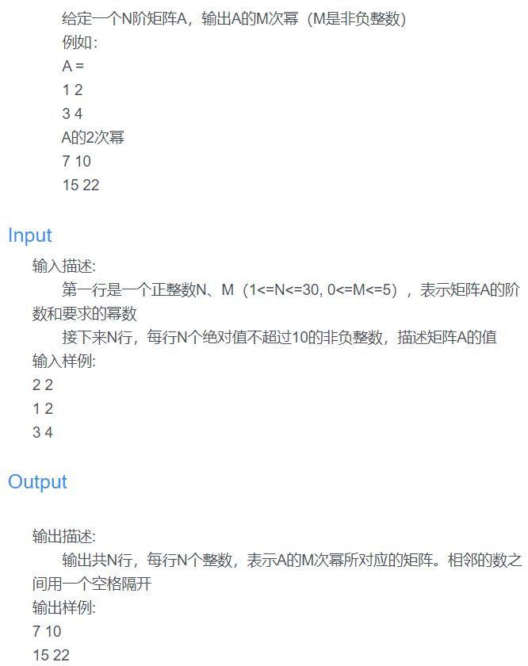

### 本文为蓝桥杯矩阵乘法的题解。
<!--more-->

题目描述

运用到矩阵幂的方法
```
str1 = input()
arr1 = str1.split(' ')
m = int(arr1[0])
n = int(arr1[1])
Arr1 = [[] for i in range(m)]
Arr2 = []
Arr3 = []
for i in range(m):
    Arr2.append([])
    Arr3.append([])
    for j in range(m):
        Arr2[i].append(0)
        Arr3[i].append(0)
for i in range(m):
    str2 = input()
    Arr1[i] = str2.split(' ')
for i in range(m):
    for j in range(m):
        Arr2[i][j] = Arr1[i][j]
        if n == 0: #当为0次幂时，为单位矩阵
            if i == j:
                Arr3[i][j] = 1
            else:
                Arr3[i][j] = 0
        else:
            Arr3[i][j] = Arr1[i][j]
for t in range(n-1):
    for i in range(n):
        for j in range(m):
            tmp = 0
            for k in range(m):
                tmp += int(Arr2[i][k]) * int(Arr1[k][j]) #矩阵相乘
            Arr3[i][j] = tmp
    for i in range(m):
        for j in range(m):
            Arr2[i][j] = Arr3[i][j]
for i in range(m):
    for j in range(m):
        print(Arr3[i][j],end=' ')
    print()
```