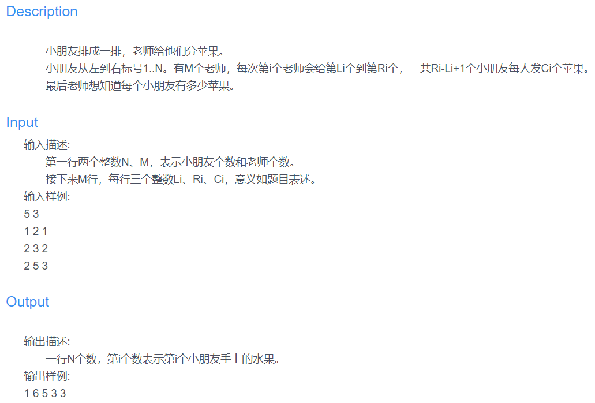

### 本文为蓝桥杯分苹果的python题解
<!--more-->

看到这道题感觉还可以，花了一会就写出了代码，但提交上却TLE，试着简化了简化还是不行，最后找到了其他大佬的解法，通过差分数组求解

## 我的方法和代码如下

也可解出答案，但是会超时
Time Limit Exceeded

```
N,M = map(int,input().split(' '))
Arr = [0] * N
for i in range(M):
    a,b,c = map(int,input().split())
    for j in range(a,b+1):
        Arr[j-1] += c
for i in range(N):
    print(Arr[i],end=' ')
```
## 运用差分数组
代码很简洁，只计算一次就行
f[i] = d[i] - d[i-1]
d[2] = f[1]+d[0]+f[2] = d[1] + d[2] -d[1] = d[2]
数列第i项的值是可以用差分数组的前i项的和计算的，即d[i] = f[i]的前缀和
差分数组其实就相当于通过改变区间前段和末端与其他部分的差值，在最后进行累加的时候实行对整个区间的值的改变
```
N,M = map(int,input().split(' '))
Arr = [0] * (N + 2)
for i in range(M):
    a,b,c = map(int,input().split())
    Arr[a] += c
    Arr[b+1] -= c
for i in range(1,N+1):
    Arr[i] += Arr[i-1]
    print(Arr[i],end=' ')
```