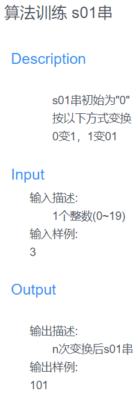

### 本文为蓝桥杯s01串的题解。
<!--more-->


# 直接计算 暴力求解

```
n = eval(input())
str1 = '0'
if n == 0:
    print(str1)
    else:     #通过两个字符串，一个作为对照一个进行运算，一轮结束后重新赋值后再运算
    for i in range(n):          
        str2 = ''
        for i in range(len(str1)):
            if str1[i] == '0':
                str2 += '1'
            else:
                str2 += '01'
        str1 = str2
    print(str1)
```
# 递归运算
## 规律：

起始  0

n=1:   1

n=2:   01

n=3:   101

n=4:   01101

n=5:   10101101

发现一个串是由前两个串拼接起来
```
def ans(n):
    if n == 0:
        print('0',end='')
    elif n == 1:
        print('1',end='')
    else:
        ans(n-2)
        ans(n-1)
n = eval(input())
ans(n)
```
# 来个错误的事例 
python字符串一旦创建，里边的元素不可以更改，可以重新赋值，或者变换为列表进行替换
```
n = eval(input())
str1 = '0'
for i in range(n):
    for j in range(len(str1)):
        if str1[j] == '0':
            str1[j] = "1" #这里语法错误,元素无法更改
        else:
            str1.insert(j,"0")
            j += 1
print(str1)
```