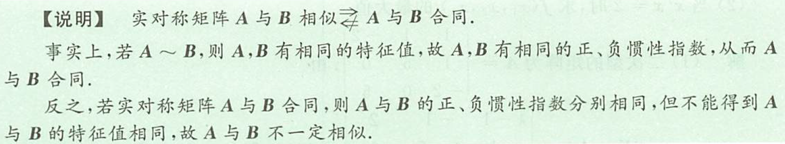
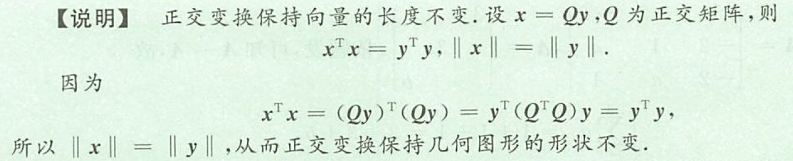
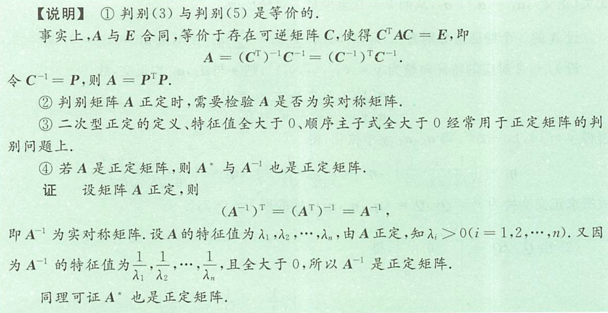

## 二次型的概念及其标准形

### 基本概念

#### 二次型的标准形

二次型只含平方项，即$f(x_1,x_2,\dotsb,x_n)=d_1x_1^2+d_2x_2^2+\dotsb+d_nx_n^2$，称为二次型的标准形

#### 二次型的标准化

二次型可通过坐标变换$x=Cy$(C可逆)化为标准型
$x^TAx\xlongequal{x=Cy}(Cy)^T(Cy)=y^TC^TACy=y^T\Lambda y=d_1y_1^2+d_2y_2^2+\dotsb+d_ny_n^2$，其中$\Lambda=C^TAC$
由于A是实对称矩阵，故存在正交变换$x=Qy$(Q为正交矩阵)将$x^TAx$标准化，即$x^TAx\xlongequal{x=Qy}y^TQ^TAQy=y^TQ^{-1}AQy=y^T\Lambda y=\lambda_1y_1^2+\lambda_2y_2^2+\dotsb+\lambda_ny_n^2$，其中$\Lambda=Q^TAQ=Q^{-1}AQ,\lambda_1,\lambda_2,\dotsb,\lambda_n$为A的特征值

(1) 由于二次型的矩阵是实对称矩阵，且唯一，故二次型与实对称矩阵A一一对应
(2) 标准型的矩阵是对角矩阵
(3) 二次型化为标准形实质上就是将矩阵A化为对角矩阵，由于A是实对称矩阵，故一定可以用正交矩阵将其化为对角矩阵，即二次型总可以利用正交变换化为标准形

#### 惯性指数

在标准形中，正平方项的个数称为正惯性指数，记为p；负平方项的个数称为负惯性指数，记为q。

#### 惯性定理

二次型经过可逆坐标变换后，正、负惯性指数保持不变，且$p+q=r(f)=r(A)$

#### 二次型的规范形

若n元二次型$x^TAx$经过坐标交换$x=Cy$化为标准形
$x^TAx\xlongequal{Cy}d_1y_1^2+\dotsb+d_py_p^2-d_{p+1}y_{p+1}^2-\dotsb-d_{p+q}y_{p+q}^2$，其中$d_i>0(i=1,2,\dotsb,p+q)$。再用坐标变换
$$\begin{cases}
    y_1=\frac{1}{\sqrt{d_1}}z_1,\\
    y_2=\frac{1}{\sqrt{d_2}}z_2,\\
    \dotsb\dotsb \\
    y_{p+q}=\frac{1}{\sqrt{d_{p+q}}}z_{p+q},\\
    y_{p+q+1}=z_{p+q+1},\\
    \dotsb\dotsb\\
    y_n=z_n
\end{cases}$$
则二次型化为$z_1^2+\dotsb+z_p^2-z_{p+1}^2-\dotsb-z_{p+q}^2$，称为规范形，二次型的规范形是唯一的，但标准形不唯一（与坐标变换有关）

#### 矩阵合同

若A,B为n阶实对称矩阵，存在可逆矩阵C，使得$c^TAC=B$，则称A与B合同。
若A,B为n阶实对称矩阵，则A与B合同$\Leftrightarrow p_A=p_n,q_A=q_n$

#### 坐标变换

形如$\begin{cases}
    x_1=c_{11}y_1+c_{12}y_2+c_{13}y_3,\\
    x_2=c_{21}y_1+c_{22}y_2+c_{23}y_3,\\
    x_3=c_{31}y_1+c_{32}y_2+c_{33}y_3
\end{cases}$，称为坐标变换，记作x=Cy，其中$C=(c_{ij})_{3\times3}$，且C可逆，$x=(x_1,x_2,x_3)^T,y=(y_1,y_2,y_3)^T$

### 二次型化为标准形的方法

#### 正交变换

1. 求A的特征值，即由$|\lambda E-A|=0$，得$\lambda_1,\lambda_2,\dotsb,\lambda_n$
2. 求A的特征向量，即由$(\lambda_iE-A)x=0(i=1,2,\dotsb,n)$，得$\alpha_1,\alpha_2,\dotsb,\alpha_n$
3. 对$\alpha_1,\alpha_2,\dotsb,\alpha_n$进行施密特正交化、单位化，的$\eta_1,\eta_2,\dotsb,\eta_n$(正交化只针对重特征值对应的特征向量)
4. 令$Q=(\eta_1,\eta_2,\dotsb,\eta_n)$，则x=Qy为正交变换
5. 写出标准形$\lambda_1y_1^2+\lambda_2y_2^2+\dotsb+\lambda_ny_n^2$

#### 配方法

## 正定二次型与正定矩阵

### 正定二次型的概念

设二次型$f(x_1,x_2,\dotsb,x_n)=x^TAx$(A为对称矩阵)，若对任意$x\ne0$，都有$x^TAx>0$，则称二次型正定，称A为正定矩阵

### 正定二次型的判别

1. 二次型$x^TAx$正定$\Leftrightarrow$A的特征值全大于0
2. 二次型$x^TAx$正定$\Leftrightarrow$A的顺序主子式全大于0
3. 设A为实对称矩阵，则A正定$\Leftrightarrow$A合同与单位矩阵E
4. 设A为实对称矩阵，则A正定$\Leftrightarrow$正惯性指数$p=n=r(A)$
5. 设A为实对称矩阵，则A正定$\Leftrightarrow$存在可逆矩阵P，使得$A=P^TP$
6. 二次型$x^TAx$正定的必要条件是$a_{ii}>0(i=1,2,\dotsb,n)$

