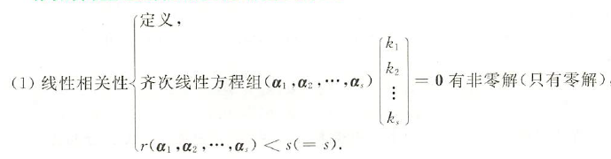
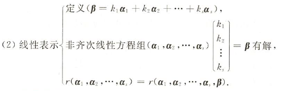

## 向量及其运算

### 向量及其运算的概念

#### 向量的定义

由n个数$a_1,a_2,\dotsb,a_n$所组成的有序数组$\alpha=(a_1,a_2,\dotsb,a_n)^T$或$\alpha=(a_1,a_2,\dotsb,a_n)$叫做n维列向量或n维行向量

#### 向量的线性运算

设$\alpha=(a_1,a_2,\dotsb,a_n)^T,\beta=(b_1,b_2,\dotsb,b_n)^T$，则
$$k\alpha=(k\alpha_1,k\alpha_2,\dotsb,ka_n)^T,\\ \alpha\pm\beta=(a_1\pm b_1,a_2\pm b_2,\dotsb,a_n\pm b_n)^T$$

相等 $\alpha=\beta\Leftrightarrow\alpha,\beta$同维，且对应分量$a_i=b_i,i=1,2,\dotsb,n.$
<!--more-->

**向量的模** 设向量$\alpha=(a_1,a_2,\dotsb,a_n)$，称 $\sqrt{(a_1^2+a_2^2+\dotsb+a_n^2)}$为向量$\alpha$ 的模，记为$|\alpha|$，即$|\alpha|=\sqrt{(a_1^2+a_2^2+\dotsb+a_n^2)}$

**向量的单位化** 设$\alpha=(a_1,a_2,\dotsb,a_n)$为非零向量，与向量$\alpha$方向相同且单位长度为1的向量称为向量$\alpha$对应的单位向量，令 $\alpha^0=\frac{1}{|\alpha|}\alpha$，则$\alpha^0$为向量$\alpha$的单位化向量

### 向量内积的运算

#### 向量内积的定义

设有 n 维向量$\alpha=(a_1,a_2,\dotsb,a_n)^T,\beta=(b_1,b_2,\dotsb,b_n)^T$，则内积$(\alpha,\beta)=\alpha^T\beta=\beta^T\alpha=\sum_{i=1}^na_ib_i$

#### 内积的性质

1. $(\alpha,\beta)=(\beta,\alpha)=\alpha^T\beta=\beta^T\alpha$ 对称性；
2. $(\alpha,\alpha)=\alpha^T\alpha=|\alpha|^2$，且$(\alpha,\alpha)=0\Leftrightarrow\alpha=0$
3. $(\alpha,k_1\beta_1+\dotsb+k_n\beta_n)=k_1(\alpha_1\beta_1)+k_2(\alpha_1\beta_2)+\dotsb+k_n(\alpha_1\beta_n)$
4. 若 $(\alpha,\beta)=0\Leftrightarrow a_1b_2+a_2b_2+\dotsb+a_nb_n=0$，称$\alpha,\beta$正交，记为$\alpha\perp\beta$
5. $(\alpha,\alpha)\ge0$,等号成立当且仅当$\alpha=0$ 正定性

#### 正交单位向量

设$a_1,a_2,\dotsb,a_n$是n维向量，若
(1) $(\alpha_i,\alpha_j)=0(i\ne j,i,j=1,2,\dotsb,n)$;
(2) $a_1,a_2,\dotsb,a_n$是单位向量，
则称$a_1,a_2,\dotsb,a_n$为正交单位向量

### 正交矩阵

#### 正交矩阵的定义

设 A 为 n 阶矩阵，若$AA^T=A^TA=E$，则称 A 为正交矩阵

#### 正交矩阵的性质

1. A是正交矩阵$\Leftrightarrow A^{-1}=A^T$
2. 由$AA^T=A^T=E$，知$|A|^2=1\Leftrightarrow|A|=\pm1$
3. 正交矩阵A的几何含义：A的列（或行）是两两垂直的单位向量

## 向量组的线性相关性与线性表示

### 向量组

若干个同维数的行向量（或同维数的列向量）所组成的集合叫做*向量组*
$\alpha_1,\alpha_2,\dotsb,\alpha_r$及$\alpha_1,\alpha_2,\dotsb,\alpha_r,\dotsb,\alpha_s$(其中$s\ge r$),称$\alpha_1,\alpha_2,\dotsb,\alpha_r$是$\alpha_1,\alpha_2,\dotsb,\alpha_s$的*部分组*，$\alpha_1,\alpha_2,\dotsb,\alpha_s$是*整体组*
向量组$\alpha_1=[a_{11},a_{21},\dotsb,a_{r1}]^T,\alpha_2=[a_{12},a_{22},\dotsb,a_{r2}]^T,\dotsb,\alpha_m=[a_{1m},a_{2m},\dotsb,a_{rm}]^T$及$\widetilde{\alpha_1}=[a_{11},a_{21},\dotsb,a_{r1},\dotsb,a_{s1}]^T,\widetilde{\alpha_2}=[a_{12},a_{22},\dotsb,a_{r2},\dotsb,a_{s2}]^T,\dotsb,\widetilde{\alpha_m}=[a_{1m},a_{2m},\dotsb,a_{rm},\dotsb,a_{sm}]^T$其中$s\ge r$，则称$\widetilde{\alpha_1},\widetilde{\alpha_2},\dotsb,\widetilde{\alpha_m}$为向量组$\alpha_1,\alpha_2,\dotsb,\alpha_m$的*延伸组*（或称$\alpha_1,\alpha_2,\dotsb,\alpha_m$是$\widetilde{\alpha_1},\widetilde{\alpha_2},\dotsb,\widetilde{\alpha_m}$的*缩短组*）

### 向量组线性相关

#### 定义

对 m 个 n 维向量$\alpha_1,\alpha_2,\dotsb,\alpha_m$，若存在不全为零的数$k_1,k_2,\dotsb,k_m$，使得$k_1\alpha_1+k_2\alpha_2+\dotsb+k_m\alpha_m=0$成立，则称向量组$\alpha_1,\alpha_2,\dotsb,\alpha_m$*线性相关*

#### 等价说法

若$\alpha_1,\alpha_2,\dotsb,\alpha_m$是n维列向量，存在不全为零的数$k_1,k_2,\dotsb,k_m$使得$k_1\alpha_1+k_2\alpha_2+\dotsb+k_m\alpha_m=0\Leftrightarrow$齐次线性方程组$(\alpha_1,\alpha_2,\dotsb,\alpha_n)\begin{bmatrix}
    k_1\\
    k_2 \\
    \vdots \\
    k_m
\end{bmatrix}=0$有非零解$\Leftrightarrow r(\alpha_1,\alpha_2,\dotsb,\alpha_n)<m$

#### 判别向量组线性相关的常用步骤

设$\alpha_1,\alpha_2,\dotsb,\alpha_m$是n维向量

1. 当$m>n$时，向量组必线性相关；
2. 当$m=n$时，若行列式$|(\alpha_1,\alpha_2,\dotsb,\alpha_n)|=0$，则向量组必线性相关；
3. 当$m<n$时，若秩$r(\alpha_1,\alpha_2,\dotsb,\alpha_n)<m$，则向量组必线性相关

### 向量组线性无关

#### 线性无关定义

对 m 个 n 维向量$\alpha_1,\alpha_2,\dotsb,\alpha_m$，若$k_1\alpha_1+k_2\alpha_2+\dotsb+k_m\alpha_m=0$成立，当且仅当$k_1=k_2=\dotsb=k_m=0$，则称$\alpha_1,\alpha_2,\dotsb,\alpha_n$线性无关

#### 线性无关等价说法

若$\alpha_1,\alpha_2,\dotsb,\alpha_m$是n维列向量，则向量组线性无关$\Leftrightarrow$齐次线性方程组$(\alpha_1,\alpha_2,\dotsb,\alpha_n)\begin{bmatrix}
    k_1\\
    k_2 \\
    \vdots \\
    k_m
\end{bmatrix}=0$只有零解$\Leftrightarrow r(\alpha_1,\alpha_2,\dotsb,\alpha_n)=m$

#### 判别向量组线性无关的常用方法

1. 定义法:设$k_1\alpha_1+k_2\alpha_2+\dotsb+k_m\alpha_m=0\Rightarrow k_1=k_2=\dotsb=k_m=0$。
2. 利用行列式$|(\alpha_1,\alpha_2,\dotsb,\alpha_m)|\ne0$或$r(\alpha_1,\alpha_2,\dotsb,\alpha_m)=m$进行判别

### 线性表示

#### 线性表示定义

设m 个 n 维向量$\alpha_1,\alpha_2,\dotsb,\alpha_m$，存在m个数$k_1,k_2,\dotsb,k_m$，使得$\beta=k_1\alpha_1+k_2\alpha_2+\dotsb+k_m\alpha_m$,则称$\beta$可由$a_1,a_2,\dotsb,a_m$线性表示

#### 线性表示等价说法

设$\alpha_1,\alpha_2,\dotsb,\alpha_m$是n维列向量，存在$k_1,k_2,\dotsb,k_m$使得$\beta=k_1\alpha_1+k_2\alpha_2+\dotsb+k_m\alpha_m\Leftrightarrow$非齐次线性方程组$(\alpha_1,\alpha_2,\dotsb,\alpha_n)\begin{bmatrix}
    k_1\\
    k_2 \\
    \vdots \\
    k_m
\end{bmatrix}=\beta$有解$\Leftrightarrow r(\alpha_1,\alpha_2,\dotsb,\alpha_n)=r(\alpha_1,\alpha_2,\dotsb,\alpha_n,\beta)$

**说明：**
若非齐次线性方程组有唯一解，则$\beta$可由$\alpha_1,\alpha_2,\dotsb,\alpha_m$唯一表示；若非齐次线性方程组有无穷多解，则线性表示不唯一
设$\alpha_1,\alpha_2,\dotsb,\alpha_n$线性无关，而$\beta,a_1,a_2,\dotsb,a_m$线性无关，则$\beta$可由$\alpha_1,\alpha_2,\dotsb,\alpha_n$线性表示，且表示方法唯一

### 极大线性无关组与向量组等价

#### 极大线性无关组

设向量组$\alpha_1,\alpha_2,\dotsb,\alpha_n$满足：
(1) 向量组$\alpha_1,\alpha_2,\dotsb,\alpha_n$中有r个向量线性无关；
(2) 向量组$\alpha_1,\alpha_2,\dotsb,\alpha_n$中任意r+1个向量（如果有）线性相关，
则称这r个线性无关的向量为该向量组的一个极大线性无关组，其中r称为向量组的秩，即$r(\alpha_1,\alpha_2,\dotsb,\alpha_n)=r$

#### 向量组等价

1. 设n维向量组$(I)\alpha_1,\alpha_2,\dotsb,\alpha_s,(II)\beta_1,\beta_2,\dotsb,\beta_t$，若向量组(I)可由向量组(II)线性表示，且向量组(II)也可以由向量组(I)线性表示（互相线性表示），则称(I)与(II)等价
2. 向量组(I)与向量组(II)等价$\overset{\Rightarrow}{\nLeftarrow}r(I)=r(II)$

#### 利用向量组的秩判别线性表示

1. $r(\alpha_1,\alpha_2,\dotsb,\alpha_m,\beta)=r(\alpha_1,\alpha_2,\dotsb,\alpha_m)\Leftrightarrow\beta$可由$\alpha_1,\alpha_2,\dotsb,\alpha_m$线性表示；$r(\alpha_1,\alpha_2,\dotsb,\alpha_m,\beta)=r(\alpha_1,\alpha_2,\dotsb,\alpha_m)+1\Leftrightarrow\beta$
不能由$\alpha_1,\alpha_2,\dotsb,\alpha_m$线性表示
2. $\beta$可由$\alpha_1,\alpha_2,\dotsb,\alpha_m$唯一线性表示的充要条件为$$r(\alpha_1,\alpha_2,\dotsb,\alpha_m,\beta)=r(\alpha_1,\alpha_2,\dotsb,\alpha_m)=s$$
3. 向量组$(\beta_1,\beta_2,\dotsb,\beta_t)$可由$(\alpha_1,\alpha_2,\dotsb,\alpha_s)$线性表示的充要条件为$$r(\alpha_1,\alpha_2,\dotsb,\alpha_s,\beta_1,\beta_2,\dotsb,\beta_t)=r(\alpha_1,\alpha_2,\dotsb,\alpha_s)$$
4. 向量组$(\alpha_1,\alpha_2,\dotsb,\alpha_s)$与向量组$(\beta_1,\beta_2,\dotsb,\beta_t)$等价的充要条件为$$r(\beta_1,\beta_2,\dotsb,\beta_t)=r(\alpha_1,\alpha_2,\dotsb,\alpha_s,\beta_1,\beta_2,\dotsb,\beta_t)=r(\alpha_1,\alpha_2,\dotsb,\alpha_s)$$

## 相关性常用结论

### 判别向量组线性相关性的主要方法

### 常用结论

1. 向量组的扩大与缩小$\begin{cases}
    线性无关向量组缩小后仍线性无关 \\
    线性相关向量扩大后仍线性相关
\end{cases}$
2. 向量的分量增加与减少$\begin{cases}
    线性无关组分量增加后仍线性无关 \\
    线性相关组分量减少后仍线性相关
\end{cases}$
3. 若向量组(I)可由向量组(II)线性表示，则$r(I)\le r(II)$
4. 以少表多，多的相关，即若$\beta_1,\beta_2,\dotsb,\beta_t$可由$\alpha_1,\alpha_2,\dotsb,\alpha_s$线性表示，且$s<t$，则$\beta_1,\beta_2,\dotsb,\beta_t$线性相关
5. 若向量组(I)可由向量组(II)可相互线性表示，即(I)与(II)等价，则$r(I)=r(II)$
6. 若向量组(I)可由向量组(II)线性表示，且$r(I)=r(II)$，则向量组(I)与向量组(II)等价
7. 若$\alpha_1,\alpha_2,\dotsb,\alpha_s$线性无关，且可由$\beta_1,\beta_2,\dotsb,\beta_s$线性表示，则这两个向量组等价
8. 设$\beta$可由$\alpha_1,\alpha_2,\dotsb,\alpha_s$线性表示，则表示法唯一的充要条件是$\alpha_1,\alpha_2,\dotsb,\alpha_s$线性无关
9. 已知n维向量组$\alpha_1,\alpha_2,\dotsb,\alpha_k$线性无关，$\alpha_{k+1}=\lambda_1\alpha_1+\lambda_2\alpha_2+\dotsb+\lambda_k\alpha_k(\lambda_i\ne0,i=1,2,\dotsb,k)$，则$\alpha_1,\alpha_2,\dotsb,\alpha_k,\alpha_{k+1}$中任意k个向量都线性无关
10. 设$$(\beta_1,\beta_2,\beta_3)=(\alpha_1,\alpha_2,\alpha_3)\begin{bmatrix}
    c_{11} &c_{12} &c_{13} \\
    c_{21} &c_{22} &c_{23} \\
    c_{31} &c_{32} &c_{33}
\end{bmatrix}$$，记$C=(c_{ij})_{3\times3}$。若$\alpha_1,\alpha_2,\alpha_3$线性无关，则$\beta_1,\beta_2,\beta_3$线性无关$\Leftrightarrow$矩阵C可逆
11. 设$\alpha_1,\alpha_2,\dotsb,\alpha_s$线性无关，且$\beta_1=\alpha_1+\alpha_2,\beta_2=\alpha_2+\alpha_3,\dotsb,\beta_s=\alpha_s+\alpha_1$，则当s为偶数时，$\beta_1,\beta_2,\dotsb,\beta_s$线性相关；当s为奇数时，$\beta_1,\beta_2,\dotsb,\beta_s$线性无关
12. A的列向量$\alpha_1,\alpha_2,\dotsb,\alpha_n$线性相关(无关)$\Leftrightarrow$方程组$Ax=0$有非零解(只有零解)
13. A的行向量组$\beta_1,\beta_2,\dotsb,\beta_m$线性相关(无关)$\Leftrightarrow$方程组$A^Tx=0$有非零解(只有零解)

### 正交规范化、正交矩阵

**定义** 两个向量$\alpha,\beta$夹角的余弦为$\cos(\overbrace{\alpha,\beta})=\frac{(\alpha,\beta)}{\lVert\alpha\rVert\lVert\beta\rVert}$当$(\alpha,\beta)=0$时，则$\cos(\overbrace{\alpha,\beta})=0,(\overbrace{\alpha,\beta})=\frac{\pi}{2}$，此时称$\alpha,\beta$正交
*零向量与任何向量正交*

#### 施密特正交化

**施密特正交化方法**
设向量组$\alpha_1,\alpha_2,\alpha_3$线性无关，其标准正交化的方法如下
先正交化，取
$$\beta_1=\alpha_1\\\beta_2=\alpha_2-\frac{(\alpha_2,\beta_1)}{(\beta_1,\beta_1)}\beta_1\\\beta_3=\alpha_3-\frac{(\alpha_3,\beta_1)}{(\beta_1,\beta_1)}\beta_1-\frac{(\alpha_3,\beta_2)}{(\beta_2,\beta_2)}\beta_2$$
则$\beta_1,\beta_2,\beta_3$是正交向量组。
再将$\beta_1,\beta_2,\beta_3$单位化，取
$$\eta_1=\frac{\beta_1}{\lvert\beta_1\rvert},\eta_2=\frac{\beta_2}{\lvert\beta_2\rvert},\eta_3=\frac{\beta_3}{\lvert\beta_3\rvert}$$
则$\eta_1,\eta_2,\eta_3$是标准正交向量组，即有$(\eta_i,\eta_j)=\begin{cases}
    0,i\ne j\\
    1,,i=j
\end{cases}$
