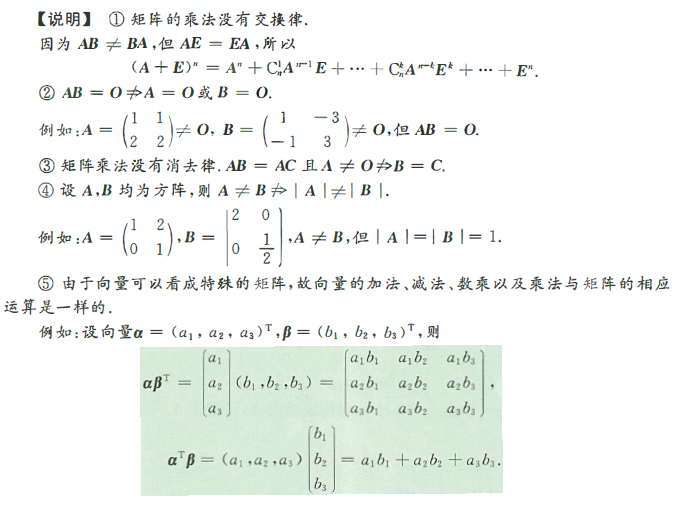
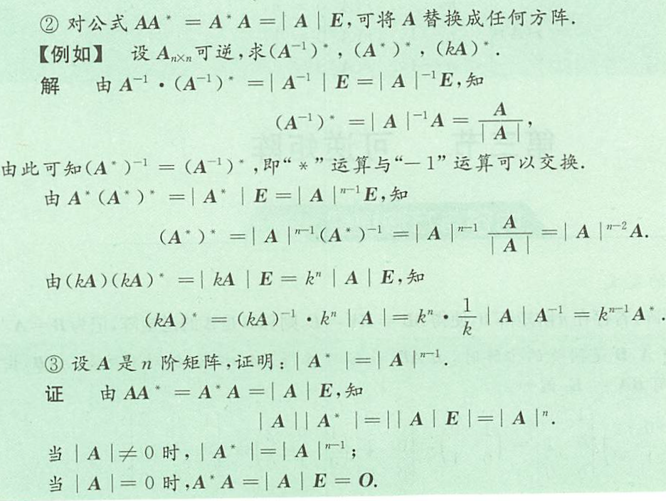
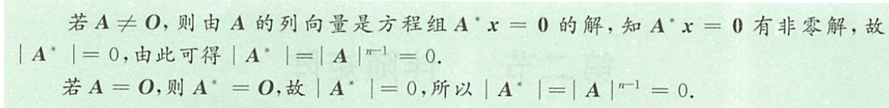
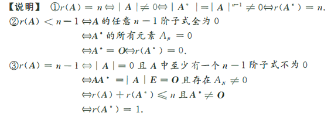

## 矩阵

### 矩阵的概念及运算

#### 矩阵的概念

**定义** $m\times n$个数排列成如下 m 行 n 列的一个表格
$$\begin{bmatrix}
    a_{11} &a_{12} &\dotsb &a_{1n} \\
    a_{21} &a_{22} &\dotsb &a_{2n} \\
    \vdots &\vdots & &\vdots \\
    a_{m1} &a_{m2} &\dotsb &a_{mn}
\end{bmatrix}$$
称为是一个 $m\times n$ 矩阵，当 m = n 时，矩阵A称为 n 阶矩阵或叫 n 阶方阵
如果一个矩阵的所有元素都是0，则称这个矩阵是零矩阵，简记为$O$
<!--more-->

**定义**（矩阵多项式） 设A是 n 阶矩阵，$f(x)=a_mx^m+\dotsb+a_1x+a_0$是 x 的多项式，则称$a_mA^m+a_{m-1}A^{m-1}+\dotsb+a_1A+a_0E$为矩阵多项式，记为$f(A)$

#### 特殊矩阵

1. 单位矩阵
2. 转置矩阵：将A的行与列互换后所得的矩阵，称为A的转置矩阵，记作$A^T$
3. 对称矩阵：若$A^T=A$，即$a_{ij}=a_{ji}(i,j=1,2,\dotsb,n)$，则称A为对称矩阵；若$A^T=-A$，即$a_{ij}=-a_{ji}(i,j=1,2,\dotsb,n)$，则称A为反对称矩阵
4. 正交矩阵：设A为n阶矩阵，若$A^TA=AA^T=E$，则称A为正交矩阵
5. 伴随矩阵：$A^*=(A_{ij})_{n\times n},A_{ij}=(-1)^{i+j}\cdot M_{ij}$，其中$M_{ij}$为|A|中去掉第i行、第j列后的n-1阶子式
6. 数量矩阵：数 k 与单位阵 E 的积 $kE$
7. *对角阵：* 非对角元素都是 0 的矩阵（即$\forall i\not ={j}$恒有$a_{ij}=0$）称为对角阵，记成 $\Lambda.\Lambda=diag[a_1,a_2,\dotsb,a_n]$
8. *上（下）三角阵：* 当 $i>j(i<j)$时，有$a_{ij}=0$的矩阵

关于对角矩阵
(1) $\Lambda_1\Lambda_2=\Lambda_2\Lambda_1$
(2) $\begin{bmatrix}
    a_1 & & \\
     &a_2 & \\
     & &a_3
\end{bmatrix}=\begin{bmatrix}
    a_1^n &0 &0 \\
    0 &a_2^n &0 \\
    0 &0 &a_3^n
\end{bmatrix}$
(3) $\begin{bmatrix}
    a_1 & & \\
     &a_2 & \\
     & &a_3
\end{bmatrix}^{-1}=\begin{bmatrix}
    \frac{1}{a_1} & & \\
     &\frac{1}{a_2} & \\
     & &\frac{1}{a_3}
\end{bmatrix}$
关于$\alpha\beta^T,\beta\alpha^T,\alpha^T\beta,\beta^T\alpha$

**同型矩阵** 两个矩阵 $A=[a_{ij}]_{m\times n},B=[b_{ij}]_{s\times t}$ ，如果 m = s，n = t，则称A与B是同型矩阵
如果两个同型矩阵对应的元素都相等，则称矩阵A与B相等
n 阶方阵 $A=[a_{ij}]_{m\times n}$ 的元素所构成的行列式称为 n 阶矩阵 A 的行列式，记成 $|A|$ 或 $\det A$

#### 矩阵的运算

**加减法** 两个同型矩阵（行数与列数分别相等）可以相加减，且$A\pm B=[a_{ij}]_{m\times n}\pm[b_{ij}]_{m\times n}=[a_{ij}\pm b_{ij}]_{m\times n}$
**数乘** 设 k 是数，$A=(a_{ij})_{m\times n}$是矩阵，则定义数与矩阵的乘法为$kA=(ka_{ij})_{m\times n}$(k为常数)
**乘法** 设 $A_{m\times n}=(a_{ik})_{m\times n},B_{n\times x}=(b_{kj})_{n\times s}$，则$AB=(C_{i\times j})_{m\times s}$，其中
$$c_{ij}=\sum_{k=1}^{s}a_{ik}b_{kj}=a_{i1}b_{1j}+a_{i2}b_{2j}+\dotsb+a_{in}b_{nj}(i=1,2,\dotsb,m;j=1,2,\dotsb,s)$$

**运算法则** 

1. *(加法)* A,B,C是同型矩阵，则
   $$A+B=B+A \\
   (A+B)+C=A+(B+C) \\
   A+O=A\\
   A+(-A)=O$$
2. *(数乘矩阵)* $$k(mA)=(km)A=m(kA);(k+m)A=kA+mA\\k(A+B)=kA+kB;1A=A,0A=O$$
3. *(乘法)* A,B,C满足运算条件时$$(AB)C=A(BC)\\A(B+C)=AB+AC\\(B+C)A=BA+CA$$

#### 矩阵转置的运算公式

1. $(A^T)^T=A$
2. $(kA)^T=kA^T$
3. $(A\pm B)^T=A^T\pm B^T$
4. $(AB)^T=B^TA^T$
5. $(A^{-1})^T=(A^T)^{-1}$
6. $(A^T)^m=(A^m)^T$

### 伴随矩阵

#### 定义

由矩阵 A 的行列式 |A| 所有代数余子式所构成的形如
$$\begin{bmatrix}
    A_{11} &A_{21} &\dotsb &A_{n1} \\
    A_{12} &A_{22} &\dotsb &A_{n2} \\
    \vdots &\vdots & &\vdots \\
    A_{1n} &A_{2n} &\dotsb &A_{nn}
\end{bmatrix}$$
的矩阵称为矩阵A的伴随矩阵，记为$A^*$

#### 伴随矩阵的公式

$$AA^*=A^*A=|A|E\\(A^*)^{-1}=(A^{-1})^*=\frac{1}{|A|}A (|A|\not ={0})\\(kA)^*=k^{n-1}A^*\\(A^*)^T=(A^T)^*\\|A^*|=|A|^{n-1}\\(A^*)^*=|A|^{n-2}A (n\ge 2)\\(AB)^*=B^*A^*$$

#### 2阶矩阵的伴随矩阵

设$A=\begin{bmatrix}
    a &b \\
    c &d
\end{bmatrix},|A|=\left |\begin{array}{cccc}
    a &b \\
    c &d 
\end{array} \right |\ne0$，则$A^*=\begin{bmatrix}
    A_{11} &A_{21} \\
    A_{12} &A_{22}
\end{bmatrix}=\begin{bmatrix}
    d &-b \\
    -c &a
\end{bmatrix}$

#### 伴随矩阵的秩

设 A 是 n 阶矩阵，则 $r(A^*)=\begin{cases}
    n,r(A)=n,\\
    1,r(A)=n-1,(n\ge2),\\
    0,r(A)<n-1
\end{cases}$

### 可逆矩阵

**定义** 设 A 是 n 阶矩阵，如果存在 n 阶矩阵 B 使得$AB=BA=E$成立，则称 A 是可逆矩阵或非奇异矩阵，B 是 A 的逆矩阵，记成$A^{-1}=B$
**定理** 若 A 可逆，则 A 的逆矩阵唯一

**定理** A 可逆$\Leftrightarrow|A|\not ={0}$
**证明** $\Rightarrow$ 设 A 可逆，由矩阵可逆的定义，存在 B ，使得 $BA=E$，两边取行列式得 $|B|\cdot|A|=1$，于是 $|A|\ne0$
$\Leftarrow$ 设 $|A|\ne0$，由 $AA^*=A^*A=|A|E$ 得 $A\cdot\frac{1}{|A|}A^*=\frac{1}{|A|}A^*\cdot A=E$，由矩阵可逆的定义得A可逆，且 $A^{-1}=\frac{1}{|A|}A^*$

**定理** 设 A 和 B 是 n 阶矩阵 且 AB = E，则BA = E

#### n 阶矩阵 A 可逆的充分必要条件

1. 存在 n 阶矩阵 B ，使得 AB=E（或BA=E）
2. $|A|\ne0$,或秩$r(A)=n$，或 A 的列（行）向量线性无关
3. 齐次方程组 $Ax=0$只有零解
4. $\forall b$，非齐次线性方程组$Ax=b$总有唯一解
5. 矩阵 A 的特征值全不为0

#### 求逆矩阵的方法

**方法一** 用公式，若$|A|\ne0$，则$A^{-1}=\frac{1}{|A|}A^*$
**方法二** 初等变换法 $(A\vdots E)\underrightarrow{初等行变换}(E\vdots A^{-1})$
**方法三** 用定义求B，使$AB=E$或$BA=E$，则$A$可逆，且$A^{-1}=B$
**方法四** 用分块矩阵 设B，C都是可逆矩阵，则$$\begin{bmatrix}
    B &O \\
    O &C \\
\end{bmatrix}^{-1}=\begin{bmatrix}
    B^{-1} &O \\
    O &C^{-1} \\
\end{bmatrix};\begin{bmatrix}
    O &B \\
    C &O \\
\end{bmatrix}^{-1}=\begin{bmatrix}
    O &C^{-1} \\
    B^{-1} &O \\
\end{bmatrix}$$

#### 逆矩阵的运算性质

(1) $k\ne0$，则$(kA)^{-1}=\frac{1}{k}A^{-1}$；
(2) 若A，B可逆，则$(AB)^{-1}=B^{-1}A^{-1}$，特别地$(A^2)^{-1}=(A^{-1})^2$；
(3) 若$A^T$可逆，则$(A^T)^{-1}=(A^{-1})^T$;
(4) $(A^{-1})^{-1}=A$;
(5) $|A^{-1}|=\frac{1}{|A|}$
(6) $(A^T)^{-1}=(A^{-1})^T$

**注意** 即使A,B和A+B都可逆，一般地$(A+B)^{-1}\ne A^{-1}+B^{-1}$

### 初等矩阵

#### 初等变换与初等矩阵的概念

**定义(初等变换)** 设A是$ m \times n$矩阵
(1) 用某个非零常数$k(k\ne0)$乘A的某行（列）的每个元素；
(2) 互换A的某两行（列）的位置；
(3) 将A的某行（列）元素的k倍加到另一行（列），
称为矩阵的三种初等行（列）变换，且分别称为初等倍乘、互换、倍加行（列）变换，统称初等变换

**定义(初等矩阵)** 由单位矩阵经一次初等变换得到的矩阵称为初等矩阵，它们分别是

1. **倍乘初等矩阵**，将单位矩阵 E 的第 i 行（或第 j 列）乘以非零常数 k 所得到的矩阵，记为 $E(i(k))$.如
$$E(2(k))=\begin{bmatrix}
    1 &0 & 0\\
    0 &k &0 \\
    0 &0 &1
\end{bmatrix}$$
性质：
(1) $E_i(k)A$ 本质上即矩阵 A 的i 行乘以非零常数 k
(2) $AE_i(k)$ 本质上即矩阵 A 的 i 列乘以非零常数 k
(3) $|E_i(k)|=k\ne0$，即$E_i(k)$ 可逆
(4) $[E_i(c)]^{-1}=E_i(\frac{1}{k})$
2. **互换初等矩阵**，将单位矩阵 E 的第 i 行和第 j 行对调（或者将第 i 列与第 j 列对调）所得到的矩阵，记为 $E(i,j)$.如：
$$E(1,2)=\begin{bmatrix}
    0 &1 & 0 \\
    1 &0 & 0 \\
    0 &0 &1
\end{bmatrix}$$
性质：
(1) $E_{i,j}A$ 本质上即对调矩阵 A 的 i,j 行
(2) $AE_{i,j}$ 本质上即对调矩阵 A 的 i,j 列
(3) $|E_{i,j}|=-1\ne0$，即$E_{i,j}$ 可逆
(4) $(E_{i,j})^{-1}=E_{i,j}$
(5) $(E_{i,j})^2=E$
3. **倍加初等矩阵**，将单位矩阵 E 的第 j 行的 k 倍加到第 i 行（或将单位矩阵 E 的第 i 列的 k 倍加到 j 列）所得到的矩阵，记为 $E(ij(k))$.如：
$$E(31(k))=\begin{bmatrix}
    1 &0 &0 \\
    0 &1 & 0 \\
    k &0 &1
\end{bmatrix}$$
性质：
(1) $E_{ij}(k)A$ 本质上即矩阵 A 的 j 行 的 k 倍加到 i 行
(2) $AE_{ij}(k)$ 本质上即矩阵 A 的 i 列的 k 倍 加到 j 列
(3) $|E_{ij}(k)=1\ne0$，即 $E_{ij}(k)$ 可逆
(4) $[E_{ij}(k)]^{-1}=E_{ij}(-k)$

**定义(等价矩阵)** 矩阵A经过有限次初等变换变成矩阵B，则称A与B等价，记成$a\cong B$.若
$A\cong\begin{bmatrix}
    E_r &O \\
    O &O
\end{bmatrix}$，则后者称为A的等价标准形

#### 初等矩阵与初等矩阵变换的性质

1. 初等矩阵的转置仍是初等矩阵
2. 初等矩阵均是可逆阵，且其逆矩阵仍是初等矩阵
$$E(i,j)^{-1}=E(i,j)\\E(i(k))^{-1}=E(i(\frac{1}{k}))\\E(ij(k))^{-1}=E(ij(-k))$$
3. 用初等矩阵P左乘（右乘）A，其结果PA（AP），相当于对A做相应的初等行（列）变换

**定理** 矩阵A可逆的充分必要条件是它能表示成一些初等矩阵的乘积$P_N\dotsb P_2P_1A=E$

#### 行阶梯矩阵，行最简矩阵

**行阶梯矩阵**

1. 如果矩阵中有零行（即这一行元素全是0），则零行在矩阵的底部
2. 每个非零行的主元（即该行最左边的第一个非零元），它们的列指标随着行指标的递增而严格增大

**行最简矩阵** 一个行阶梯矩阵，如果还满足：非零行的主元都是1，且主元所在的列的其他元素都是0，则为行最简矩阵

### 矩阵的秩

**定义** 在$m\times n$矩阵A中，任取k行与k列$k\le m,k\le n$，位于这些行与列的交叉点上的$k^2$个元素按其在原来矩阵A中的次序可构成一个k阶行列式，称其为矩阵A的k阶*子式*
**定义** （矩阵的秩）设A是$m\times n$矩阵，若A中存在r阶子式不等于零，r阶以上子式均等于零，则称矩阵A的秩为r，记成r(A)，零矩阵的秩规定为0
秩$r(A)=r\Leftrightarrow$矩阵A中非零子式的最高阶数是r
$r(A)<r\Leftrightarrow A$中每一个r阶子式全为0
$r(A)\ge r\Leftrightarrow A$中有r阶子式不为0
特别的，$r(A)=0\Leftrightarrow A=O,A\ne0\Leftrightarrow r(A)\ge1$
若 A 是 n 阶矩阵，$r(A)=n\Leftrightarrow|A|\ne0\Leftrightarrow A$可逆。$r(A)<n\Leftrightarrow|A|=0\Leftrightarrow A$不可逆
若 A 是 $m\times n$矩阵，则$r(A)\le min(m,n).$

**定理** 经初等变换矩阵的秩不变

#### 矩阵秩的求法

1. 矩阵的秩本质上即为方程组约束条件的个数
2. $r(A)=0$ 的充分必要条件是 $A=O$
3. $r(A)\ge1$ 的充分必要条件是 $A\ne O$
4. $r(A)\ge2$ 的充分必要条件是 A 至少两行不成比例

#### 矩阵秩的性质

1. $r(A)=r(A^T)=r(A^TA)=r(AA^T)$.
2. 设 $A,B$ 是同型矩阵，则 $|r(A)-r(B)|\le r(A\pm B)\le r(A)+r(B)$
3. 设 A 为 $m\times n$ 矩阵，B 为 $n\times s$ 矩阵，则 $r(AB)\le min(r(A),r(B))$
4. 若 A 是 $m\times n$ 矩阵，B 是 $n\times s$ 矩阵，$AB=O$，则$r(A)+r(B)\le n$
5. 设 A 是 $m\times n$ 矩阵，$P,Q$ 分别为 m 及 n 阶可逆矩阵，则 $r(A)=r(PA)=r(AQ)=r(PAQ)$
6. 设 A 是 n 阶矩阵，则 $r(A^*)=\begin{cases}
    n,r(A)=n,\\
    1,r(A)=n-1,(n\ge2),\\
    0,r(A)<n-1
\end{cases}$
7. 
   1. 分块矩阵$r\begin{pmatrix}
    A &O\\
    O &B
\end{pmatrix}=r(A)+r(B)$
    2. 设A,B 分别为 $m\times n,n\times s$ 矩阵，则 $max({r(A),r(B)})\le r(A\vdots B)\le r(A)+r(B)$
8. 设 A 为 n 阶非零矩阵，则r(A)=1的充分必要条件是，存在非零向量$\alpha,\beta$，使得 $A=\alpha\beta^T$

**定理** （三秩相等）设 A 是 $m\times n$ 矩阵，将 A 以行及列分块，得$A_{m\times n}=\begin{bmatrix}
    \alpha_1 \\
    \alpha_2 \\
    \vdots \\
    \alpha_m
\end{bmatrix}=[\beta_1,\beta_2,\dotsb,\beta_n]$，则有$r(A)=r(\alpha_1,\alpha_2,\dotsb,\alpha_m)=r(\beta_1,\beta_2,\dotsb,\beta_n)$

### 分块矩阵

#### 分块矩阵的概念

将矩阵用若干纵线和横线分成许多小块，每一小块称为原矩阵的子矩阵（或子块），把子块看成原矩阵的一个元素，则原矩阵叫分块矩阵

#### 分块矩阵的运算

运算法则：
$$\begin{bmatrix}
    A_1 &A_2 \\
    A_3 &A_4
\end{bmatrix}+\begin{bmatrix}
    B_1 &B_2 \\
    B_3 &B_4
\end{bmatrix}=\begin{bmatrix}
    A_1+B_1 &A_2+B_2 \\
    A_3+B_3 &A_4+B_4
\end{bmatrix} \\ \begin{bmatrix}
    A &B \\
    C &D
\end{bmatrix}\begin{bmatrix}
    X &Y \\
    Z &W
\end{bmatrix} = \begin{bmatrix}
    AX+BZ &AY+BW \\
    CX+DZ &CY+DW
\end{bmatrix} \\ \begin{bmatrix}
    A &B \\
    C &D
\end{bmatrix}^T=\begin{bmatrix}
    A^T &C^T \\
    B^T &D^T
\end{bmatrix}$$

若B，C分别是m阶和s阶矩阵，则
$$\begin{bmatrix}
    B &O \\
    O &C
\end{bmatrix}^n=\begin{bmatrix}
    B^n &O\\
    O &C^n
\end{bmatrix}$$

若B,C分别是m阶和n阶可逆矩阵，则
$$\begin{bmatrix}
    B &O \\
    O &C
\end{bmatrix}^{-1}=\begin{bmatrix}
    B^{-1} &O \\
    O &C^{-1}
\end{bmatrix},\begin{bmatrix}
    O &B \\
    C &O
\end{bmatrix}^{-1}=\begin{bmatrix}
    O &C^{-1} \\
    B^{-1} &O
\end{bmatrix}$$