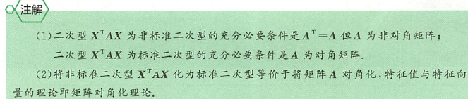
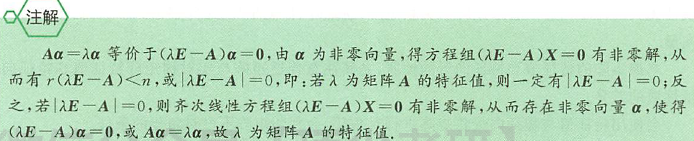
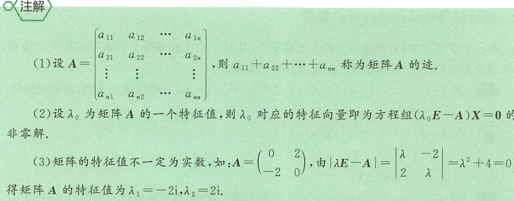
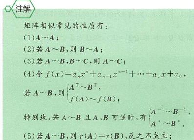
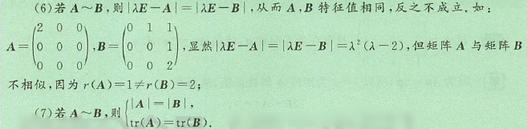
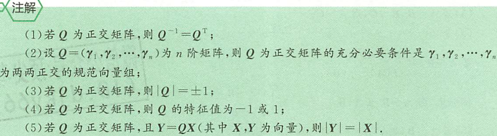

## 特征值与特征向量的基本概念

### 特征值与特征向量的理论背景

在一个多项式中，未知数的个数为任意多个，且每一项次数都是2的多项式称为二次型，二次型分为两种类型：即非标准二次型及标准二次型。

### 基本概念

#### 特征值与特征向量

设 A 为 n 阶矩阵，若存在常数$\lambda$及 n 为非零列向量$\alpha$，使得$A\alpha=\lambda\alpha$称$\lambda$为矩阵 A 的特征值，$\alpha$为矩阵 A 的属性特征值$\lambda$的特征向量

#### 特征方程

设$A=\begin{bmatrix}
    a_{11} &a_{12} &\dotsb &a_{1n} \\
    a_{21} &a_{22} &\dotsb &a_{2n} \\
    \vdots &\vdots & &\vdots \\
    a_{n1} &a_{n2} &\dotsb &a_{nn}
\end{bmatrix}$称$|\lambda E-A|=0$为矩阵 A 的特征方程

#### 矩阵相似

设A,B为n阶矩阵，若存在可逆矩阵P,使得$P^{-1}AP=B$,称矩阵A与矩阵B相似，记为A~B.若存在可逆矩阵P,使得$P^{-1}AP=A$,其中$\Lambda$为对角矩阵，则称A可以相似对角化

#### 施密特正交化

把一组线性无关的向量组转化为一组两两正交且规范的向量组的过程称为施密特正交化
设$a_1,a_2,\dotsb,a_s$线性相关，施密特正交互过程分为两个步骤：
(1)正交化
令$\beta_1=\alpha_1,\beta_2=\alpha_2-\frac{(\alpha_2,\beta_1)}{(\beta_1,\beta_1)}\beta_1,\dotsb,\\\beta_n=\alpha_n-\frac{(\alpha_n\beta_1)}{(\beta_1,\beta_1)}\beta_1-\frac{(\alpha_n\beta_2)}{(\beta_2,\beta_2)}\beta_2-\dotsb-\frac{(\alpha_n\beta_{n-1})}{(\beta_{n-1},\beta_{n-1})}\beta_{n-1}$,
则$\beta_1,\beta_2,\dotsb,\beta_n$两两正交
(2)规范化
令$\gamma_1=\frac{1}{|\beta_1|}\beta_1,\gamma_2=\frac{1}{|\beta_2|}\beta_2,\dotsb,\gamma_b=\frac{1}{|\beta_b|}\beta_b$，则$\gamma_1,\gamma_2,\dotsb,\gamma_n$为两两正交且规范的向量组

#### 正交矩阵

设Q为n阶矩阵，若$Q^TQ=E$(或$QQ^T=E$),称Q为正交矩阵

## 特征值与特征向量的性质

### 特征值与特征向量的一般性质

#### 定理1

设 A 为 n 阶矩阵，$\lambda_1,\lambda_2,\dotsb,\lambda_n$ 为 A 的特征值，则有
(1) $\lambda_1+\lambda_2+\dotsb+\lambda_n=tr(A)$
(2) $\lambda_1\lambda_2\dotsb\lambda_n=|A|$

A 可逆$\Leftrightarrow|A|\ne0\Leftrightarrow\lambda_i\ne0(i\le i\le n)$

## 矩阵对角化理论

### 一般矩阵的相似对角化

设 A 为 n 阶矩阵，其特征值为$\lambda_1,\lambda_2,\dotsb,\lambda_n$，若存在可逆矩阵P，使得
$$P^{-1}AP=\begin{bmatrix}
    \lambda_1 \\
    &\lambda_2 \\
    & &\ddots \\
    & & &\lambda_n
\end{bmatrix}$$
称矩阵A可相似对角化，或A可以对角化，或A与对角矩阵相似