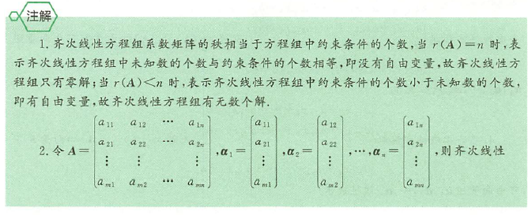
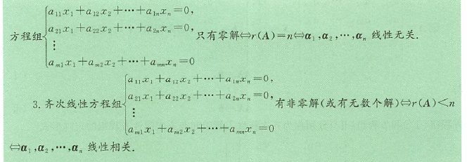
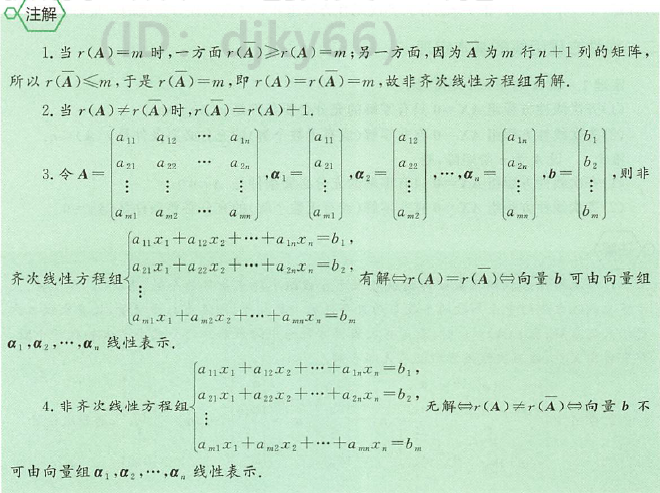
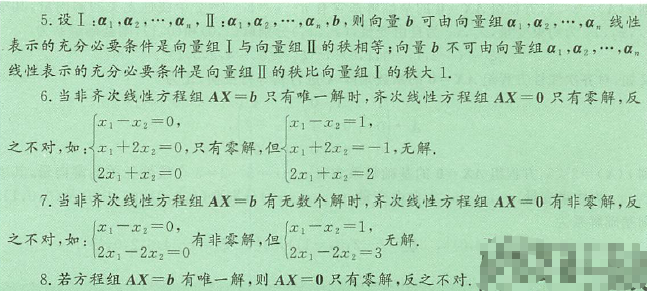
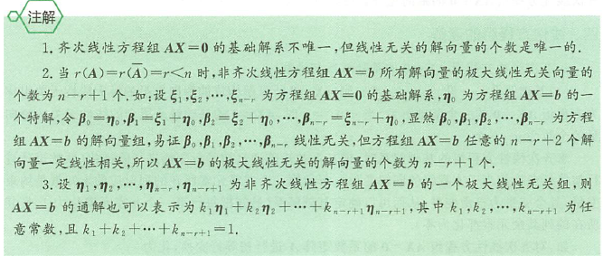

## 线性方程组

### 基本概念

我们称
$$\begin{cases}
    a_{11}x_1+a_{12}x_2+\dotsb+a_{1n}x_n=b_1\\
    a_{21}x_1+a_{22}x_2+\dotsb+a_{2n}x_n=b_2\\
    \dotsb \\
    a_{m1}x_1+a_{m2}x_2+\dotsb+a_{mn}x_n=b_m
\end{cases}\tag{I}$$
是 n 个未知数 m 个方程的*非齐次线性方程组*，其中$x_1,x_2,\dotsb,x_n$代表 n 个未知数，而$b_1,b_2,\dotsb,b_m$是不全为0的常数

<!--more-->

利用矩阵乘法，方程组(I)可表示法：
$$\begin{bmatrix}
    a_{11} &a_{12} &\dotsb &a_{1n} \\
    a_{21} &a_{22} &\dotsb &a_{2n} \\
    \vdots &\vdots &\vdots & \\
    a_{m1} &a_{m2} &\dotsb &a_{mn}
\end{bmatrix}\begin{bmatrix}
    x_1 \\
    x_2 \\
    \vdots \\
    x_n
\end{bmatrix}=\begin{bmatrix}
    b_1 \\
    b_2 \\
    \vdots \\
    b_m
\end{bmatrix}$$
于是方程组(I)的矩阵形式：$Ax=b$称 A 为方程组(I)的系数矩阵

对矩阵 A 按列分块，记 $A=(\alpha_1,\alpha_2,\dotsb,\alpha_n)$ 则方程组(I)有向量形式 $x_1\alpha_1+x_2\alpha_2+\dotsb+x_n\alpha_n=\beta$ 其中$a_j=(a_{1j},a_{2j},\dotsb,a_{nj})^T,j=1,2,\dotsb,n,\beta=(b_1,b_2,\dotsb,b_m)^T$
如果$\forall j=1,2,\dotsb,m$ 恒有 $b_j=0$ ，则称
$$\begin{cases}
    a_{11}x_1+a_{12}x_2+\dotsb+a_{1n}x_n=0\\
    a_{21}x_1+a_{22}x_2+\dotsb+a_{2n}x_n=0\\
    \dotsb \\
    a_{m1}x_1+a_{m2}x_2+\dotsb+a_{mn}x_n=0
\end{cases}\tag{II}$$
为*齐次线性方程组*。其矩阵形式为 $Ax=0$
齐次方程组(II)的向量形式为$x_1\alpha_1+x_2\alpha_2+\dotsb+x_n\alpha_n=0$
若将一组数 $c_1,c_2,\dotsb,c_n$ 分别代替方程组(I)（或(II)中的$x_1,x_2,\dotsb,x_n$）使(I)（或(II)）中 m 个等式都成立，则称$c_1,c_2,\dotsb,c_n)^T$是方程组(I)（或(II)）的一个解

求方程组的解就是要对所给方程组作同解变形，而同解变形的方法：

1. 两个方程互换位置
2. 用非零常数乘方程的两端
3. 把某个方程的 k 倍加到另一个方程上

### 线性方程组解的基本定理

**定理1** 设 A 为 $m\times n$矩阵，则
(1)齐次线性方程组 $AX=0$ 只有零解的充分必要条件是 $r(A)=n$
(2)齐次线性方程组 $AX=0$ 有非零解（或有无数个解）的充分必要条件是 $r(A)<n$

**推论1** 设 A 为 n 阶，则
(1)齐次线性方程组 $AX=0$ 只有零解的充分必要条件是 $|A|\ne0$
(2)齐次线性方程组 $AX=0$ 有非零解（或无数个解）的充分必要条件是 $|A|=0$

**定理2** 设 A 是 $m\times n$，增广矩阵 $\overline{A}=(A\vdots b)$，则
(1)非齐次线性方程组 $AX=b$ 有解的充分必要条件是 $r(A)=r(\overline{A})$，其中当 $r(A)=r(\overline{A})=n$ 时，非齐次线性方程组 $AX=b$ 有唯一解；当 $r(A)=r(\overline{A})<n$ 时，非齐次线性方程组$AX=b$有无数个解
(2)非齐次线性方程组 $AX=0$ 无解的充分必要条件是 $r(A)\ne r(\overline{A})$

**推论2** 设 A 是 n 阶矩阵，则
(1) 非齐次线性方程组 $AX=b$ 有解的充分必要条件是 $r(A)=r(\overline{A})$，其中当$|A|\ne0$时，方程组有唯一解；当$|A|=0$时，方程组有无数个解
(2)非齐次线性方程组 $AX=b$ 无解的充分必要条件是 $r(A)\ne r(\overline{A})$

### 线性方程组解的结构

1. 设 $X_1,X_2,\dotsb,X_s$ 为齐次线性方程组 $AX=0$ 的一组解，则 $k_1X_1+k_2X_2+\dotsb+k_sX_s$ 也为齐次线性方程组 $AX=0$ 的解，其中 $k_1,k_2,\dotsb,k_s$ 为任意常数
2. 设 $\eta_0$ 为非齐次线性方程组 $AX=b$ 的一个解，$X_1,X_2,\dotsb,X_s$ 为齐次线性方程组 $AX=0$ 的一组解，则 $k_1X_1+k_2X_2+\dotsb+k_sX_s+\eta_0$ 为非齐次线性方程组 $AX=b$ 的解
3. 设 $\eta_1,\eta_2$ 为非齐次线性方程组 $AX=b$ 的两个解，则 $\eta_2-\eta_1$ 为齐次线性方程组 $AX=0$ 的一个解
4. 设 $\xi$ 是方程组 $Ax=b$ 的解，$\eta$ 是导出组 $Ax=0$ 的解，k 是任意常数，则 $\xi+k\eta$ 是方程组 $Ax=b$ 的解
5. 设 $X_1,X_2,\dotsb,X_s$ 为非齐次线性方程组 $AX=b$ 的一组解，则 $k_1X_1+k_2X_2+\dotsb+k_sX_s$ 为 $AX=b$ 的解的充分必要条件是 $k_1+k_2+\dotsb+k_s=1$
6. 设 $\eta_1,\eta_2,\dotsb,\eta_s$ 为非齐次线性方程组 $AX=b$ 的一组解，则 $k_1\eta_1+k_2\eta_2+\dotsb+k_s\eta_s$ 为齐次线性方程组 $AX=0$ 的解的充分必要条件是 $k_1+k_2+\dotsb+k_s=0$

### 线性方程组的通解

#### 齐次线性方程组 $AX=0$ 的基础解系与通解

1. 基础解系——设$r(A)=r<n$，则$AX=0$所有解构成的解向量组的极大线性无关组成为方程组$AX=0$的一个基础解系。当$r(A)=r$时，$AX=0$的基础解系所含的线性无关的解向量的个数为$n-r$个

        设A为$m\times n$矩阵，且$r(A)=r<n$,所谓$AX=0$的基础解系，即满足如下三个条件的向量组
        (1)该向量组中每个向量都是$AX=0$的解；
        (2)该向量组线性无关；
        (3)该向量组所含解向量的个数等于$nーr$

2. 通解——设$\xi_1,\xi_2,\dotsb,\xi_{n-r}$为齐次线性方程组$AX=0$的一个基础解系，则称$k\xi_1+k_2\xi_2+\dotsb+k_{n-r}\xi_{n-r}$为齐次线性方程组$AX=0$的通解，其中$k_1,k_2,\dotsb,k_{n-r}$为任意常数

#### 非齐次线性方程组 $AX=b$的通解

设$r(A)=r(\overline{A})=r<n$且$\xi_1,\xi_2,\dotsb,\xi_{n-r}$为$AX=b$的导出方程组$AX=0$的一个基础解系，$\eta_0$为$AX=b$的一个解，则$AX=b$的通解为$k\xi_1+k_2\xi_2+\dotsb+k_{n-r}\xi_{n-r}+\eta_0$，其中$k_1,k_2,\dotsb,k_{n-r}$为任意常数

### 方程组解的理论延伸

1. 设 $A$ 是 $m\times n$矩阵，B是$n\times s$矩阵，若$AB=0$，则B的列向量组为方程组$AX=0$的解
2. 设方程组$AX=0$与$BX=0$为同解方程组，则$r(A)=r(B)$,反之不对
3. 设方程组$AX=0$的解为$BX=0$的解，则$r(A)\ge r(B)$
    1.若方程组$AX=0$的解为方程组$BX=0$的解，但方程组$BX=0$的解不全是方程组$AX=0$的解，则$r(A)>r(B)$
    2.若方程纽$AX=0$的解为方程组$BX=0$的解，且$r(A)=r(B)$,则方程组$AX=0$与方程组$BX=0$同解
4. 设$$AX=b\tag{I}$$$$BX=c\tag{II}$$则线性方程组$(\overset{A}{B})X=(\overset{b}{c})$的解即为线性方程组(I)和(II)的解