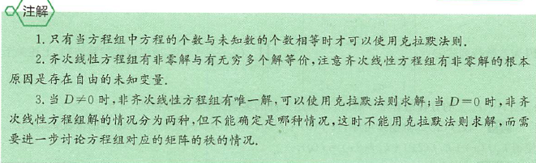
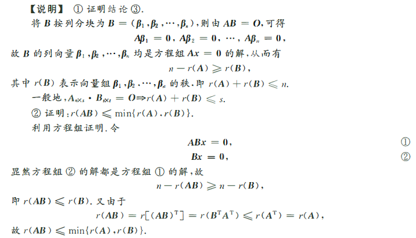

## 行列式的基本概念与性质

### 概念

#### 行列式的定义

$$D=\begin{bmatrix}
    a_{11} &a_{12} &\dots &a_{1n} \\
    a_{21} &a_{22} &\dots &a_{2n} \\
    \vdots &\vdots & &\vdots \\
    a_{n1}& a_{n2} &\dots &a_{nn}
\end{bmatrix}=\sum_{j_1,j_2,\dotsb,j_n}(-1)^{\tau(j_1,j_2,\dotsb,j_n)}a_{1j_1}a_{2j_2}\dotsb,a_{2j_n}$$
其中$\tau(j_1j_2..j_n)$表示排列$j_1j_2...j_n$的*逆序数*，即|A|是所有在不同行、不同列的n个元素乘积的代数和

偶排列：一个排列的逆序数是偶数
奇排列：一个排列的逆序数是奇数

#### 行列式按行（列）展开公式

$$|A|=a_{i1}A_{i1}+a_{i2}A_{i2}+...+a_{in}A_{in} = \sum_{k=1}^{n}a_{ik}A_{ik},i=1,2,..,n \\
    |A|=a_{1j}A_{1j}+a_{2j}A_{2j}+...+a_{nj}A_{nj} = \sum_{k=1}^{n}a_{kj}A_{kj},j=1,2,..,n$$
其中$A_{ij}$为$a_{ij}$的代数余子式，即$A_{ij}=(-1)^{i+j}M_{ij}$，$M_{ij}$为|A|中去掉第 i 行及 第 j 列元素后的 n - 1 阶行列式
说明：
行列式的任一行（列）元素与另一行（列）元素的代数余子式乘积之和为0，即
$$\sum_{k=1}^na_{ik}A_{jk}=a_{i1}A_{j1}+a_{i2}A_{j2}+...+a_{in}A_{jn} = 0,i\not ={j} \\
\sum_{k=1}^na_{ki}A_{kj}=a_{1i}A_{1j}+a_{2i}A_{2j}+...+a_{ni}A_{nj} = 0,i\not ={j}$$
<!--more-->

#### 行列式的性质

记$|A|=\left |\begin{array}{cccc}
    a_{11} &a_{12} &\dots &a_{1n} \\
    a_{21} &a_{22} &\dots &a_{2n} \\
    \vdots &\vdots & &\vdots \\
    a_{n1}& a_{n2} &\dots &a_{nn}\\
\end{array}\right|
,\lvert A^T\rvert=\left |\begin{array}{cccc}
    a_{11} &a_{21} &\dots &a_{n1} \\
    a_{12} &a_{22} &\dots &a_{n2} \\
    \vdots &\vdots & &\vdots \\
    a_{1n}& a_{2n} &\dots &a_{nn}\\
\end{array}\right|$，
行列式 $\lvert A^T\rvert$ 称为|A|的转置行列式

1. 经过转置行列式的值不变，即 $|A^T|=|A|$
2. 两行（或列）互换位置，行列式的值变号，特别地，两行（或列）相同，行列式的值为0
3. 某行（或列）如有公因子k，则可把k提出行列式记号外。
    (1)某行（或列）的元素全为0，行列式的值为0
    (2)若两行（或列）的元素对应成比例，行列式的值为0
4. 如果行列式某行（或列）是两个元素之和，则可把行列式拆成两个行列式之和
    $$\left | \begin{array}{cccc}
        a_1+b_1 &a_2+b_2 &a_3+b_3 \\
        c_1 &c_2 &c_3 \\
        d_1 &d_2 &d_3 \\
    \end{array} \right | = \left | \begin{array}{cccc}
        a_1 &a_2 &a_3 \\
        c_1 &c_2 &c_3 \\
        d_1 &d_2 &d_3 \\
    \end{array} \right | + \left | \begin{array}{cccc}
        b_1 &b_2 &b_3 \\
        c_1 &c_2 &c_3 \\
        d_1 &d_2 &d_3 \\
    \end{array} \right |$$
5. 把某行（或列）的k倍加到另一行（或列），行列式的值不变
   $$\left | \begin{array}{cccc}
        a_1 &a_2 &a_3 \\
        b_1 &b_2 &b_3 \\
        c_1 &c_2 &c_3 \\
    \end{array} \right | = \left | \begin{array}{cccc}
        a_1 &a_2 &a_3 \\
        b_1+ka_1 &b_2+ka_2 &b_3+ka_3 \\
        c_1 &c_2 &c_3 \\
    \end{array} \right |$$

#### 有关行列式的重要公式

(1) $\lvert A^T\rvert=\lvert A\rvert$;
(2) 若A是n阶矩阵，则$\lvert kA\rvert=k^n\lvert A\rvert$;
(3) 若A、B是同型矩阵，$\lvert AB\rvert=\lvert A\rvert\cdot\lvert B\rvert$;
(4) 若A是n阶可逆矩阵，$\lvert A^{-1}\rvert=\frac{1}{\lvert A\rvert}$;
(5) 若A是n阶矩阵，$\lvert A^*\rvert=\lvert A\rvert^{n-1}$
(7) $AA^*=A^*A=|A|E$
(6) 若A是n阶矩阵，且A的特征值为$\lambda_1,\lambda_2,\dotsb,\lambda_n$，则$|A|=\lambda_1\lambda_2\dotsb\lambda_n$
(8) 若A与B矩阵相似，则$|A|=|B|$

### 重要的行列式及定理

1. 对角形行列式
$$\begin{bmatrix}
    a_{11} &0 &\dotsb & 0 \\
    0 &a_{22} &\dotsb &0 \\
    \vdots &\vdots & &\vdots \\
    0 &0 &\dotsb &a_{nn}
\end{bmatrix}=a_{11}a_{22}\dotsb a_{nn}$$
2. 上（下）三角形行列式的值等于主对角线元素的乘积
$$\left | \begin{array}{cccc}
    a_{11} &a_{12} &\cdots &a_{1n} \\
    0 &a_{22} &\cdots &a_{2n} \\
    0 &0 &\ddots &\vdots \\
    0 &0 &0 &a_{nn} \\
\end{array} \right | ==\left | \begin{array}{cccc}
    a_{11} &0 &0 &0 \\
    a_{21} &a_{22} &0 &0 \\
    \vdots &\vdots &\ddots &0 \\
    a_{n1} &a_{n2} &\cdots &a_{nn} \\
\end{array} \right | = a_{11}a_{22}\cdots a_{nn}$$
3. 关于副对角线的行列式
$$\left | \begin{array}{cccc}
    a_{11} &a_{12} &\dots &a_{1,n-1} &a_{1n} \\
    a_{21} &a_{22} &\dots &a_{2,n-1} &0 \\
    \vdots &\vdots & &\vdots &\vdots \\
    a_{n1} &0 &\dots &0 &0 \\
\end{array} \right | = \left | \begin{array}{cccc}
    0 &\dots &0 &a_{1n} \\
    0 &\dots &a_{2,n-1} &a_{2n} \\
    \vdots & &\vdots &\vdots \\
    a_{n1} &\dots &a_{n,n-1} &a_{nn} \\
\end{array} \right | = (-1)^{\frac{n(n-1)}{2}}a_{1n}a_{2,n-1}\dots a_{n1}$$
4. 两个特殊的拉普拉斯展开式
$$\left | \begin{array}{cccc}
    A &\ast \\
    O &B \\
\end{array} \right | = \left | \begin{array}{cccc}
    A &O \\
    \ast &B \\
\end{array} \right | = |A| \cdot|B|,\left | \begin{array}{cccc}
    O &A \\
    B &\ast \\
\end{array} \right | = \left | \begin{array}{cccc}
    \ast &A \\
    B &O \\
\end{array} \right | = (-1)^{mn}|A|\cdot|B|$$
5. 范德蒙行列式
$$\left | \begin{array}{cccc}
    1 &1 &\cdots &1 \\
    x_1 &x_2 &\cdots &x_n \\
    x_1^2 &x_2^2 &\cdots &a_n^2 \\
    \vdots &\vdots & &\vdots \\
    x_1^{n-1} &x_2^{n-1} &\cdots &x_n^{n-1} \\
\end{array} \right |=\prod_{1\le j<i\le n}(x_i-x_j)$$
6. 箭形行列式
   1. 一般地，箭形行列式
   $$D_{n+1}=\left |\begin{array}{cccc}
       \lambda_0 &a_1 &a_2 &\dotsb &a_n \\
       b_1 &\lambda_1 &0 &\dotsb &0 \\
       b_2 &0 &\lambda_2 &\dotsb &0 \\
       \vdots &\vdots &\vdots &\ddots &\vdots \\
        b_n &0 &0 &\dotsb &\lambda_n
   \end{array}\right |=\left |\begin{array}{cccc}
       \lambda_0-\sum_{i=1}^n\frac{b_ia_i}{\lambda_i} &a_1 & a_2 &\dotsb &a_n \\
       0 &\lambda_1 &0 &\dotsb &0 \\
       0 &0 &\lambda_2 &\dotsb &0 \\
       \vdots &\vdots &\vdots &\ddots &\vdots \\
       0 &0 &0 &\dotsb &\lambda_n
   \end{array} \right |\\=(\lambda_0-\sum_{i=1}^n\frac{b_ia_i}{\lambda_i})\cdot \lambda_1\lambda_2\dotsb\lambda_n(\lambda_i\ne0,i=1,2,\dotsb,n)$$
   若$\lambda_i=0(i=1,2,\dotsb,n)$，则$D_{n+1}=0$
   2. 其他箭形行列式也可类似的计算

## 克拉默法则

对线性方程组
$$\begin{cases}
    a_{11}x_1+a_{12}x_2+\cdots+a_{1n}x_n = 0 \\
    a_{21}x_1+a_{22}x_2+\cdots+a_{2n}x_n = 0 \\
    \cdots\cdots \\
    a_{n1}x_1+a_{n2}x_2+\cdots+a_{nn}x_n=0 \\
\end{cases}\tag{I}$$
及
$$\begin{cases}
    a_{11}x_1+a_{12}x_2+\cdots+a_{1n}x_n = b_1 \\
    a_{21}x_1+a_{22}x_2+\cdots+a_{2n}x_n = b_2 \\
    \cdots\cdots \\
    a_{n1}x_1+a_{n2}x_2+\cdots+a_{nn}x_n=b_n
\end{cases}\tag{II}$$
其中(II)称为非齐次线性方程组,(I)称为(II)对应的齐次线性方程组或(II)的导出方程组
令$D=\left | \begin{array}{cccc}
        a_{11} &a_{12} &\dotsb &a_{1n} \\
        a_{21} &a_{22} &\dotsb &a_{2n} \\
        \vdots &\vdots & &\vdots \\
        a_{n1} &a_{n2} &\dotsb &a_{nn} \\
    \end{array} \right |,D_1=\left | \begin{array}{cccc}
        b_{1} &a_{12} &\dotsb &a_{1n} \\
        b_{2} &a_{22} &\dotsb &a_{2n} \\
        \vdots &\vdots & &\vdots \\
        b_{n} &a_{n2} &\dotsb &a_{nn} \\
    \end{array} \right |,\dotsb,D_n=\left | \begin{array}{cccc}
        a_{11} &a_{12} &\dotsb &b_{1} \\
        a_{21} &a_{22} &\dotsb &b_{2} \\
        \vdots &\vdots & &\vdots \\
        a_{n1} &a_{n2} &\dotsb &b_{n} \\
    \end{array} \right |$
其中D称为系数行列式，我们有
**定理1** 方程组(I)只有零解的充分必要条件是$D\ne0$
方程组(I)有非零解(或者(I)有无穷多个解)的充分必要条件是$D=0$
**定理2** 方程组(II)有唯一解的充分必要条件是$D\ne0$,此时$x=\frac{D_i}{D}(i=1,2,\dotsb,n)$,当$D=0$时，方程组(II)要么无解，要么有无穷多个解

## 讨论|A|=0的问题

1. 矩阵的秩：A中非零子式的最高阶数称为A的秩，记作$r(A)$
2. 有关矩阵A的秩的常用表达
   1. $r(A)=r\Leftrightarrow A$中至少有r阶子式不为0，且A中任意的r阶以上子式全为0（如果有）
   2. $r(A)<r\Leftrightarrow A$中任意的r阶及r阶以上子式全为0
   3. $r(A)\le r\Leftrightarrow A$中任意r阶以上子式全为0
   4. $r(A)>r\Leftrightarrow A$中至少有r+1阶子式不为0
   5. $r(A)\ge r\Leftrightarrow A$中至少有r阶子式不为0
3. 设$A_{m\times n}$，则$\begin{cases}
    r(A)<n\Leftrightarrow |A| = 0\\r(A)=n\Leftrightarrow |A|\ne0
\end{cases}$
4. $A\ne0\Leftrightarrow r(A)\ge1$
5. 讨论矩阵秩的常用方法，设A,B均为n阶方阵，则：
   1. 利用矩阵秩的定义，即讨论矩阵的子式
   2. 利用方程组$Ax=0$有$n-r(A)$个基础解
   3. $AB=O\Rightarrow\begin{cases}
       B的列向量都是方程组Ax=0的解\\
       r(A)+r(B)\le n
   \end{cases}$
   4. $r(AB)\le min(r(A),r(B)),r(A+B)\le r(A)+r(B)$
   
6. 证明|A|=0常用方法
   1. 利用秩$r(A)<n\Leftrightarrow|A|=0$
   2. 利用齐次线性方程组$Ax=0$有非零解$\Leftrightarrow|A|=0$
   3. 反证法
   4. 利用$|A|=\lambda_1\lambda_2\dotsb\lambda_n$，其中$\lambda_1,\lambda_2,\dotsb,\lambda_n$为A的特征值
