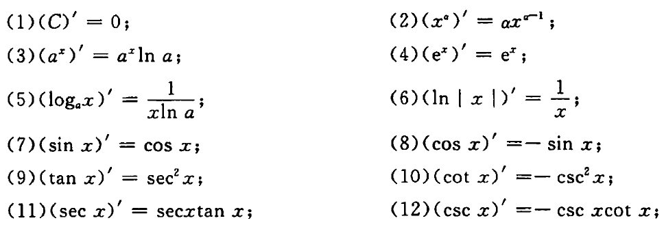
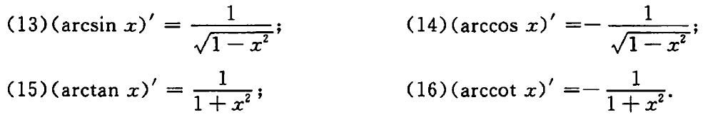

## 导数与微分的概念

### 导数的概念

函数$f(x)$在$x_0$处可导的充分必要条件是它在该点的左导数与右导数都存在且相等

### 微分的概念

函数$y=f(x)$在$x_0$点处可微的充分必要条件是$f(x)$在点$x_0$处可导，且有$\mathrm{d}y=f'(x_0)\Delta x=f'(x_0)\mathrm{d}x$，在点$x$处，常记$\mathrm{d}y=f'(x)\mathrm{d}x$

## 导数公式及求导法则

### 基本初等函数的导数公式

### 求导法则

#### 有理运算

设$u=u(x),v=v(x)$在x处可导，则

1. $(u\pm v)'=u'\pm v'$
2. $(uv)'=u'v+uv'$
3. $(\frac{u}{v})'=\frac{u'v-uv'}{v2}(v\ne0)$

#### 复合函数求导

设$u=\varphi(x)$在x处可导，$y=f(u)$在对应点处可导，则复合函数$y=f[\varphi(x)]$在x处可导，且$\frac{dy}{dx}=\frac{dy}{du}\cdot\frac{du}{dx}=f'(u)\varphi(x)$

#### 隐函数求导

#### 反函数求导

$\varphi'(y)=\frac{1}{f'(x)}\Leftrightarrow\frac{\mathrm{d}x}{\mathrm{d}y}=\frac{1}{\frac{\mathrm{d}y}{\mathrm{d}x}}$
$\varphi''(y)=\frac{\mathrm{d}}{\mathrm{d}x}[\frac{1}{f'(x)}]\cdot\frac{\mathrm{d}x}{\mathrm{d}y}=-\frac{f''(x)}{f'(x)^2}\cdot\frac{1}{f'(x)}$

#### 参数方程求导

设$y=y(x)$是由参数方程$$\begin{cases}
   x=\varphi(t)\\
   y=\psi(t)
\end{cases}(\alpha<t<\beta)$$确定的函数，则

(1) 若$\varphi(t)和\psi(t)$都可导，且$\varphi'(t)\ne0$，则$\frac{dy}{dx}=\frac{\psi'(t)}{\varphi'(t)}$

(2) 若$\varphi(t)和\psi(t)$二阶可导，且$\varphi'(t)\ne0$，则$\frac{d^2y}{dx^2}=\frac{d}{dt}(\frac{\psi'(t)}{\varphi'(t)})\frac{1}{\varphi'(t)}=\frac{\psi''(t)\varphi'(t)-\varphi''(t)\psi'(t)}{\varphi'^3(t)}$

#### 常用结论

设$f(x)=\varphi(x)|x-a|$，其$\varphi(x)$在$x=a$处连续，则$f(x)$在$x=a$处可导的充要条件是$\varphi(a)=0$

$f(x)$可导$\overset{\nrightarrow}{\nleftarrow}|f(x)|$可导
设$f(x)$连续
(1) 若$f(x_0)\ne0$，则在$x_0$处$f(x)$可导$\Leftrightarrow|f(x)|$可导
(2) 若$f(x_0)=0$，则$f'(x_0)=0\Leftrightarrow|f(x)|$在$x_0$处可导

## 高阶导数

### 常用的高阶导数公式

1. $(\sin x)^{(n)}=\sin(x+n\cdot\frac{\pi}{2})$
2. $(\cos x)^{(n)}=\cos(x+n\cdot\frac{\pi}{2})$
3. $(u\pm v)^{(n)}=u^{(n)}\pm v^{(n)}$
4. $(uv)^{(n)}=\sum_{k=0}^nC_n^ku^{(k)}v^{(n-k)}$

## 微分中值定理

### 费马引理

设函数$f(x)$在点$x_0$处可导，如果函数$f(x)$在点$x_0$处取得极值，那么$f'(x_0)=0$

### 罗尔定理

如果$f(x)$满足以下条件：
(1) 在闭区间[a,b]上连续
(2) 在开区间(a,b)内可导
(3) $f(a)=f(b)$
则在(a,b)内至少存在一点$\xi$，使得$f'(\xi)=0$

### 拉格朗日中值定理

如果$f(x)$满足以下条件：
(1) 在闭区间[a,b]上连续
(2) 在开区间(a,b)内可导
则在(a,b)内至少存在一点$\xi$，使得$f(b)-f(a)=f'(\xi)(b-a)$

如果在(a,b)内恒有$f'(x)=0$，则在(a,b)内$f(x)$为常数

### 柯西中值定理

如果$f(x),F(x)$满足以下条件：
(1) 在闭区间[a,b]上连续
(2) 在开区间(a,b)内可导，且$F'(x)$在(a,b)内每一点处均不为零，则在(a,b)内至少存在一点$\xi$，使得$\frac{f(b)-f(a)}{F(b)-F(a)}=\frac{f'(\xi)}{F'(\xi)}$

### 皮亚诺型余项泰勒公式

如果$f(x)$在点$x_0$有直至n阶的导数，则有$f(x)=f(x_0)+f'(x_0)(x-x_0)+\frac{1}{2!}f''(x_0)(x-x_0)^2+\dotsb+\frac{1}{n!}f^{(n)}(x_0)(x-x_0)^n+o[(x-x_0)^n]$,常称$R_n(x)=o(x-x_0)^n$为皮亚诺余项

### 拉格朗日型余项泰勒公式

设函数$f(x)$在含有$x_0$的开区间(a,b)内有n+1阶导数，则当$x\in(a,b)$时有$f(x)=f(x_0)+f'(x_0)(x-x_0)+\frac{1}{2!}f''(x_0)(x-x_0)^2+\dotsb+\frac{1}{n!}f^{(n)}(x_0)(x-x_0)^n+R_n(x)$

## 导数的应用

### 函数的单调性

### 函数的极值

**极值必要条件**
设$y=f(x)$在点$x_0$出可导，如果$x_0$为$f(x)$的极值点，则$f'(x_0)=0$

**极值第一充分条件**
设$y=f(x)$在点$x_0$的某去心邻域内可导，且$f'(x_0)=0$（或$f(x)$在$x_0$处连续）
(1) 若$x<x_0$时，$f'(x)>0,x>x_0$时，$f'(x)<0$，则$x_0$为$f(x)$的极大值点
(2) 若$x<x_0$时，$f'(x)<0,x>x_0$时，$f'(x)>0$，则$x_0$为$f(x)$的极小值点
(3) 若$f'(x)$在点$x_0$的两侧同号，则$x_0$不为$f(x)$的极值点

**极值的第二充分条件**
设$y=f(x)$在点$x_0$处二阶可导，且$f'(x_0)=0$
(1) 若$f''(x_0)<0$，则$x_0$为$f(x)$的极大值点
(2) 若$f''(x_0)>0$，则$x_0$为$f(x)$的极小值点
(3) 若$f''(x_0)=0$，则此方法不能判定$x_0$是否为极值点

### 函数的最大值与最小值

### 曲线的凹凸性

设函数$y=f(x)$在[a,b]上连续，在(a,b)内二阶可导，那么
(1) 若在(a,b)内有$f''(x)>0$，则$f(x)$在[a,b]上的图形式凹的
(1) 若在(a,b)内有$f''(x)<0$，则$f(x)$在[a,b]上的图形式凸的

**拐点的必要条件**
设$y=f(x)$在点$x_0$处二阶可导，且点$(x_0,f(x_0))$为曲线$y=f(x)$的拐点，则$f''(x_0)=0$

**拐点的第一充分条件**
设$y=f(x)$在点$x_0$的某去心邻域内二阶可导，且$f''(x_0)=0$(或$f(x)$在$x_0$处连续)
(1) 若$f''(x)$在$x_0$的左、右两侧异号，则点$(x_0,f(x_0))$为曲线$y=f(x)$的拐点
(2) 若$f''(x)$在$x_0$的左、右两侧同号，则点$(x_0,f(x_0))$不为曲线$y=f(x)$的拐点

**拐点的第二充分条件**
设$y=f(x)$在点$x_0$处三阶可导，且$f''(x_0)=0$
(1) 若$f'''(x_0)\ne0$，则点$(x_0,f(x_0))$为曲线$y=f(x)$的拐点
(2) 若$f'''(x_0)=0$，则此方法不能判定$(x_0,f(x_0))$是否为曲线$y=f(x)$的拐点

### 曲线的渐近线

**水平渐近线**
若$\lim\limits_{x\rightarrow\infty}f(x)=A$(或$\lim\limits_{x\rightarrow-\infty}f(x)=A,or\lim\limits_{x\rightarrow+\infty}f(x)=A$)，那么$y=A$是曲线$y=f(x)$水平渐近线

**垂直渐近线**
若$\lim\limits_{x\rightarrow x_0}f(x)=\infty$(或$\lim\limits_{x\rightarrow x_0^-}f(x)=\infty,or\lim\limits_{x\rightarrow x_0^+}f(x)=\infty$)，那么$x=x_0$是曲线$y=f(x)$的垂直渐近线

**斜渐近线**
若$\lim\limits_{x\rightarrow\infty}\frac{f(x)}{x}=a$，且$\lim\limits_{x\rightarrow\infty}(f(x)-ax)=b(orx\rightarrow-\infty,orx\rightarrow+\infty)$，那么$y=ax+b$是曲线$y=f(x)$的渐近线

### 曲线的弧微分与曲率

**弧微分**
设$y=f(x)$在(a,b)内有连续导数，则有弧微分$\mathrm{d}s=\sqrt{1+y'^2}\mathrm{d}x$

**曲率**
设$y=f(x)$有二阶导数，则有曲率$K=\frac{|y''|}{(1+y'^2)^\frac{3}{2}}$

**曲率圆与曲率半径**
$$R=\frac{1}{K}$$

## 常考题型

### 常用不等式

$\sin x < x <\tan x,a+b < 2\sqrt{ab},\frac{x}{1+x} < \ln(1+x) < x(x>0)$

$f(\frac{x+y}{2})\le\frac{f(x)+f(y)}{2}$

### 微分中值定理证明

**证明存在一个点$\xi\in(a,b)$，使$F[\xi,f(\xi),f'(\xi)]=0$**

1. 分析法
   1. 确定辅助函数$g(x),g'(x)=F[\xi,f(\xi),f'(\xi)]$
2. 微分方程法
   1. 求微分方程$F(x,y,y')=0$的通解$H(x,y)=C$
   2. 设辅助函数：$g(x)=H(x,f(x))$

常用辅助函数
(1) 欲证$f'(\xi)+\lambda f(\xi)=0\Rightarrow F(x)=e^{-\lambda x}f(x)$
(2) 欲证$\alpha f'(\xi)+\beta f(\xi)=0\Rightarrow F(x)=e^{\frac{\beta}{\alpha}x}f(x)(\alpha\ne0)$
(3) 欲证$f'(\xi)+g'(\xi)f(\xi)=0\Rightarrow F(x)=e^{g(x)}f(x)$
(4) 欲证$f'(\xi)+g(\xi)f(\xi)=0\Rightarrow F(x)=e^{\int g(x)\mathrm{d}x}f(x)$

**证明存在两个中值点$\xi,\eta\in(a,b)$，使$F[\xi,\eta,f(\xi),f(\eta),f'(\xi),f'(\eta)=0$**
(1) 不要求$\xi\ne\eta$
    在同一区间[a,b]上用两次中值定理
(2) 要求$\xi\ne\eta$
将区间[a,b]分为两个子区间，在两个子区间上分别用拉格朗日中值定理

**证明存在一个中值带你$\xi\in(a,b)$，使$F[\xi,f^{(n)}(\xi)]\ge0(n\ge2)$

用拉格朗日余项的泰勒公式，其中$x_0$点选题目提供函数值和导数信息多的点
