## 不定积分

### 两个基本概念

*原函数*
$F'(x)=f(x)$
*不定积分*
$\int f(x)dx=F(x)+C$

### 原函数的存在性

(1) 若$f(x)$在区间$I$上连续，则$f(x)$在区间$I$上必有原函数
(2) 若$f(x)$在区间$I$上有第一类间断点，则$f(x)$在区间$I$上没有原函数
(3) 若$f(x)$在区间$I$上只有震荡间断点，则$f(x)$在区间$I$上可能存在原函数（专指不定积分）

### 不定积分的性质

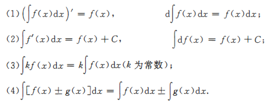

### 基本积分公式

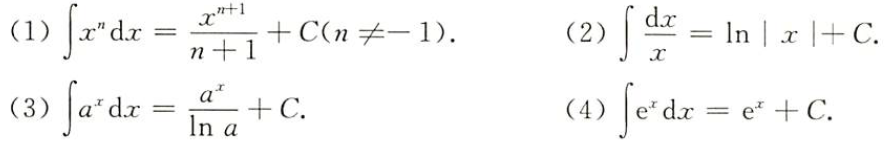
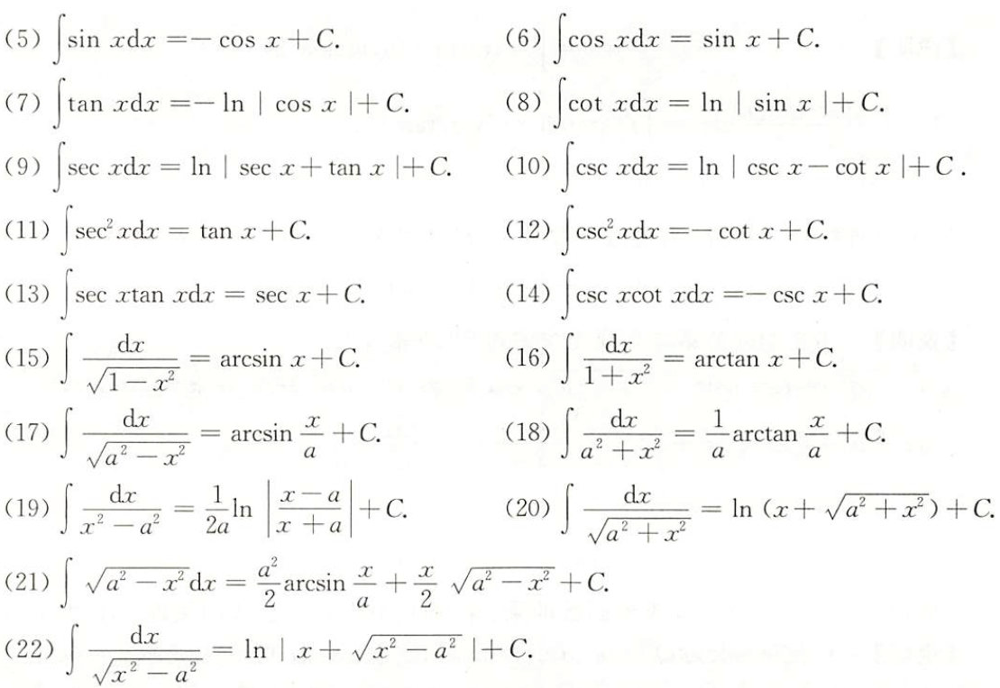

(23) $\int\tan^2xdx=\sec^2x-1+C$

(24) $\int\arcsin xdx=x\arcsin x+\sqrt{1-x^2}$

(25) $\int_{-\infty}^{+\infty}e^{-x^2}dx=\sqrt{\pi}$

(26) $\int_{-\infty}^{+\infty}e^{-\frac{x^2}{a}}dx=\sqrt{a}\int_{-\infty}^{+\infty}e^{-(\frac{x}{\sqrt{a}})^2}d\frac{x}{\sqrt{a}}=\sqrt{a\pi}$

### 三种主要积分法

#### 第一类换元法(凑微分)

若$\int f(u)du=F(u)+C, and\varphi(x)$可导，则
$$\int f(\varphi(x))\varphi'(x)dx=\int f(\varphi(x))d\varphi(x)=F(\varphi(x))+C$$

#### 第二类换元法

设函数$x=\varphi(t)$可导，且$\varphi'(t)\ne0$,又设$\int f(\varphi(t))\varphi'(t)dt=F(t)+C$，则$\int f(x)dx=\int f(\varphi(t))\varphi'(t)dt=F(\varphi^{-1}(x))+C$

三种常用的变量代换
(1) 被积函数中含有$\sqrt{a^2-x^2}$时，令$x=a\sin t,or x = a\cos t$
(2) 被积函数中含有$\sqrt{a^2-x^2}$时，令$x=a\tan t$
(3) 被积函数中含有$\sqrt{a^2-x^2}$时，令$x=a\sec t$

#### 分部积分法

设$u(x),v(x)$有连续一阶导数，则$\int udv=uv-\int vdu$

### 三类常见可积函数积分

#### 有理函数积分

#### 三角有理式积分

$$\int R(\sin x,\cos x)dx$$

(1) 一般方法（万能代换）
令$\tan\frac{x}{2}=t$
$\sin\alpha=\frac{2\tan\frac{\alpha}{2}}{1+\tan^2\frac{\alpha}{2}}、\cos\alpha=\frac{1-\tan^2\frac{\alpha}{2}}{1+\tan^2\frac{\alpha}{2}}、dx=\frac{2dt}{1+t^2}$
$$\int R(\sin x,\cos x)dx=\int R(\frac{2t}{1+t^2},\frac{1-t^2}{1+t^2})\frac{2}{1+t^2}du$$

(2) 特殊方法（三角变形，换元，分部）

1. 若$R(-\sin x,\cos x)=-R(\sin x,\cos x)$，则令$u=\cos x$，即凑$d\cos x$
2. 若$R(\sin x,-\cos x)=-R(\sin x,\cos x)$，则令$u=\sin x$，即凑$d\sin x$
3. 若$R(-\sin x,-\cos x)=R(\sin x,\cos x)$，则令$u=\tan x$，即凑$d\tan x$

#### 简单无理函数积分

$$\int R(x,\sqrt[n]{\frac{ax+b}{cx+d}})dx$$
令$\sqrt[n]{\frac{ax+b}{cx+d}}=t$，将其化为有理函数积分进行计算

## 定积分

### 定积分的概念

### 定积分的几何意义

1. 设$\int_a^bf(x)dx$存在，若在[a,b]上$f(x)\ge0$，则$\int_a^bf(x)dx$的值等于以曲线$y=f(x)$，$y=a,x=b$及x轴所围成的曲边梯形的面积
2. 若在[a,b]上$f(x)\le0$，则$\int_a^bf(x)dx$的值等于以曲线$y=f(x),x=a,x=b$及x轴所围成的曲边梯形面积的负值
3. 若在[a,b]上$f(x)$的值有正也有负，则$\int_a^bf(x)dx$在几何上表示$y=f(x),x=a,x=b$及x轴所围成的x轴上方图形的面积减去下方图形的面积所得之差

### 可积性

**必要条件**
若$\int_a^bf(x)dx$存在，则$f(x)$在[a,b]上有界

**充分条件**
(1) 若$f(x)$在[a,b]上连续，则$\int_a^bf(x)dx$必定存在
(2) 若$f(x)$在[a,b]上有界，且只有有限个间断点，则$\int_a^bf(x)dx$必定存在
(3) 若$f(x)$在[a,b]上只有有限个第一类间断点，则$\int_a^bf(x)dx$必定存在

f(x)在[a,b]上可积，则$\int_a^xf(t)dt$连续

### 定积分的计算

**牛顿莱布尼茨公式**
如果函数$F(x)$是连续函数$f(x)$在区间[a,b]上的一个原函数，则$\int_a^bf(x)dx=F(b)-F(a)$

**换元积分法**
设f(x)在区间[a,b]上连续，函数$x=\varphi(t)满足以下条件$：
(1) $\varphi(\alpha)=a,\varphi(\beta)=b$

(2) $\varphi(t)$在$[\alpha,\beta](or[\beta,\alpha])$上具有连续导数，且其值域$R_\varphi=[a,b]$，则
$$\int_a^bf(x)dx=\int_\alpha^\beta f(\varphi(t))\varphi'(t)dt$$

**分部积分法**
设函数$u(x)、v(x)$在[a,b]上有连续一阶导数，则$\int_a^budv=uv|\overset{b}{a}-\int_a^bvdu$

**利用奇偶性和周期性**
(1) 设$f(x)$为[-a,a]上的连续函数(a>0)，则
$$\int_{-a}^a=\begin{cases}
    0,&f(x)为奇函数\\
    2\int_a^bf(x)dx,&f(x)为偶函数
\end{cases}$$
(2) 设$f(x)$是以T为周期的连续函数，则对任给数a，总有$\int_a^{a+T}f(x)dx=\int_0^Tf(x)dx$

**利用公式**
(1) $$\int_0^{\frac{\pi}{2}}\sin^nxdx=\int_0^\frac{\pi}{2}\cos^nxdx=\begin{cases}
    \frac{n-1}{n}\cdot\frac{n-3}{n-2}\cdot\dotsb\cdot\frac{1}{2}\cdot\frac{\pi}{2},&n为偶数\\
    \frac{n-1}{n}\cdot\frac{n-3}{n-2}\cdot\dotsb\cdot\frac{2}{3},&n为大于1的奇数
\end{cases}$$
(2) $\int_0^\pi xf(\sin x)dx=\frac{\pi}{2}\int_0^\pi f(\sin x)dx$(其中$f(x)$连续)

### 变上限积分：$\int_a^xf(t)dt$

**定理**
若$f(x)$在[a,b]上连续，则$\int_a^xf(t)dt$在[a,b]上可导且$(\int_a^xf(t)dt)'=f(x)$

*有关$F(x)=\int_a^xf(t)dt$在一点处的可导性的结论*
| $f(x)$ | $F(x)=\int_a^xf(t)dt$ |
| --- | --- |
|连续|可导，且$F'(x_0)=f(x_0)$|
|可去间断|可导，且$F'(x_0)=\lim\limits_{x\rightarrow x_0}f(x)$|
|跳跃间断|连续但不可导，且$F_+'(x_0)=f(x_0^+),F_-'(x_0)=f(x_0^-)$|

**变上限求导的三个类型**
(1) $(\int_{\varphi(x)}^{\psi(x)}f(t)dt)'= f(\psi(x))\psi'(x)-f(\varphi(x))\varphi'(x)$

(2) $(\int_a^bf(x,t)dt)'=\int_a^b\frac{\vartheta f(x,t)}{\vartheta x}dt$

**连续性**
设$f(x)$在[a,b]上可积，则$\int_a^xf(x)dt$在[a,b]上连续

**奇偶性**
(1) 若$f(x)$为奇函数，则$\int_a^xf(t)dt$为偶函数

(2) 若$f(x)$为偶函数，则$\int_0^xf(t)dt$为奇函数

### 定积分的性质

**不等式**
(1) 若$f(x)\le g(x),x\in[a,b]$，则$\int_a^bf(x)dx\le\int_a^bg(x)dx$

(2) 若$f(x)$在[a,b]上连续，则$m(b-a)\le\int_a^bf(x)dx\le M(b-a)$，其中m,M分别为$f(x)$在[a,b]上的最小值与最大值

(3) $|\int_a^bf(x)dx|\le\int_a^b|f(x)|dx$

**积分中值定理**
(1) 若$f(x)$在[a,b]上连续，则$\int_a^bf(x)dx=f(\xi)(b-a),a<\xi<b$

(2) 若$f(x),g(x)$在[a,b]上连续，且$g(x)$不变号，则$\int_a^bf(x)g(x)dx=f(\xi)\int_a^bg(x)dx,a\le\xi\le b$

### 积分不等式

柯西积分不等式：$(\int_a^bf(x)g(x)dx)^2\le\int_a^bf^2(x)dx\int_a^bg^2(x)dx$

## 反常积分

### 无穷区间上的反常积分

**定义** 设$f(x)$为$(-\infty,+\infty)$上的连续函数，如果反常积分$\int_{-\infty}^0f(x)dx$和$\int_0^{+\infty}f(x)dx$都收敛，则称反常积分$\int_{-\infty}^{+\infty}f(x)dx$收敛，且$\int_{-\infty}^{+\infty}f(x)dx=\int_{-\infty}^0f(x)dx+\int_0^{+\infty}f(x)dx$
如果$\int_{-\infty}^0f(x)dx$与$\int_0^{+\infty}f(x)dx$之一发散，则称$\int_{-\infty}^{+\infty}f(x)dx$发散

**定理1（比较判别法）** 设$f(x),g(x)$在$[a,+\infty)$上连续，且$0\le f(x)\le g(x)$，且

(1) 当$\int_a^{+\infty}g(x)dx$收敛时，$\int_a^{+\infty}f(x)dx$收敛

(2) 当$\int_a^{+\infty}f(x)dx$发散时，$\int_a^{+\infty}g(x)dx$发散

**定理2（比较法的极限形式）** 设$f(x),g(x)$在$[a,+\infty)$上非负连续，且$\lim\limits_{x\rightarrow+\infty}\frac{f(x)}{g(x)}=\lambda$(有限或无穷)，则

(1) 当$\lambda\ne0$时，$\int_a^{+\infty}f(x)dx$与$\int_a^{+\infty}g(x)dx$同敛散

(2) 当$\lambda=0$时，若$\int_a^{+\infty}g(x)dx$收敛，则$\int_a^{+\infty}f(x)dx$也收敛

(3) 当$\lambda=+\infty$时，若$\int_a^{+\infty}g(x)dx$发散，则$\int_a^{+\infty}f(x)dx$也发散

常用结论：$$\int_a^{+\infty}\frac{1}{x^p}dx\begin{cases}
    p>1,&收敛 \\
    p\le1,&发散
\end{cases}\tag{a>0}$$

### 无界函数的反常积分

**定理1（比较判别法** 设$f(x),g(x)$在$(a,b]$上连续，且$0\le f(x)\le g(x),x=a$为$f(x)$和$g(x)$的瑕点，则
(1) 当$\int_a^bg(x)dx$收敛时，$\int_a^bf(x)dx$收敛
(2) 当$\int_a^bf(x)dx$发散时，$\int_a^bg(x)dx$发散

**定理2（比较法的极限形式** 设$f(x),g(x)$在$(a,b]$上非负连续，且$\lim\limits_{x\rightarrow a^+}\frac{f(x)}{g(x)}=\lambda$(有限或无穷)，则
(1) 当$\lambda\ne0$时，$\int_a^{b}f(x)dx$与$\int_a^{b}g(x)dx$同敛散
(2) 当$\lambda=0$时，若$\int_a^bg(x)dx$收敛，则$\int_a^bf(x)dx$也收敛
(3) 当$\lambda=+\infty$时，若$\int_a^bg(x)dx$发散，则$\int_a^bf(x)dx$也发散

常用结论：
$$\int_a^b\frac{1}{(x-a)^p}dx\begin{cases}
    p<1,&收敛 \\
    p\ge1,&发散
\end{cases}$$
$$\int_a^b\frac{1}{(b-x)^p}dx\begin{cases}
    p<1,&收敛 \\
    p\ge1,&发散
\end{cases}$$

## 定积分应用

### 几何应用

**平面图形的面积**
设有平面域D,则该平面域D的面积为$\iint_D1d\sigma$
(1) 若平面域D由曲线$y=f(x),y=g(x)(f(x)\ge g(x)),x=a,x=b(a<b)$所围成，则
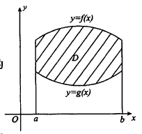
$$S=\iint_D1d\sigma=\int_a^bdx\int_{g(x)}^{f(x)}1dy=\int_a^b[f(x)-g(x)]dx$$
(2) 若平面域D由曲线$r=r(\theta),\theta=\alpha,\theta=\beta(\alpha<\beta)$所围成，则面积为
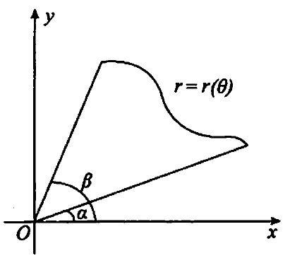
$$S=\iint_D1d\sigma=\int_\alpha^\beta d\theta\int_0^{r(\theta)}rdr=\frac{1}{2}\int_\alpha^\beta r^2(\theta)d\theta$$

**空间体的体积**
(1) 旋转体的体积
平面域D绕直线L:ax+by+c=0(该直线不穿过区域D)旋转所得旋转体体积记为V
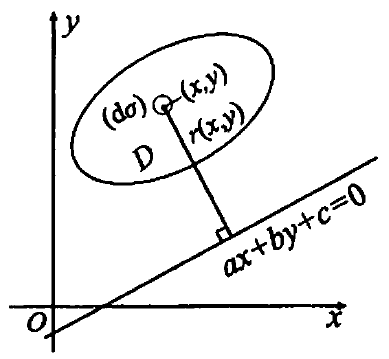
$$r(x,y)=\frac{|ax+by+c|}{\sqrt{a^2+b^2}}$$

$$dV=2\pi r(x,y)d\sigma$$

$$V=2\pi\iint_Dr(x,y)d\sigma$$

特别的，若区域D由曲线$y=f(x)(f(x)\ge0$和直线$x=a,x=b(0\le a\le b)$及x轴所围成，则
(1) 区域D绕x轴旋转$(r(x,y)=y)$一周所得旋转体的体积为
$$V_x=2\pi \iint_Dyd\sigma=2\pi\int_a^bdx\int_0^{f(x)}ydy=\pi\int_a^bf^2(x)dx$$
(2) 区域D绕y轴旋转$(r(x,y)=x)$一周所得旋转体的体积为
$$V_y=2\pi\iint_Dxd\sigma=2\pi\int_a^bdx\int_0^{f(x)}xdy=2\pi\int_a^bxf(x)dx$$

(2) 横截面面积的体积
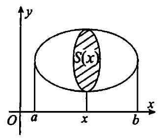
$$V=\int_a^bS(x)dx$$

**曲线弧长**
(1) 设曲线段C由直角坐标方程$y=f(x)(a\le x\le b)$给出，其中$y(x)$在[a,b]上有一阶连续导数，则该曲线段的弧长为
$$s=\int_a^b\sqrt{1+y'^2}dx$$
(2) 设曲线段C由参数方程$\begin{cases}
    x=x(t),\\
    y=y(t),
\end{cases}(a\le t\le \beta)$给出，其中$x(t),y(t)$在$[\alpha,\beta]$上有一阶连续导数，则该曲线段的弧长为
$$s=\int_\alpha^\beta\sqrt{x'^2(t)+y'^2(t)}dt$$
(3) 设曲线段C由极坐标方程$r=r(\theta)(\alpha\le\theta\beta)$给出，其中$r(\theta)$在$[\alpha,\beta]$上有一阶连续导数，则该曲线段的弧长为
$$s=\int_\alpha^\beta\sqrt{r^2(\theta)+r'^2(\theta)}d\theta$$
(4) 旋转体侧面积
曲线$y=f(x)(f(x)\ge0)$和直线$x=a,x=b(0\le a\le b)$及x轴所围成区域绕x轴旋转所得旋转体的侧面积是
$$S=2\pi\int_a^bf(x)\sqrt{1+f'^2(x)}dx$$

#### 特殊图形

**星形线**
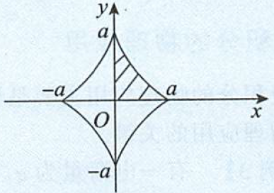
直角坐标方程：$x^{\frac{2}{3}}+y^{\frac{2}{3}}=a^{\frac{2}{3}}$
极坐标方程：$x=a\cos^3t,y=a\sin^3t$
围成面积$A=4\int_0^aydx$
弧长$L=4\int_0^a\sqrt{1+y'^2}dx$
绕x轴体积$V=2\pi\int_a^a y^2dx$
旋转体横截面积$2*2\pi\int_0^ay\sqrt{1+y'^2}dx$

**摆线**
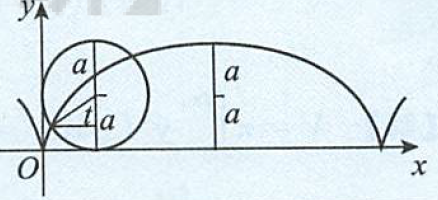
极坐标方程：$x=a(t-\sin t),y=a(1-\cos t)$

**心形线**
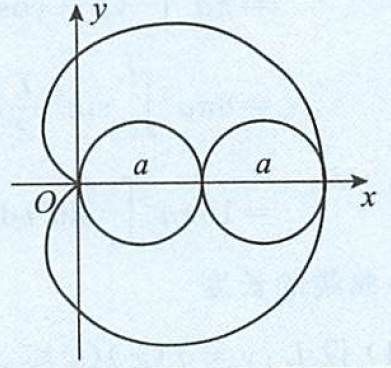
极坐标方程：$r=a(1+\cos\theta)$

**双纽线**
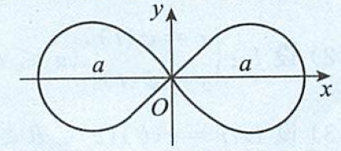
直角坐标方程：$(x^2+y^2)^2=a^2(x^2-y^2)$
极坐标方程：$r^2=a^2\cos2\theta$
旋转体侧面积：$2\int_0^\frac{\pi}{4}2\pi*r\sin\theta\sqrt{r^2+r'^2(\theta)}d\theta$

### 物理应用

1. 压力
   1. 水的压力F=水的压强P x 装水的容器的底面积S（F=pghS)
2. 变力做功
3. 引力

质心计算公式$r_\sigma=\frac{\sum_im_ir_i}{M}$和$r_\sigma=\frac{\int^b_ax\rho(x)dx}{\int^b_a\rho(x)dx}$