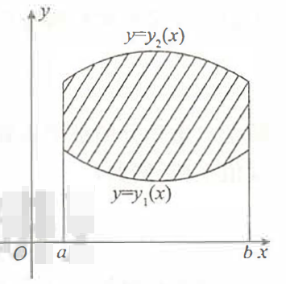
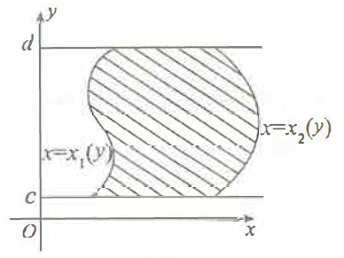
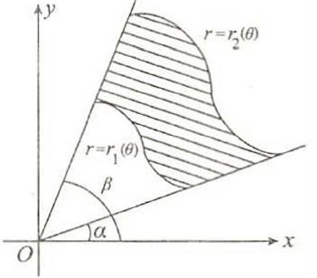
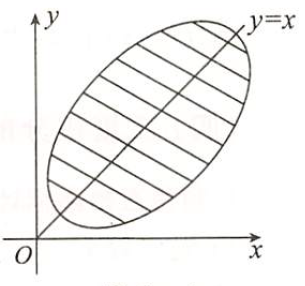

## 二重积分的概念

$$\iint_Df(x,y)d\sigma=\lim\limits_{\lambda\rightarrow0}\sum_{i=1}^nf(\xi_i,\eta_i)\Delta\sigma_i$$

## 二重积分的几何意义

二重积分$\iint_Df(x,y)d\sigma$是一个数。当$f(x,y)\ge0$时，其值等于以积分域D为底，以曲面$z=f(x,y)$为曲顶的曲顶柱体的体积

## 二重积分的性质

### 不等式性质

1. 若在D上$f(x,y)\le g(x,y)$，则$\iint_Df(x,y)d\sigma\le\iint_Dg(x,y)d\sigma$
2. 若$f(x,y)$在D上连续，则$mS\le\iint_Df(x,y)d\sigma\le MS$，其中m和M分别为$f(x,y)$在D上的最小值和最大值，S为积分域D的面积
3. $|\iint_Df(x,y)d\sigma|\le\iint_D|f(x,y)|d\sigma$

### 积分中值定理

若$f(x,y)$在D上连续，则$\iint_Df(x,y)d\sigma=f(\xi,\eta)S$，其中$(\xi,\eta)\in D,S$为积分域D的面积

## 二重积分的计算

### 利用直角坐标计算

**先y后x**
若积分域D是X型区域，即积分域D可以用不等式$y_1(x)\le y\le y_2(x),a\le x\le b$来表示，则

$$\iint_Df(x,y)d\sigma=\int_a^bdx\int_{y_1(x)}^{y_2(x)}f(x,y)dy$$

**先x后y**
若积分域D是Y型区域，即积分域D可以用不等式$x_1(y)\le x\le x_2(y),c\le y\le d$来表示，则

$$\iint_Df(x,y)d\sigma=\int_c^ddy\int_{x_1(y)}^{x_2(y)}f(x,y)dx$$

### 利用极坐标计算

**先r后$\theta$**
若积分域D可以用不等式$r_1(\theta)\le r\le r_2(\theta),\alpha\le\theta\le\beta$，来表示，则

$$\iint_Df(x,y)d\sigma=\int_\alpha^\beta d\theta\int_{r_1(\theta)}^{r_2(\theta)}f(r\cos\theta,r\sin\theta)rdr$$

### 利用对称性和奇偶性计算

(1) 若积分域D关于y轴对称，f(x,y)关于x有奇偶性，则：
$$\iint_Df(x,y)d\sigma=\begin{cases}
    2\iint_{D_{x\ge0}}f(x,y)d\sigma,&f(-x,y)=f(x,y) \\
    0,&f(-x,y)=-f(x,y)
\end{cases}$$
(1) 若积分域D关于x轴对称，f(x,y)关于y有奇偶性，则：
$$\iint_Df(x,y)d\sigma=\begin{cases}
    2\iint_{D_{y\ge0}}f(x,y)d\sigma,&f(x,-y)=f(x,y) \\
    0,&f(x,-y)=-f(x,y)
\end{cases}$$

### 利用变量对称性计算

二重积分$\iint_Df(x,y)d\sigma$的积分域D是点(x,y)的集合，记为$D_{(x,y)}$，类似一元定积分的值与积分变量用什么记号无关，则

$$\iint_{D_{(x,y)}}f(x,y)d\sigma=\iint_{D_{(y,x)}}f(y,x)d\sigma$$
即把二重积分的被积函数f(x,y)及积分域$D_{(x,y)}$中的x和y对调，积分值不变
