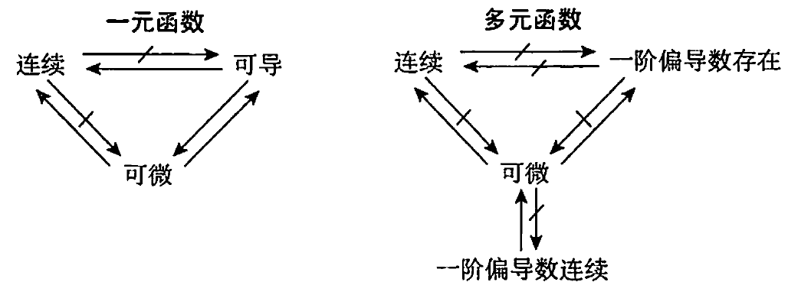

## 重极限、连续、偏导数、全微分

### 重极限

#### 求重极限常用方法

1. 利用极限性质（四则运算法则，夹逼定理）
2. 消去分母中极限为零的因子（有理化，等价无穷小代换）
3. 利用无穷小量与有界变量之积的无穷小量

**证明重极限不存在常用方法**
沿两种不同路径极限不同（通常可取过($x_0,y_0$)的直线)

### 连续

若$\lim\limits_{\substack{x\rightarrow x_0 \\y\rightarrow y_0}}f(x,y)=f(x_0,y_0)$，则称$f(x,y)$在$(x_0,y_0)$处连续

#### 性质

1. 连续函数的和、差、积、商（分母不为零）及复合仍连续
2. 基本初等函数在其定义域内连续；初等函数在其定义区域内连续
3. 有界闭区域上连续函数的性质
   1. 有界性：若$f(x,y)$在有界闭区域D上连续，则$f(x,y)$在D上有界
   2. 最值性：若$f(x,y)$在有界闭区域D上连续，则$f(x,y)$在D上必有最大值和最小值
   3. 介值性：若$f(x,y)$在有界闭区域D上连续，则$f(x,y)$在D上可取到介于最小值与最大值之间的任何值

### 偏导数

### 全微分

#### 以下四条等价

1. $\Delta z=f(x_0+\Delta x,y_0+\Delta y)-f(x_0,y_0)=A\Delta x+B\Delta y+o(\rho)$
2. $\lim\limits_{\substack{\Delta x\rightarrow0 \\ \Delta y\rightarrow0}}\frac{[f(x_0+\Delta x,y_0+\Delta y)-f(x_0,y_0)]-[A\Delta x+B\Delta y]}{\sqrt{(\Delta x)^2+(\Delta y)^2}}=0$
3. $\Delta z=f(x,y)-f(x_0,y_0)=A(x-x_0)+B(y-y_0)+o(\rho)$
4. $\lim\limits_{\substack{x\rightarrow x_0\\y\rightarrow y_0}}\frac{[f(x,y)-f(x_0,y_0)]-[A(x-x_0)+B(y-y_0)]}{\sqrt{(x-x_0)^2+(y-y_0)^2}}=0$

#### 可微性判定

1. 必要条件：$f'_x(x_0,y_0)$与$f'_y(x_0,y_0)$都存在
2. 充分条件：$f'_x(x_0,y_0)$和$f'_y(x_0,y_0)$在$(x_0,y_0)$连续
3. 用定义判定
   1. $f'_x(x_0,y_0)$和$f'_y(x_0,y_0)$是否都存在
   2. $\lim\limits_{\substack{\Delta x\rightarrow0 \\ \Delta y\rightarrow0}}\frac{[f(x_0+\Delta x,y_0+\Delta y)-f(x_0,y_0)]-[f'_x(x_0,y_0)\Delta x+f'_y(x_0,y_0)\Delta y]}{\sqrt{(\Delta x)^2+(\Delta y)^2}}$是否为零

#### 连续、可导、可微的关系

## 偏导数与全微分的计算

### 复合函数求导

设$u=u(x,y),v=v(x,y)$可导，$z=f(u,v)$在相应点有连续一阶偏导数，则
$$\frac{\delta z}{\delta x}=\frac{\delta f}{\delta u}\frac{\delta u}{\delta x}+\frac{\delta f}{\delta v}\frac{\delta v}{\delta x} \\ \frac{\delta z}{\delta y}=\frac{\delta f}{\delta u}\frac{\delta u}{\delta y}+\frac{\delta f}{\delta v}\frac{\delta v}{\delta y}\\$$

### 隐函数求导法

由一个方程所确定的隐函数
设$F(x,y,z)$有连续一阶偏导数，$F'_z\ne0,z=z(x,y)$由$F(x,y,z)=0$所确定
**方法：**

1. 公式：$\frac{\delta z}{\delta x}=-\frac{F'_x}{F'_z},\frac{\delta z}{\delta y}=-\frac{F'_y}{F'_z}$
2. 等式两边求导$F'_x+F'_z\frac{\delta z}{\delta x}=0,F'_y+F'_z\frac{\delta z}{\delta y}=0$
3. 利用微分形式不变性：$F'_xdx+F'_ydy+F'_zdz=0$

注：
若$p(x,y)$和$Q(x,y)$有一阶连续偏导数，且$P(x,y)dx+Q(x,y)dy$是某一函数的全微分，则$\frac{\delta P}{\delta y}=\frac{\delta Q}{\delta x}$

## 极值与最值

### 无条件极值

**极值的必要条件**
设$z=f(x,y)$在点$(x_0,y_0)$存在偏导数，且$(x_0,y_0)$为$f(x,y)$的极值点，则$f'_x(x_0,y_0)=0,f'_y(x_0,y_0)=0$

**极值的充分条件**
设$z=f(x,y)$在点$P_0(x_0,y_0)$的某邻域内有二阶连续偏导数，又$f'_x(x_0,y_0),f'_y(x_0,y_0)=0$，记$A=f''_{xx}(x_0,y_0),B=f''_{xy}(x_0,y_0),C=f''_{yy}(x_0,y_0)$
有下列结论

1. 若$AC-B^2>0,$则$(x_0,y_0)$为f(x,y)的极值点
   1. A<0,则$(x_0,y_0)$为f(x,y)的极大值点
   2. A>0,则$(x_0,y_0)$为f(x,y)的极小值点
2. 若$AC-B^2<0$，则$(x_0,y_0)$不为f(x,y)的极值点
3. 若$AC-B^2=0$，则$(x_0,y_0)$可能为f(x,y)的极值点，也可能不为f(x,y)的极值点

求具有二阶连续偏导数二元函数$z=f(x,y)$极值的一般步骤为：
(1) 求出f(x,y)的驻点$P_1,\dotsb,P_k$
(2) 利用极值的充分条件判定驻点$P_i$是否为极值点
二元函数$z=f(x,y)$在偏导数不存在的点也可能取到极值（如$f(x,y)=\sqrt{x^2+y^2}$，而这种点是否取得极值一般用极值定义判定

### 条件极值及拉格朗日乘数法

求$z=f(x,y)$在条件$\varphi(x,y)=0$下的条件极值的一般方法：
(1) 构造拉格朗日函数$F(x,y,\lambda)=f(x,y)+\lambda\varphi(x,y)$；
(2) 将$F(x,y,\lambda)$分别对$x,y,\lambda$求偏导数，构造方程组

$$\begin{cases}
   f'_x(x,y)+\lambda\varphi'_x(x,y)=0 \\
   f'_y(x,y)+\lambda\varphi'_y(x,y)=0 \\
   \varphi(x,y)=0 \\
\end{cases}$$

### 最大最小值

求连续函数$f(x,y)$在有界闭区域D上的最大最小值三部曲
(1) 求f(x,y)在D内部可能的极值点
(2) 求f(x,y)在D的边界上的最大最小值
(3) 比较

应用题

点到直线的距离公式:
直线为$Ax+By+C=0,A,B\ne0$，则直线外一点$(x_0,y_0)$到该直线最短的距离为$d=\frac{Ax_0+By_0+C}{\sqrt{A^2+B^2}}$

三角形面积公式：海伦公式
设三角形三边为x,y,z,周长为2p，则面积为$S=\sqrt{p(p-a)(p-b)(p-c)}$
